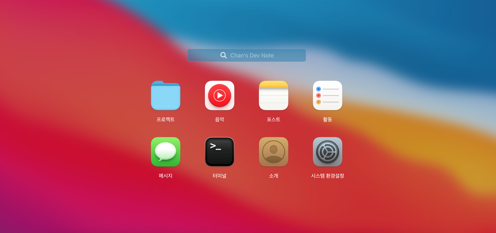

## 미니맥 프로젝트를 소개합니다!

---

미니맥은 항상 한성노트북으로 코드를 짜오면서 맥에 가졌던 동경과 환상(?) 을 담아 만든 애정어린 블로그입니다.  
[개츠비 스타터 템플릿](https://github.com/gatsbyjs/gatsby-starter-blog)을 기반으로 제작되었으며, 디자인은 다른 블로거분들이 제작한 테마들과 맥 시스템 UI를 많이 참고하였습니다.

아직 추가 / 개선해야 할 부분들도 많고 당분간은 글과 공부에 전념하고자 업데이트가 더디긴 하지만, 언젠간 꼭 템플릿화해 배포하고 싶은 욕심도 가지고 있습니다. 😆

소스 코드를 포크해 수정 & 커스터마이징해서 사용하시는 건 자유이며, 필요하시다면 각 소스에 대한 설명도 추가해 드리겠습니다.

오늘도 좋은 하루 보내시길 바라겠습니다 :)
