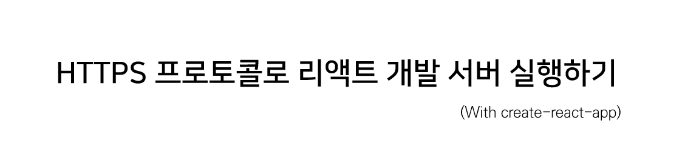

`create-react-app` 을 사용해 리액트 프로젝트를 구성하면 `npm start` 명령으로 쉽게 테스트 서버를 열 수 있다.  
아마 여기까지는 대부분 아는 내용이겠지만, 리액트 테스트 서버가 HTTP 프로토콜을 사용한다는 점은 자칫하면 간과하기 쉬운 사실이다.

이로 인해 [Mixed Content](https://web.dev/what-is-mixed-content/) 같은 네트워크 이슈를 개발 단계에서 놓칠 수도 있는 등 때로는 테스트 서버를 HTTPS 프로토콜로 열어야 할 때가 있어 그 방법을 정리한다.

---

복잡한 환경 변수 설정이나 세팅이 필요한 것은 아니고 실행 커맨드를 이렇게 고쳐주면 된다.  
OS나 환경에 따라 일부 차이가 있으니 본인의 개발 환경에 맞는 명령어를 사용하자.

**1. CMD 사용 시**

```powershell
set HTTPS=true&&npm start
```

**2. 파워쉘 사용 시**

```powershell
($env:HTTPS = "true") -and (npm start)
```

**3. 리눅스, MacOS 사용 시**

```powershell
HTTPS=true npm start
```


사용하는 터미널에 맞게 명령어를 수행하면 자체 서명된 인증서가 포함된 HTTP 사이트로 접속하게 되며, 안전하지 않다는 경고가 출력되지만 무시하고 진행할 수 있다.
