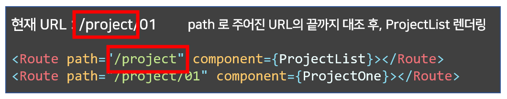
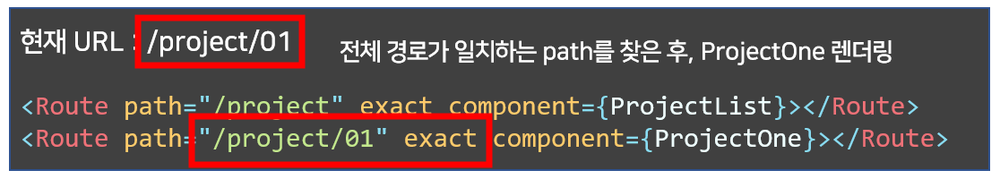

주어진 URL에 따라 다른 웹페이지를 제공하는 것을 라우팅(Routing)이라고 부르는데요, 리액트는 기본적으로 **단일 페이지 어플리케이션(Single Page Application)**를 만드는데 특화되었기 때문에 별도의 라우팅이 구현되어 있지 않습니다.

하지만 없으면 만들면 되는 법!  
오늘 다룰 `react-router-dom` 라이브러리를 사용하면 리액트에서도 라우팅을 구현할 수 있습니다.

## 1. why Router?

"그런데 라우팅은 `<a href = "">` 태그를 사용하면 되지 않나?" 라고 생각하실 수도 있습니다.

그러나 `<a>` 태그를 통해 다른 페이지로 이동하면 서버에 완전히 새로운 페이지를 요청하게 되는데요, 그 결과 브라우저는 새로고침을 수행함과 동시에 현재 컴포넌트가 갖고 있던 모든 상태값을 잃게 됩니다.

```js
import React, { useState } from "react"
import { BrowserRouter as Router, Switch, Link, Route } from "react-router-dom"

const App = () => {
  return (
    <Router>
      <div>
        <Link to="/counter">react-router-dom 사용</Link>
      </div>
      <div>
        <a href="/counter">a 태그 사용</a>
      </div>
      <Switch>
        <Route exact path="/counter" component={Counter} />
      </Switch>
    </Router>
  )
}

const Counter = () => {
  const [count, setCount] = useState(0)
  return (
    <div>
      <span>카운터 : {count} </span>
      <button onClick={() => setCount(count + 1)}>+</button>
      <button onClick={() => setCount(count - 1)}>-</button>
    </div>
  )
}

export default App
```

<div style = "text-align:center">
    
</div>
<div style = "text-align: center; margin-bottom: 1rem; font-size: 0.9rem">[코드 실행 결과]</div>

보시는 것처럼 `react-router-dom` 을 사용하면 새로고침이 일어나지 않고 상태값도 그대로 유지되지만, `<a>` 태그를 사용했을 때는 새로고침이 일어나 상태값이 초기화된 모습입니다.

> 정리 : react-router-dom 을 사용하는 이유 - 브라우저 새로고침으로 인한 상태값 손실 방지

## 2. How Router?

`react-router-dom` 는 `$ npm install react-router-dom` 을 통해 설치할 수 있습니다.

설치가 끝났다면 라우터를 사용할 차례인데요, `react-router-dom` 의 주요 컴포넌트는 세 가지로 나뉩니다.

1. 라우터 (router)
2. 경로 탐색자 (route matchers)
3. 네비게이션 (navigation)

## 2. 1. 라우터 (router)

라우터는 라우팅을 진행할 컴포넌트들을 감싸는 컴포넌트로 `<BrowserRouter>` 또는 `<HashRouter>` 를 사용해 주로 루트 컴포넌트를 감싸줍니다.

```js
import React from "react"
import ReactDOM from "react-dom"
import App from "./App"
import { BrowserRouter as Router } from "react-router-dom"

ReactDOM.render(
  <Router>
    <App />
  </Router>,
  document.getElementById("root")
)
```

**[참고하면 좋은 글]**

> [BrowserRouter와 HashRouter의 차이 - stackoverflow](https://stackoverflow.com/questions/51974369/hashrouter-vs-browserrouter)

## 2. 2. 경로 탐색자 (route matchers)

경로 탐색자는 경로에 따라 다른 컴포넌트를 렌더링합니다.

```js
<Switch>
    <Route path="/about">
        <About />
    </Route>
    <Route exact path="/project">
        <Project />
    </Route>
    <Route exact path="/people" component={People}>
</Switch>
```

주로 사용하는 컴포넌트를 정리해보면 `<Switch>` 컴포넌트는 라우팅할 경로를 관리하며 하위 `<Route>`들의 `path` 속성을 검사한 뒤, URL과 일치하는 `<Route>`에 속한 컴포넌트를 렌더링합니다.

그런데 한가지 아주 중요한 점이 있습니다.

```js
import React from "react"
import { BrowserRouter as Router, Switch, Link, Route } from "react-router-dom"

const App = () => {
  return (
    <Router>
      <div>
        <Link to="/project">프로젝트 목록</Link>
      </div>
      <div>
        <Link to="/project/01">프로젝트 1</Link>
      </div>
      <Switch>
        <Route path="/project" component={ProjectList}></Route>
        <Route path="/project/01" component={ProjectOne}></Route>
      </Switch>
    </Router>
  )
}

const ProjectList = () => {
  return <div>Project List</div>
}

const ProjectOne = () => {
  return <div>Project one</div>
}

export default App
```

`<Route>`가 이렇게 구성되어 있을 때 `프로젝트 1`를 누르면 어떤 컴포넌트가 렌더링될까요?  
<br/>

<div style = "text-align:center">
    
</div>
<div style = "text-align: center; margin-bottom: 1rem; font-size: 0.9rem">[코드 실행 결과]</div>

`/project/01` 로 이동하는 링크를 눌렀으니 **"Project one"** 이 화면에 나타나야 한다고 생각했겠지만, 실제로 렌더링된 컴포넌트는 **ProjectList** 컴포넌트입니다.

이 문제는 `<Route>` 컴포넌트에 `exact` 속성을 추가해 해결할 수 있습니다.



<div style = "text-align: center; margin-bottom: 1rem; font-size: 0.9rem">[exact 속성이 없을 때]</div>

<br>



<div style = "text-align: center; margin-bottom: 1rem; font-size: 0.9rem">[exact 속성이 있을 때]</div>

또 `<Route>` 의 자식으로 하위 컴포넌트를 사용하는 대신에 `component`나 `render` 라는 속성에 렌더링할 컴포넌트를 줄 수도 있지만, 두 속성의 동작 방식은 완전히 다르니 주의하세요.

만약 두 차이를 잘 모르겠다면 `component` 속성만 사용해도 무방합니다.

**[참고하면 좋은 글]**

> [component와 render 속성의 차이 - medium](https://medium.com/@migcoder/difference-between-render-and-component-prop-on-react-router-v4-368ca7fedbec)  
> [exact 의 유무에 따른 차이 - stackoverflow](https://stackoverflow.com/questions/49162311/react-difference-between-route-exact-path-and-route-path)

## 2. 3. 네비게이션 (navigation)

네비게이션은 `<a>` 태그처럼 링크를 이동하는 역할입니다.

```js
<Router>
  <div>
    <Link to="/about">소개 페이지로 이동</Link>
    <Link to="/home">대문 페이지로 이동</Link>
  </div>
</Router>
```

`<link>` 컴포넌트는 `to` 라는 속성을 통해 이동할 경로를 지정한다는 점은 `<a>` 태그와 비슷하지만 실제로 해당 링크로 이동하는 대신 `<Route>`에 지정된 컴포넌트를 렌더링한다는 점이 다릅니다.

## 3. 맺으며

리액트는 원래 한 화면에서 컴포넌트를 업데이트하는 **단일 페이지 어플리케이션**을 지향하지만, 라우팅 라이브러리를 사용하면 여러 페이지를 넘나들 수 있는 완전한 홈페이지를 만들 수 있다는 것도 알게 되었습니다.

아래에 **샘플 코드** 도 첨부하니, 이를 활용해 간단하게 연습해보는 것을 추천합니다. 😄

```js
import React from "react"
import {
  BrowserRouter as Router,
  Switch,
  Link,
  Route,
  useRouteMatch,
} from "react-router-dom"

const App = () => {
  return (
    <Router>
      <div>
        <Link to="/blog">대문 페이지</Link>
      </div>
      <Switch>
        <Route exact path="/blog" component={Home} />
        <Route exact path="/blog/about" component={About} />
        <Route exact path="/blog/posts" component={Posts} />
      </Switch>
    </Router>
  )
}

function Home() {
  let { url } = useRouteMatch()
  return (
    <div>
      <h2>블로그에 오신 것을 환영합니다!</h2>
      <ul>
        <li>
          <Link to={`${url}/about`}>블로그 소개</Link>
        </li>
        <li>
          <Link to={`${url}/posts`}>블로그 글 목록</Link>
        </li>
      </ul>
    </div>
  )
}

function About() {
  return (
    <div>
      <Link to="/blog">홈으로</Link>
      <div>안녕하세요, 찬민입니다!</div>
    </div>
  )
}

function Posts() {
  return (
    <div>
      <Link to="/blog">홈으로</Link>
      <div>글 목록</div>
    </div>
  )
}

export default App
```

> 참고 : [react-router-dom 공식 문서](https://reactrouter.com/web/guides/quick-start)
