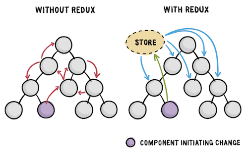

리액트에서는 조건이나 동작에 따라 변화할 수 있는 상태를 `state` 라고 부르고, 해당 상태를 하위 컴포넌트에 `props` 의 형태로 전달하여 사용하곤 한다.



다만 위의 그림처럼 상위 컴포넌트에서 하위 컴포넌트로 상태값을 전달하기 위해서는 두 컴포넌트 사이에 있는 모든 컴포넌트를 거쳐 전달해야 하는 단점이 있었는데, 이러다 보니 코드가 복잡해짐과 동시에 상태값을 전달하는 역할의 컴포넌트에서는 사용하지도 않을 불필요한 속성값을 받게 된다는 단점이 있었다.

```javascript
<하위 컴포넌트 D로 state 값을 전달하는 순서>

-- without redux --        -- with redux --
                      [중앙 Store 에서 state 관리]

컴포넌트 A  state           컴포넌트 A
컴포넌트 B    ↓             컴포넌트 B
컴포넌트 C    ↓             컴포넌트 C
컴포넌트 D  props           컴포넌트 D store.getState()
```

그래서 등장한 것이 Flux 아키텍처[^1]와 이를 구현한 리덕스(Redux)로, 리덕스를 사용하면 상태값을 중앙 스토어에서 관리할 수 있어 복잡한 컴포넌트 계층 구조에서도 상태를 효과적으로 관리할 수 있다.

## 1. 리덕스의 구성

리덕스는 크게 다음 요소들로 구성된다.

### 상태값을 저장하는 저장소 : 스토어

- 스토어는 모든 상태값을 저장하며 상태값을 조작할 리듀서 함수를 인자로 받는다.

### 상태를 조작하는 함수 : 리듀서 함수

- 리듀서(Reducer) 함수는 초기 상태값과 액션(action) 을 인자로 받아 액션에 따라[^2] 조작할 상태를 지정한다.

### 액션을 전달하는 함수 : 디스패처 함수

- 디스패처(Dispatcher) 함수는 액션값과 상태에 관한 데이터를 리듀서 함수에 전달한다.

---

이것만 봐서는 아직 각 구성 요소들이 무슨 역할을 하는지 와닿지 않을 수도 있다.  
조금 간단한 비유를 들어보자면 디스패처 함수에서는 보고서를 작성하고, 리듀서 함수는 이를 받아본 다음 보고서에 적힌 동작을 수행하는 것이라고 생각할 수도 있겠다.

## 2. 리덕스 라이브러리 사용법

우선 리덕스는 리액트에 종속적인 라이브러리가 아니라 일반적인 자바스크립트에서도 사용할 수 있으며 npm 또는 yarn 을 사용해 설치할 수 있다.

```js
npm install redux
```

리덕스의 설치가 끝나면 버튼을 누르는 대로 값이 변하는 간단한 카운터를 만들어보자.

```javascript
// 카운터 어플리케이션
// 초기 스토어를 생성하기 위한 createStore 를 임포트한다.
import { createStore } from "redux"

// HTML에는 + - 버튼과 카운터 값을 나타내는 요소가 있다고 가정한다.
const plus = document.getElementById("plus")
const minus = document.getElementById("minus")
const value = document.getElementById("value")

// # 1. 리듀서 함수
// 첫 번째 인자는 스토어에 저장될 초기 상태값이다.
// 리듀서 함수의 본체에는 action 객체가 가진 type 속성값에 따른 동작을 지정한다.
const reducer = (count = 0, action) => {
  switch (action.type) {
    case "ADD":
      return count + 1
    case "MINUS":
      return count - 1
    default:
      return count
  }
}

// # 2. createStore 함수로 스토어를 생성할때는 리듀서 함수를 인자로 가진다.
const store = createStore(reducer)

// # 4. subscribe 함수는 스토어 내의 상태값이 변화하면 자동으로 호출된다.
store.subscribe(() => {
  value.innerText = store.getState()
})

// # 3. plus 버튼이 눌리면
// dispatch 함수를 통해 리듀서에 "ADD" 타입 액션을 전달한다.
plus.addEventListener("click", () => {
  store.dispatch({ type: "ADD" })
})

// # 3. minus 버튼이 눌리면
// dispatch 함수를 통해 리듀서에 "MINUS" 타입 액션을 전달한다.
minus.addEventListener("click", () => {
  store.dispatch({ type: "MINUS" })
})
```

<iframe height="265" style="width: 100%;" scrolling="no" title="dypNMKK" src="https://codepen.io/c17an/embed/dypNMKK?height=265&theme-id=dark&default-tab=js,result" frameborder="no" loading="lazy" allowtransparency="true" allowfullscreen="true">
  See the Pen <a href='https://codepen.io/c17an/pen/dypNMKK'>dypNMKK</a> by Chan-Min, Kim
  (<a href='https://codepen.io/c17an'>@c17an</a>) on <a href='https://codepen.io'>CodePen</a>.
</iframe>

---

순수 리덕스에 대한 내용은 이게 전부다.  
리덕스를 사용함으로써 상태를 하위 컴포넌트에 전달하기 위해 중간 컴포넌트를 거칠 필요가 없어졌고, 이제는 어떤 컴포넌트에서든 중앙 상태 저장소를 통해 상태값을 가져올 수 있게 되었다.

이걸로 리덕스의 기본 구조에 대해 알았으니 다음에는 리액트에서 리덕스를 본격적으로 다루기 위한 `react-redux` 라이브러리에 대해 알아보도록 하자.

[^1]: Flux 아키텍처에 대한 설명은 [페이스북 오픈 소스](https://facebook.github.io/flux/docs/in-depth-overview) 페이지를 참고할 수 있습니다.
[^2]: 액션에 따라 상태를 조작할 때는 주로 액션값에 따른 switch문을 사용한다.
