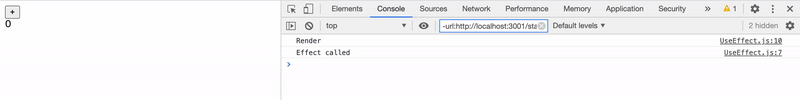
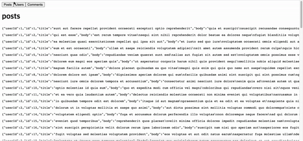

`useEffect` 훅은 컴포넌트의 부수동작(**effect**) 을 관리하는 훅으로 기본 훅 중에서도 가장 중요한 훅이라 할 수 있습니다.  
<span style = "font-size: 0.9rem">(부수동작이란 컴포넌트가 처음 마운트될때 / 컴포넌트가 업데이트될때 / 컴포넌트가 언마운트될때 일어나는 모든 동작을 의미한다.)</span>

**\[useEffect 훅의 기본 형태\]**

```js
import React, {useEffect} from 'react'

  useEffect(
    (이펙트 함수)
    return {
      (클린업 함수)
    }
  }, [의존값]);

  // 이펙트 함수 호출시점 : 컴포넌트가 처음 마운트될 때, 의존값으로 주어진 값이 변경될 때
  // 클린업 함수 호출시점 : 이펙트 함수가 호출되기 전, 컴포넌트가 언마운트될때 각각 클린업이 호출된다.

  // 의존값 배열이 비어 있으면 최초 마운트 시에만 이펙트를 호출한다.
  // 의존값이 존재하지 않으면 컴포넌트가 렌더링될 때마다 이펙트를 호출한다.
```

아직은 뭐가 뭔지 어질어질할테니 먼저 간단한 카운터를 구현한 코드를 통해 이펙트가 무엇인지 알아봅시다.

```js
import React, { useState, useEffect } from "react"

function UseEffect() {
  const [count, setCount] = useState(0)

  useEffect(() => {
    console.log("effect")
  }, [])

  console.log("render")

  return (
    <>
      <div>
        <button onClick={() => setCount(prev => prev + 1)}>+</button>
        <div>{count}</div>
      </div>
    </>
  )
}

export default UseEffect
```



버튼을 누를 때마다 count 상태값이 업데이트됨과 동시에 함수 컴포넌트가 새로 호출되어 "render" 가 콘솔에 출력됩니다.  
그러나 `useEffect`의 이펙트 함수는 단 한 번만 호출되는 것을 확인할 수 있는데, 이것이 `useEffect`를 사용하는 첫 번째 이유입니다.  
<span style = "font-size: 0.9rem; font-weight: 600">(한 가지 주의할 점이라면 이펙트 함수는 언제나 컴포넌트 렌더링이 모두 끝난 다음에 실행된다.)</span>

채팅 서버에 연결하는 경우 등 컴포넌트가 마운트되면서 처음 1회만 수행되어야 하는 함수가 있을 때 `useEffect`를 활용할 수 있으며, 컴포넌트가 마운트될 때 뿐만 아니라 **원하는 값이 변경될 때만** 이펙트를 호출할 수도 있습니다.

```js
import React, { useState, useEffect } from "react"

function UseEffect() {
  const [srcType, setSrcType] = useState("posts")
  const [items, setItems] = useState([])

  useEffect(() => {
    fetch(`https://jsonplaceholder.typicode.com/${srcType}`)
      .then(res => res.json())
      .then(data => setItems(data))
  }, [srcType])

  return (
    <>
      <div>
        <button onClick={() => setSrcType("posts")}>Posts</button>
        <button onClick={() => setSrcType("users")}>Users</button>
        <button onClick={() => setSrcType("comments")}>Comments</button>
      </div>
      <h1>{srcType}</h1>
      {items.map(item => {
        return <pre>{JSON.stringify(item)}</pre>
      })}
      {}
    </>
  )
}

export default UseEffect
```

이 코드는 컴포넌트가 처음 마운트될 때 한 번, 그리고 `srcType` 값이 변경될 때마다 서버로부터 값을 불러오는 코드인데요, 만약 서버로부터 값을 단 한 번만 불러와야만 한다면 의존값 배열을 비워 주면 됩니다.



다음은 클린업 함수로, 클린업 함수는 **이펙트가 호출되기 전**과 **컴포넌트가 언마운트될 때** 호출되면서 이전 이펙트로 인한 결과를 정리하는 역할입니다.  
<span style = "font-size: 0.9rem; font-weight: 600">(\* 단 컴포넌트가 마운트되면서 호출되는 이펙트는 이전 이펙트가 없으므로 이 때는 호출되지 않는다.)</span>

```js
import React, { useState, useEffect } from "react"

function UseEffect() {
  const [count, setCount] = useState(0)

  useEffect(() => {
    console.log("count increased!")
    return () => {
      console.log("Run Cleanup")
    }
  }, [count])

  return (
    <>
      <div>
        <button onClick={() => setCount(prev => prev + 1)}>+</button>
        <div>{count}</div>
      </div>
    </>
  )
}

export default UseEffect
```


\+ 버튼을 누르면 숫자가 올라가는 카운터 예제인데요, 버튼을 누를 때마다 "Run Cleanup" 문구가 먼저 출력되고 이펙트가 호출되는 것을 확인할 수 있습니다.

```js
import React, { useState, useEffect } from "react"

function UseEffect2() {
  const [windowWitdh, setWindowWitdh] = useState(window.innerWidth)
  const handleResize = () => {
    setWindowWitdh(window.innerWidth)
  }
  useEffect(() => {
    window.addEventListener("resize", handleResize)
    return () => {
      window.removeEventListener("resize", handleResize)
    }
  }, [])
  return <div>{windowWitdh}</div>
}

export default UseEffect2
```

이렇게 마운트 시점에 이벤트 리스너를 추가하고 언마운트될때 이벤트 리스너를 제거하는 식으로도 클린업 함수를 활용할 수 있습니다.  
<span style = "font-size: 0.9rem; font-weight: 600">(비록 눈으로는 확인하기 힘들지만 소켓에서 연결을 끊는다던지 확실한 마무리가 필요한 작업을 수행할 때 클린업을 활용합니다.)</span>
