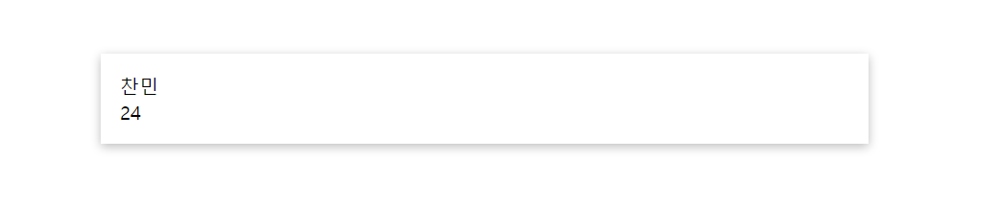

추석을 맞아 송편 대신 뷰를 찍먹해 봤다.

뷰는 리액트와 다른 점이 너무 많아 흥미로웠는데, 첫 번째로는 JSX처럼 자바스크립트로 HTML 문서를 만드는 게 아니라 기존 HTML 문서에 뷰를 끼얹는 방식이라는 것이었다.

그 과정에서 `v-model`, `v-bind` 처럼 괴상한 속성들도 많이 튀어나와 당황스러웠지만 차차 적응하면 뷰도 리액트처럼 재밌게 배울 수 있을 것 같다.

## 1. 뷰 설치하기

뷰는 설치과정부터 리액트와는 많이 다른 모습을 보여준다.  
Vue는 `create-react-app` 같은 npm 패키지에 의존할 필요 없이 HTML 문서에 스크립트 태그 형식으로 불러올 수 있는데, 여기부터 정말 큰 충격이었다.

- Vue 3.0 (2020년 10월 1일 기준)

```html
<script src="https://unpkg.com/vue@next" defer></script>
// defer 속성은 문서가 완전히 로드된 후 자바스크립트를 실행하도록 보장한다.
<script src="app.js" defer></script>
// app.js는 Vue 코드를 작성할 자바스크립트 파일
```

## 2. 뷰 시작하기

Vue 3.0 버전부터 이전 버전과는 많은 변화가 생겼는데, 이 글은 3.0 기준으로 정리했다.

우선 뷰는 `Vue.createApp()` 이라는 특별한 문법으로 시작한다.  
`createApp` 함수에는 앱을 구성하는 여러 요소가 포함되는데, 그 중 `data` **함수**[^1]를 먼저 만나보자.

리액트로 비유하자면 `data` 는 여러 상태(state)를 보관하는 함수로써 `data` 함수가 리턴하는 객체 안에 담긴 속성 - 값이 뷰의 상태가 된다고 보면 된다.

```js
// app.js
const app = Vue.createApp({
  data: function () {
    return {
      name: "찬민",
      age: "24",
    }
  },
})
app.mount("#user-info")
```

뷰에서 name과 age라는 초기 데아터를 정의한 모습이다.  
정의한 데이터를 사용하기 전에 코드의 가장 마지막 줄 `mount` 함수에 주목해 보자.

`mount` 함수 안에는 뷰로 제어할 요소의 CSS 선택자를 인자로 대입한다.

```html
<!-- index.html  -->
...
<body>
  <!-- 여기부터 -->
  <div id="user-info">
    <div>{{name}}</div>
    <div>{{age}}</div>
  </div>
  <!-- 여기까지가 Vue의 제어 범위 -->
  <script src="https://unpkg.com/vue@next" defer></script>
  <script src="app.js" defer></script>
</body>
...
```



중간에 중괄호가 보이는데, JSX를 만난 것 같아 반가웠지만 저건 JSX가 아니라 뷰의 **'보간법(interpolation)'** 이라는 문법이다. JSX와 많이 유사한 편이지만 HTML 요소 속성값으로는 사용할 수 없는 등 일부 제약이 있다.

## 3. 첫번째 뷰 속성

뷰 속성이란 `v-` 로 시작하는 HTML 요소의 속성들인데, 아마 리액트를 하던 사람들에게는 생소한 문법일 것이다.
뷰 속성을 통해 위에서 소개한 보간법을 속성값으로 사용할 수 없는 문제를 해결해 보자.

```html
<!-- index.html  -->
...
<body>
  <div id="link-info">
    <!-- href 속성의 값으로 보간법을 사용함  -->
    <p>네이버 <a href="{{link}}">(링크)</a></p>
  </div>
  <script src="https://unpkg.com/vue@next" defer></script>
  <script src="app.js" defer></script>
</body>
...
```

```js
// app.js
const app = Vue.createApp({
  data: function () {
    return { link: "https://naver.com" }
  },
})

app.mount("#link-info")
```

야심차게 배운 보간법을 사용해 a 태그의 링크 주소를 설정한 모습이지만 링크를 누르면 에러가 출력된다.  
속성의 값을 사용할 수 있게 해주는 뷰 속성은 `v-bind` 속성으로, 이걸 a 태그에 추가해 보자.

```html
<!-- index.html  -->
...
<body>
  <div id="link-info">
    <!-- v-bind를 통해 보간법을 사용할 때는 중괄호 없이 데이터 이름만을 사용한다. -->
    <p>네이버 <a v-bind:href="link">(링크)</a></p>
  </div>
  <script src="https://unpkg.com/vue@next" defer></script>
  <script src="app.js" defer></script>
</body>
...
```

이제 링크를 클릭하면 제대로 네이버 홈으로 이동하는 것을 볼 수 있을 것이다.  
이렇게 데이터를 HTML 속성에 묶어주는 `v-bind` 속성을 만나봤는데, 이외에도 다양한 속성들이 존재한다. ~~젠장~~

## 4. 메서드

정적인 데이터를 다룰 수 있게 되었으니, 이제 함수를 사용해 데이터를 조작해 보자.  
`createApp`에는 `data` 말고도 `methods`[^2] 라는 객체가 들어갈 수도 있는데, `methods` 객체는 사용할 함수들을 속성으로 가진다.

```js
const app = Vue.createApp({
  data: function () {
    return { name: "찬민", age: 24 }
  },
  methods: {
    changeName: function () {
      return "크리스"
    },
  },
})

app.mount("#user-info")
```

이렇게 `methods` 객체 안에 정의된 함수는 HTML에서 보간법을 통해 사용할 수 있다.

```html
<!-- index.html  -->
...
<body>
  <div id="user-info">
    <!-- 함수를 호출하고 있음 -->
    <div>{{changeName()}}</div>
    <div>{{age}}</div>
  </div>
  <script src="https://unpkg.com/vue@next" defer></script>
  <script src="app.js" defer></script>
</body>
...
```

또 함수에서 `data`에 정의된 데이터를 조작하고자 한다면 `this` 키워드를 통해 데이터에 접근할 수 있다.

원래대로라면 `this`가 가리키는 것은 해당 메서드를 호출한 객체여야 하겠지만 Vue의 내부적인 동작으로 인해 `this`가 가리키는 대상은 Vue가 제공하는 특수한 객체가 되고 이 안에 모든 `data`가 존재하기 때문이다.

```js
const app = Vue.createApp({
  data: function () {
    return { name: "찬민", age: 24 }
  },
  methods: {
    changeName: function () {
      this.name = "크리스"
    },
  },
})

app.mount("#app")
```

```html
<body>
  <div id="app">
    <div v-bind:onclick="changeName">{{name}}</div>
    <div>{{age}}</div>
  </div>
  <script src="https://unpkg.com/vue@next" defer></script>
  <script src="app.js" defer></script>
</body>
```

## 5. 뷰를 접한 감상

아직은 뷰를 정말 맛보기만 한 수준이라 뭐라 평가하기는 어렵겠지만 솔직히 마음에 드는 방식은 아니다.

왜냐면 개인적인 생각이지만, HTML에 `v-` 속성과 보간법 등의 뷰 문법을 사용함으로써 이제 이 HTML은 HTML도 아니고 자바스크립트도 아닌 애매한 상태가 되었다고 느껴지기 때문이다.

차라리 JSX처럼 전부 자바스크립트로 구성하던가.. ~~툴툴대기 + 1~~

어쩌면 이건 JSX에 너무 익숙해져 느껴지는 거부감일 수도 있겠지만, 아직은 더 배워봐야 알 것 같다.  
그래도 프론트엔드 라이브러리 3대장이라고 하니 배울 시간이 있을 때 열심히 배워보도록 하자. 😄

[^1]: `data` 함수는 다른 이름으로 정의할 수 없고, 언제나 객체를 리턴한다.
[^2]: `methods` 객체는 다른 이름으로 정의할 수 없고, 함수만을 속성으로 가진다.
