한국항공대 산학프로젝트를 진행하던 중, AWS 사용 비율이 낮다는 지적을 받아 S3를 사용할 곳을 찾고 있었습니다.

그러다 떠올린 것이 바로 S3을 활용해 유저 프로필 사진을 업로드하는 기능을 추가할 수 있게 하면 어떨까라는 생각을 하게 되어 바로 제작에 들어갔습니다.

<figure>
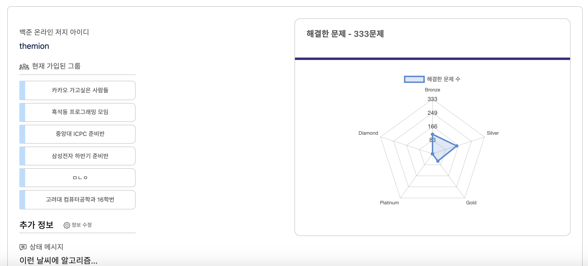
<figcaption>유저 정보 페이지인데, 아무래도 조금 휑해 보입니다.</figcaption>
<figure>

## ⚙️ AWS S3 설정하기

S3 사용 순서는 크게 [정책 / 역할 설정] - [Cognito로 접근 권한 부여] - [S3 버킷 퍼블릭 설정] - [클라이언트 코드에서 SDK로 접근] 단계로 나뉩니다.

## 1. IAM에서 역할 설정하기

먼저, 정책을 생성하기 위해 IAM 메뉴에 들어옵니다.

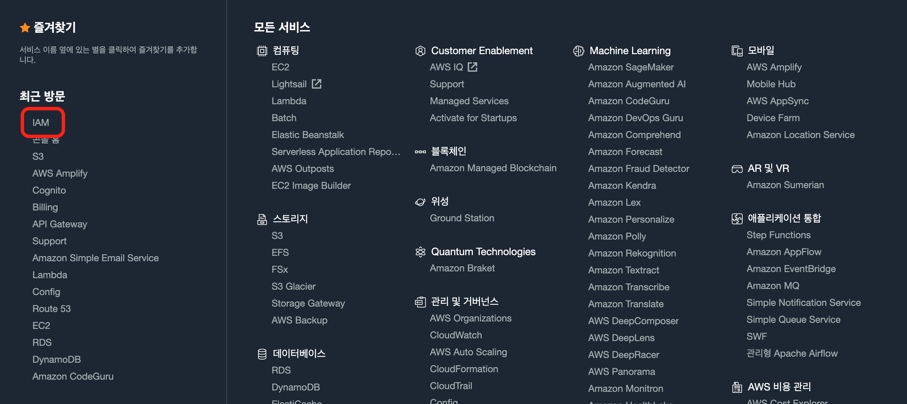

IAM 메뉴에서는 AWS 서비스에 접근할 수 있는 권한을 부여할 수 있는데요, [역할] 이라는 메뉴로 들어간 후 중앙의 [역할 만들기]를 선택합니다.

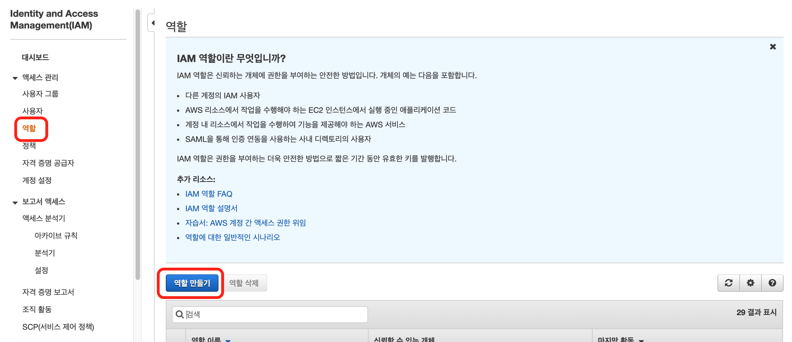

[역할 만들기] 를 선택했다면 하단의 AWS 서비스 목록에서 S3를 선택하고, 사용 사례 역시 S3를 선택합니다.

###### (S3 Batch Operations가 아닙니다!)

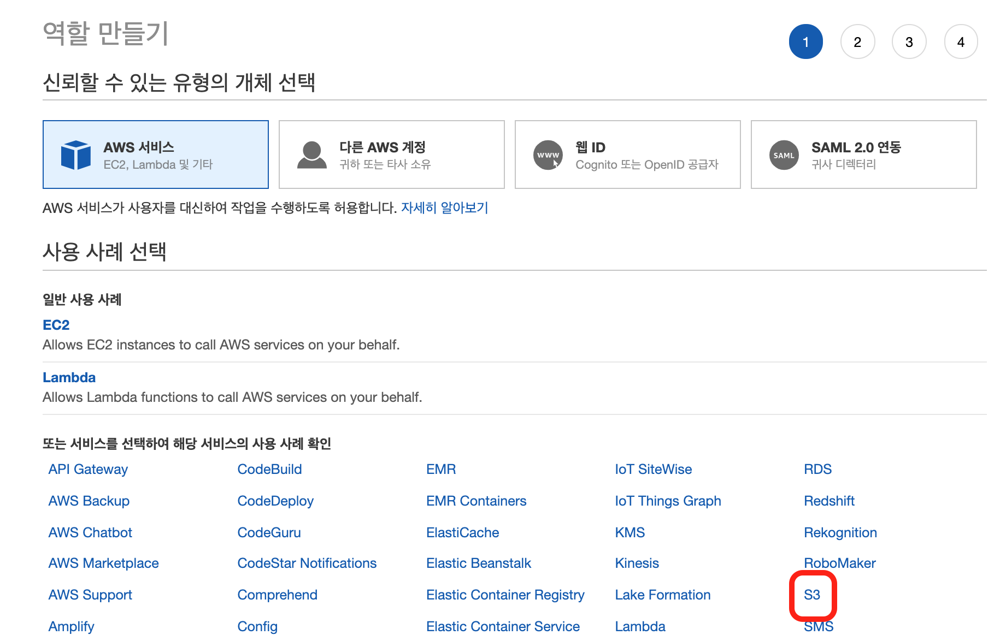

다음은 권한 정책을 검색해 지정합니다.  
이번에는 S3 버킷(저장소)를 자유롭게 읽고 쓸 수 있는 "AmazonS3FullAccess" 정책을 사용하겠습니다.

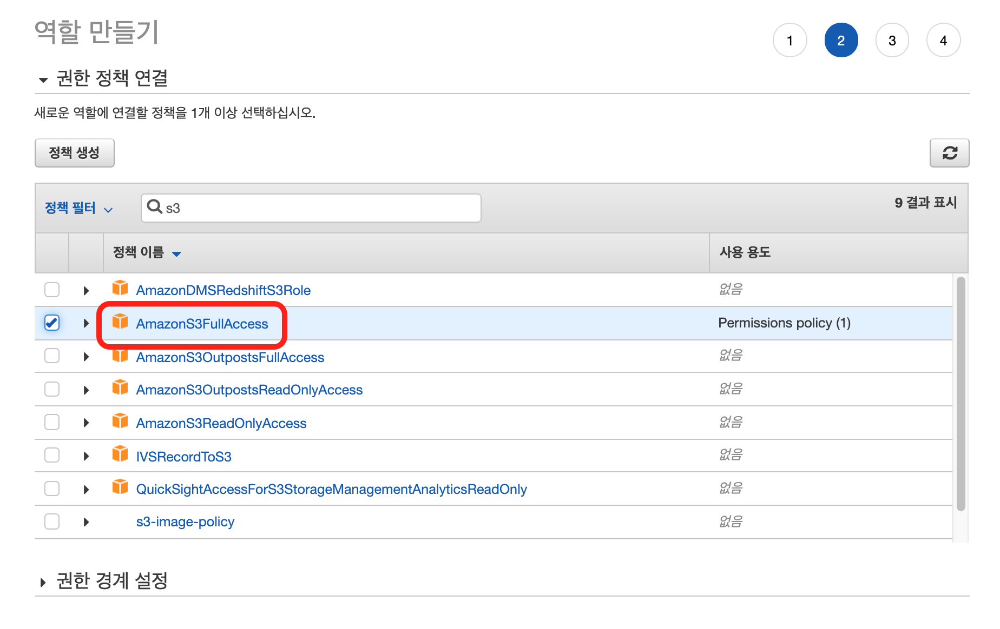

[태그] 부분은 건너뛰고, 역할 이름을 지정해줍니다.

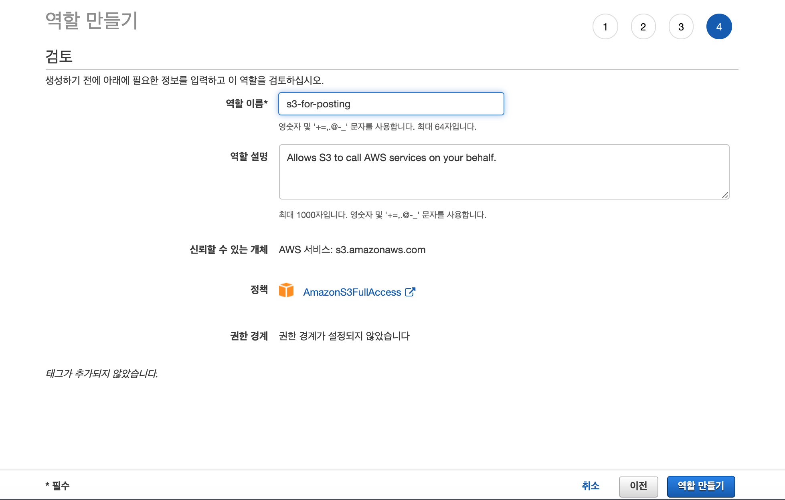

역할 이름까지 지정했다면 이제 첫 번째 단계는 끝났습니다.

## 2. Cognito로 접근 권한 부여하기

다음은 Cognito 메뉴를 찾아 진입합니다.

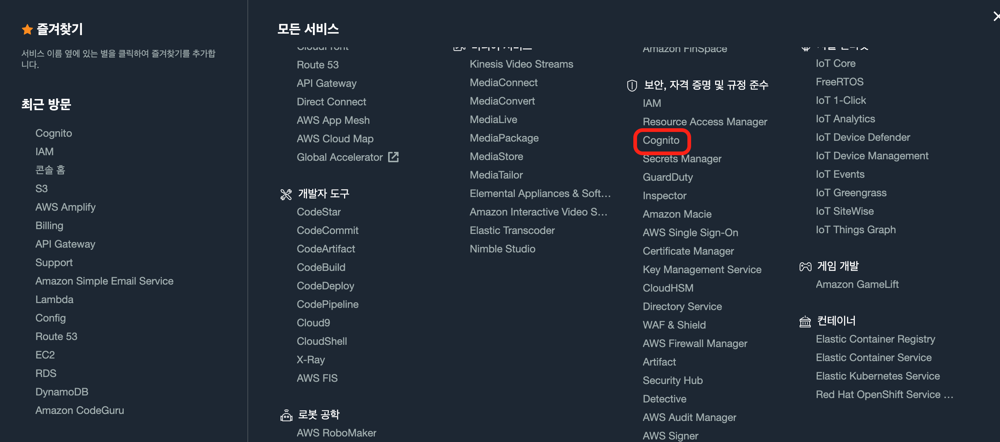

오른쪽 [자격 증명 풀 관리] 를 선택합니다.

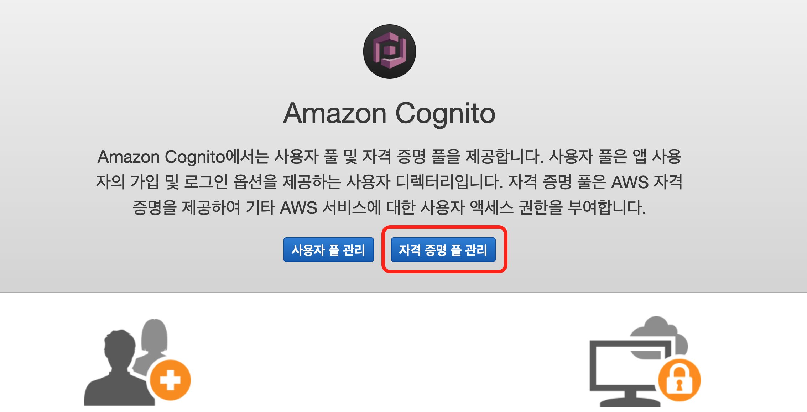

새 자격 증명 풀을 생성하는데, 두 번째 [인증되지 않은 자격 증명] 에는 꼭 체크합니다!

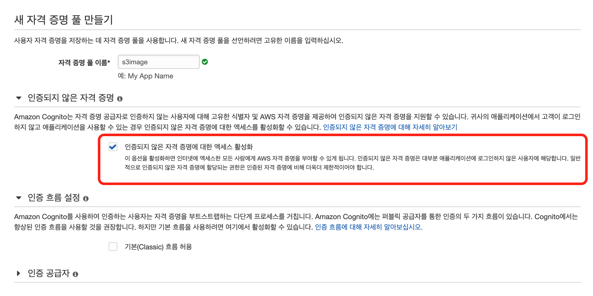

[풀 생성] 을 클릭하면 [세부 정보 보기] 라는 탭이 등장하는데, [정책 문서 숨기기] - [편집]을 눌러 다음 JSON으로 교체합니다.

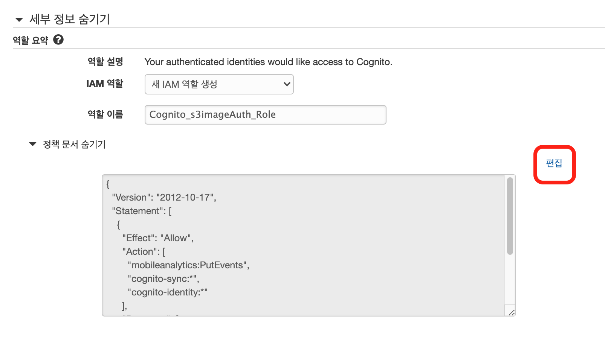

```json
{
  "Version": "2012-10-17",
  "Statement": [
    {
      "Effect": "Allow",
      "Action": ["cognito-sync:*", "cognito-identity:*", "s3:*"],
      "Resource": ["*"]
    }
  ]
}
```

Cognito 설정이 끝났다면 이제 S3 버킷(저장소)에 접근할 수 있는 자격 증명 키를 얻게 됩니다.
클라이언트에서 S3에 접근할 때 IdentityPoolId 값이 필요하므로, 값을 따로 보관해두셔야 합니다.

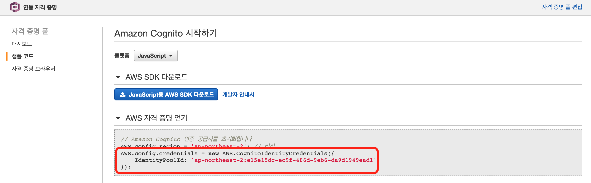

## 3. S3 버킷 설정하기

S3 저장소는 최대 1년간 5GB까지 무료로 사용할 수 있습니다.
[S3] 메뉴에 진입한 뒤, [버킷 만들기] 버튼을 눌러줍니다.

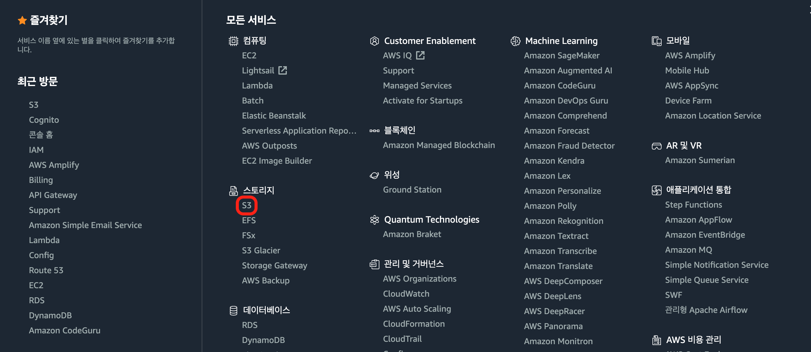

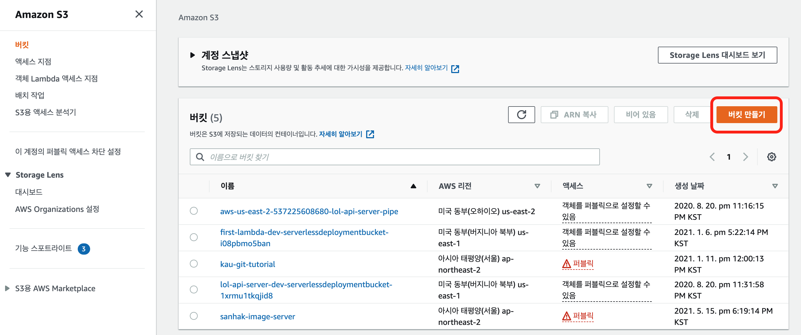

버킷 이름을 정해야 하는데, 버킷 이름은 전 세계에서 하나밖에 없는 고유한 이름이어야 합니다.

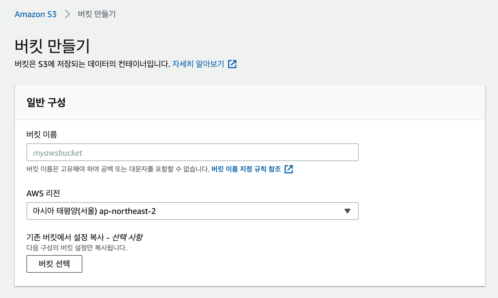

그리고 외부에서 버킷에 접근할 수 있도록 [모든 퍼블릭 액세스 차단] 설정을 **해제**합니다.

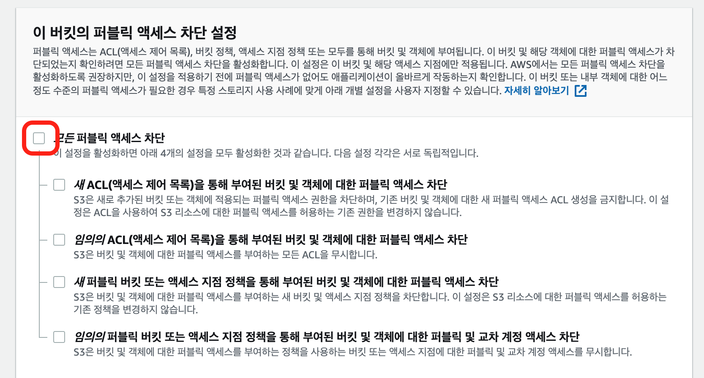

이제 버킷이 생성된 모습입니다.  
다만 아직 외부에서는 완전히 사용할 수 없는데요, [권한] 탭을 선택합니다.

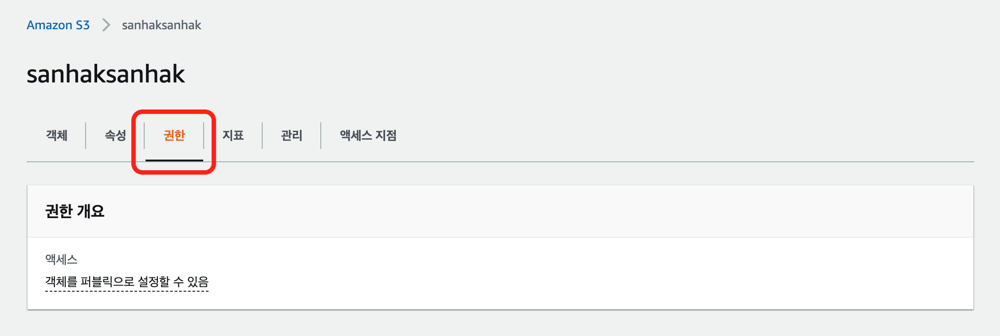

버킷을 퍼블릭으로 전환하기 위해 정책 편집을 누르고, 아래 JSON을 붙여넣습니다.

###### (Resource 중 [버킷 이름] 에는 접근할 버킷 이름을 작성합니다.)

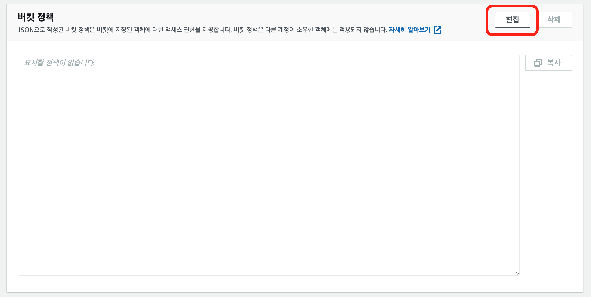

```json
{
  "Version": "2012-10-17",
  "Statement": [
    {
      "Sid": "AddPerm",
      "Effect": "Allow",
      "Principal": "*",
      "Action": "s3:*",
      "Resource": "arn:aws:s3:::버킷 이름/*"
    }
  ]
}
```

이제 버킷이 퍼블릭으로 전환되었을텐데, 마지막으로 최하단의 [CORS] 속성을 편집해 아래 JSON을 붙여넣습니다.

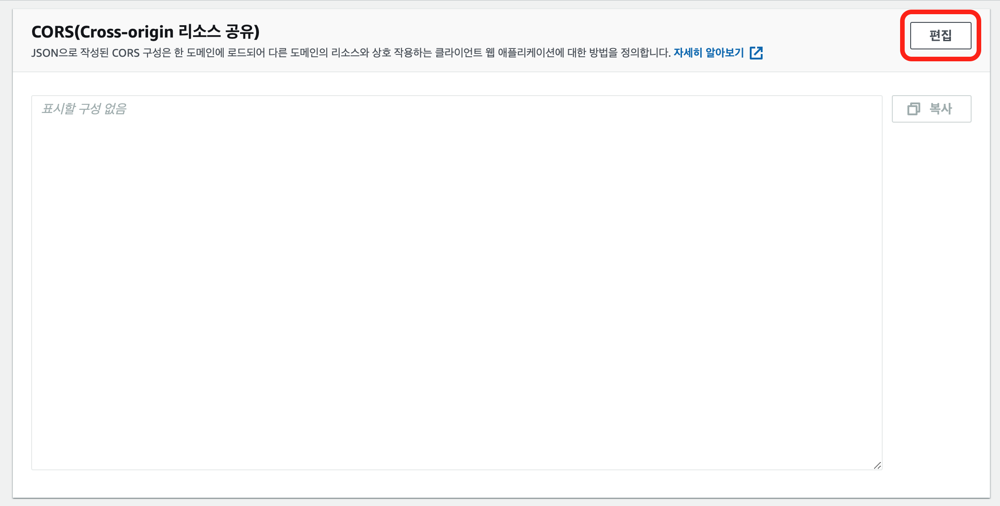

```json
[
  {
    "AllowedOrigins": ["*"],
    "AllowedMethods": ["GET", "PUT", "POST", "HEAD"],
    "AllowedHeaders": ["*"],
    "ExposeHeaders": [
      "x-amz-server-side-encryption",
      "x-amz-request-id",
      "x-amz-id-2"
    ],
    "MaxAgeSeconds": 3000
  }
]
```

S3가 퍼블릭으로 전환되었는지 확인하기 위해 이미지를 하나 업로드하겠습니다.

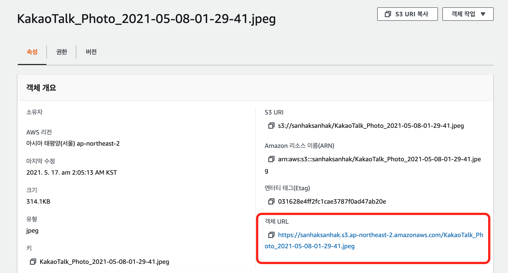

이미지를 선택한 후, [객체 URL]을 클릭했을 때 이미지가 나타난다면 S3를 외부에서 접근할 수 있는 상태가 된 것입니다!


클라이언트에서 S3에 이미지를 업로드하는 과정은 다음 글에서 이어서 작성하겠습니다. 😁
