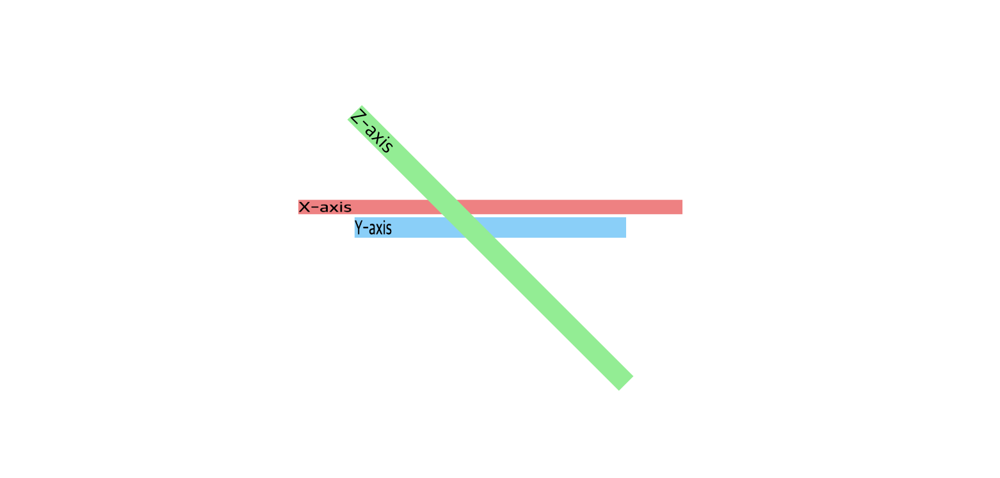
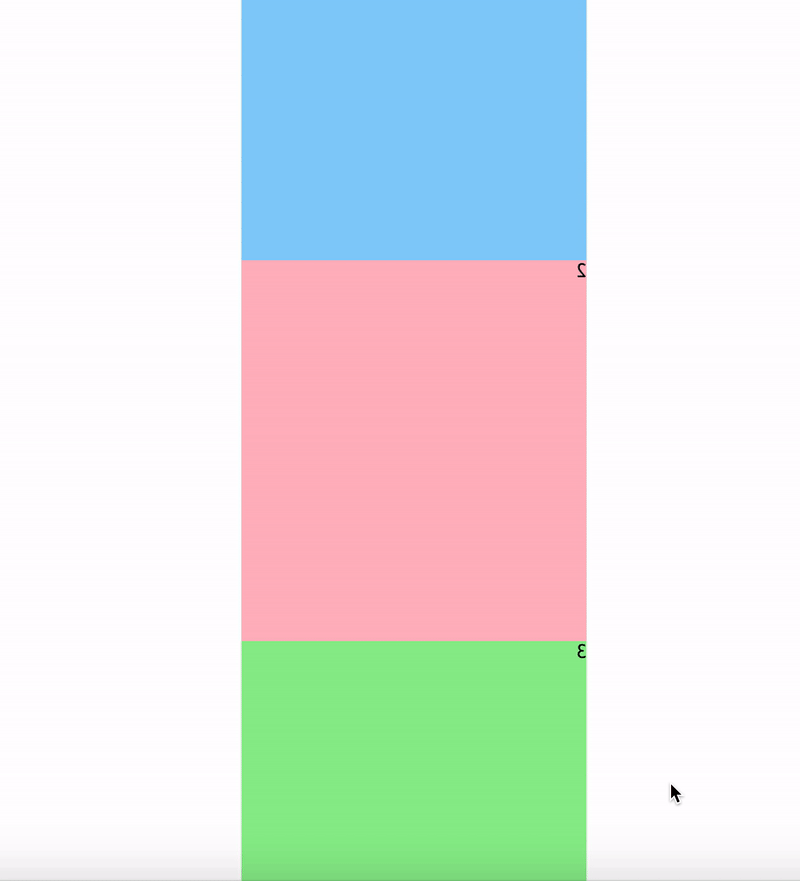
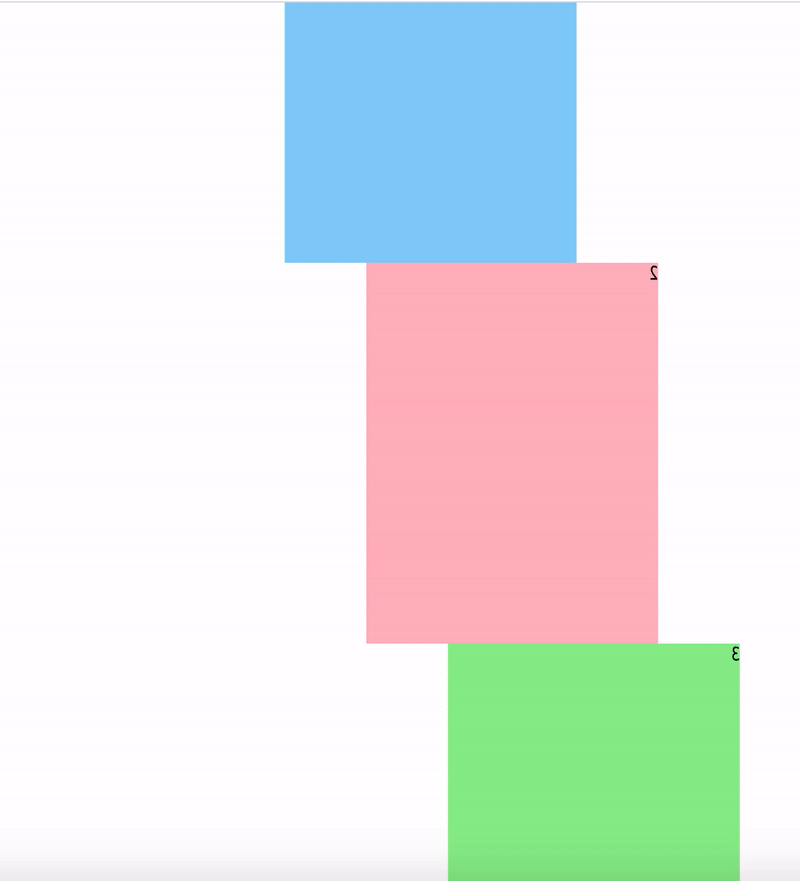

CSS의 transform 속성을 활용하면 이미지나 요소를 x, y, z축으로 움직일 수 있습니다.



그런데 평면상의 이동을 넘어서 마치 3D 화면을 보는 것처럼 꾸밀 수 있는 것도 알고 계셨나요?  
오늘은 `transform-style` 이라는 속성을 가볍게 다뤄보도록 하겠습니다.

## 우리가 보는 화면은 납작해!


<figcaption>1. 우리가 생각하는 원기둥 / 2. 원기둥을 바로 앞에서 보았을 때</figcaption>

공책에 원기둥을 그린 후 공책을 빙글빙글 돌려 보세요.  
혹시 원기둥의 뒷면을 볼 수 있나요? <span style = "font-size: 0.88rem">(만약 보셨다면 인증샷을 부탁드립니다.)</span>

당연한 이야기지만 평면의 종이에서는 삼차원의 물체를 다룰 수 없는데요, CSS에서는 공책과 달리 삼차원을 활용할 수 있는 방법이 존재합니다.  
먼저 코드로 예제를 만나보겠습니다.

```html
<!-- index.html -->
<!DOCTYPE html>
<html lang="en">
  <head>
    <meta charset="UTF-8" />
    <meta name="viewport" content="width=device-width, initial-scale=1.0" />
    <link rel="stylesheet" href="style.css" />
    <script src="index.js" defer></script>
    <title>Document</title>
  </head>
  <body>
    <div class="container">
      <div class="first">1</div>
      <div class="middle">2</div>
      <div class="back">3</div>
    </div>
  </body>
</html>
```

```css
/* style.css */
body {
  height: 100vh;
  display: flex;
  justify-content: center;
  align-items: center;
}

.container {
  /* 이 부분은 임의로 비워둔 상태입니다. */
}

.first {
  width: 300px;
  height: 300px;
  background-color: lightskyblue;
  transform: translateZ(50px);
}

.middle {
  width: 300px;
  height: 300px;
  background-color: lightpink;
  transform: translateZ(150px);
}

.back {
  width: 300px;
  height: 300px;
  background-color: lightgreen;
  transform: translateZ(250px);
}
```

```js
// index.js
const container = document.querySelector(".container")
let degree = 5

setInterval(() => {
  container.style.transform = `rotateY(${(degree += 5)}deg)`
}, 50)
```



이 코드를 실행하면 알록달록한 사각형들이 춤추는걸 볼 수 있습니다.  
그런데 뭔가 이상하지 않나요? 분명 `translateZ()` 로 인해 요소들의 Z축이 구분되어야 할 텐데, 이건 그냥 공책을 회전시키는 것 같네요.  
이제 위의 CSS 코드에서 딱 한 줄만 수정해봅시다.

```css
.container {
  transform-style: preserve-3d;
}
```

`transform-style` 은 3D 공간에서 자식 요소들을 렌더링하는 방법을 결정하는데요, 기본값은 '납작한' 이라는 의미의 `flat` 입니다.  
이와 반대로 3D 렌더링을 결정하는 값이 `preserve-3d` 으로, 이를 사용하면 해당 컨테이너 영역을 삼차원 영역으로 활용하게 됩니다.



Z축을 반영해 요소들이 3차원으로 렌더링되고 있는 모습입니다!  
이를 응용하면 눈이 휘둥그레지는 효과를 연출할 수도 있는데요, 이 [블로그의 소개 페이지](https://c17an.netlify.app/Setting)도 3차원 효과를 사용해 만들어졌습니다. 😆

하지만 아쉽게도 IE~~'그 브라우저'~~에서는 아직 지원되지 않으니 실제 사용 시에는 이 점에 유의하시면 되겠습니다.  
끝으로 CSS로 3D 효과를 연출하는 방법이 더 자세히 궁금하다면, [KimJaeHee님 블로그](https://webclub.tistory.com/486) 포스팅을 읽어 보시는 것도 추천드립니다!
