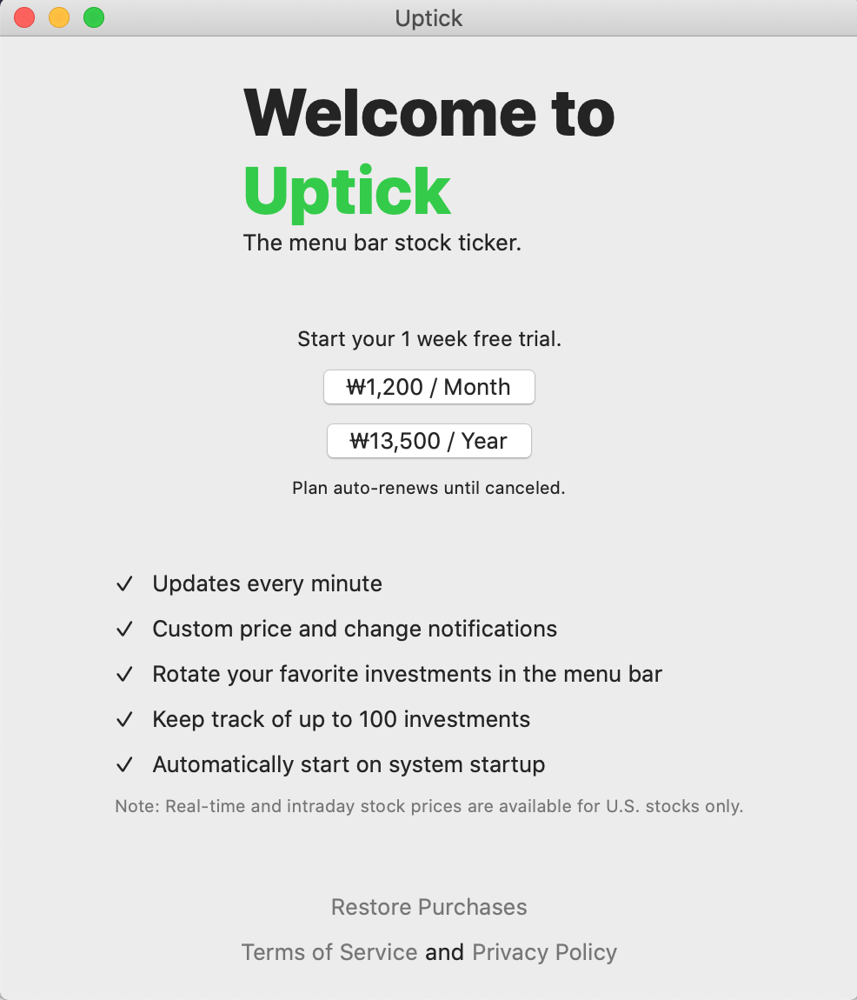
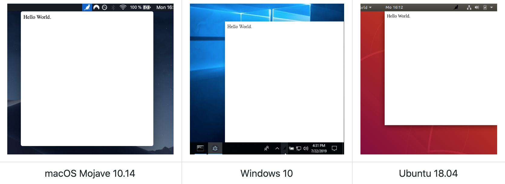
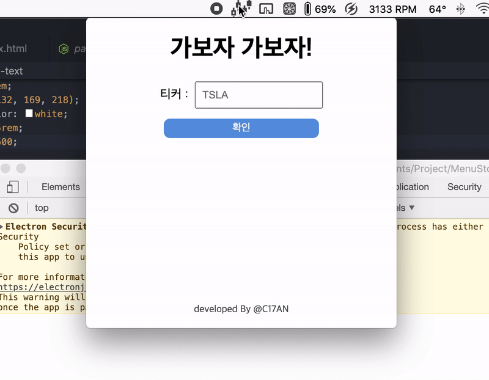

#### [[MenuStock, 데스크탑 종가 확인 어플리케이션 - 깃허브 저장소 링크]](https://github.com/C17AN/MenuStock)

평소에도 주식에 관심이 많아 주식앱을 자주 들여다 보는데, 한국투자증권 앱은 매번 켤때마다 비밀번호를 입력해야 하는게 너무 귀찮았다.  
그래서 맥 상단바에 내가 원하는 종목의 시세를 즉시 조회할 수 있는 어플리케이션이 있으면 참 좋겠다고 생각해 앱 스토어를 뒤지기 시작했다.

<div style = "width: 300px; margin-left: auto;
  margin-right: auto;">

</div>

###

의외로 쉽게 내가 생각하는 앱을 찾을 수 있었는데 어흑 마이 깟! 매달 돈을 내야 하는 것이었다. (- -)

아무리 적은 금액이라 해도 이것 때문에 매달 돈을 내고 싶지는 않아 직접 만들기로 했고, 결론부터 소개하자면 실패로 돌아가게 되었다.

## 실패의 원인 - API는 공짜가 아니라구!

<p>

</p>

현재 주가 정보를 얻기 위한 API를 열심히 찾아봤는데, 예상 외로 주식 API를 무료로 제공하는 곳은 거의 없었다.

###

그러다 우여곡절 끝에 찾은 [alphavantage](https://www.alphavantage.co/documentation/) 라는 서비스의 `TIME_SERIES_INTRADAY` API를 사용해 타임라인에 따른 주가 정보를 불러올 생각이었지만, **개발 도중** 이 API 역시 실시간으로 데이터를 불러오는 것이 아니라 장이 닫힌 후에 전일 타임라인 주가 데이터를 제공하는 방식이라는 것을 알고 패닉에 빠졌다.

그렇다고 삽을 뜬 저장소를 버리긴 아까워 밥이 아니라면 죽이라도 만들어보자는 생각에 실시간 주가가 아닌, 전일 종가를 알려주는 앱이 탄생하게 되었다.

## 프로젝트 세팅

<p>

</p>

우선 이런 상/하단바 어플리케이션을 **menubar app** 이라고 부른다.  
일렉트론은 익숙한 브라우저 API가 아닌 일렉트론 내장 모듈이나 Node.js 내장 모듈을 사용해야 할 일이 많아 처음부터 직접 구현하기보다는 [좋은 보일러플레이트 코드](https://github.com/maxogden/menubar)를 활용하는 것이 낫다고 판단했는데, 덕분에 화면 개발에만 집중할 수 있게 되어 개발 시간을 많이 단축할 수 있었다.

## 난관 - 또 너냐 API

가뜩이나 요상한 API를 사용하게 되었다는 점에서 화가 잔뜩 나있는데, 여기에 불을 지피는 사건이 발생했다.

```json
{
  "Meta Data": {
    "1. Information": "Intraday (1min) open, high, low, close prices and volume",
    "2. Symbol": "actc",
    "3. Last Refreshed": "2021-01-13 20:00:00",
    "4. Interval": "1min",
    "5. Output Size": "Compact",
    "6. Time Zone": "US/Eastern"
  },
  "Time Series (1min)": {
    "2021-01-13 20:00:00": {
      "1. open": "23.0000",
      "2. high": "23.0000",
      "3. low": "23.0000",
      "4. close": "23.0000",
      "5. volume": "695"
    }
  }
}
```

API 요청 결과로 불러온 JSON 키값이 띄어쓰기에 특수문자에.. 참 활용하기 어렵게도 만들어져 있었던 것이다.  
(저걸 받아본 후 공공데이터가 선녀로 보이기 시작했다. --)

```js
async function fetchData() {
  try {
    await fetch(URI, {
      method: "GET",
    })
      .then(res => res.json())
      .then(data => {
        for (let key in data) {
          fetchedData = { ...fetchedData, [key]: data[key] }
        }
        metaData = fetchedData["Meta Data"]
        timeLine = fetchedData["Time Series (1min)"]

        const latest = Object.keys(timeLine)[0] // 장 종료시간
        const price = timeLine[latest]["1. open"]
        attach(symbol, price)
      })
  } catch (error) {
    console.error(error)
    return error
  }
}
```

아무튼 이 요상한 키값을 처리하기 위해 `computed property name`과 `Object.keys()`를 적극적으로 활용해야만 했는데, 어떻게 보면 ES6 문법을 연습하는데 도움이 되었던 것 같기도 하다.

## 왜 순조롭지? - 생각보다 간단한 electron 후기

원래 뭐든 개발하다 보면 에러와 한숨이 끊이질 않기 마련인데 이번 결과물은 이상할 정도로 순탄하게 끝났다.  
일렉트론은 어플리케이션을 조작하는 부분과 화면을 담당하는 부분이 완전히 분리되어 있는데, 이번에는 어플리케이션 부분을 보일러플레이트를 사용하다 보니 큰 어려움 없이 화면과 API 요청 처리에만 집중할 수 있었던 것 같다.



실시간 데이터 수집에는 실패했지만, 그래도 나중에 일렉트론을 활용해 데스크탑 어플리케이션을 제작하는 데에 거리낌없이 도전할 수 있을 것 같다.
