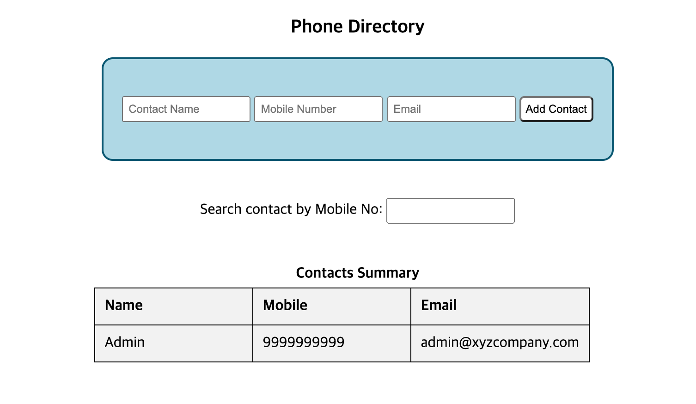

우연히 페이스북 생활코딩 그룹에서 멀티캠퍼스 주관 프론트엔드 코딩 테스트가 열린다는 정보를 얻었다.  
[프로그래머스 프론트엔드 과제관](https://programmers.co.kr/skill_check_assignments/4)에서 한번 뜨겁게 데어본 적이 있었지만, 그래도 맞으면서 크는 거라는 생각으로 무작정 지원했다.

문제에 대한 엠바고나 저작권에 대한 언급은 없어 차후 대회 참여자들 및 다른 프론트엔드 코딩 테스트를 응시하는 사람들을 위한 후기를 남겨보려 한다.

## 이번 코테는 어떤 코테였나요?

총 6문제(알고리즘 \* 2 + 프론트엔드 \* 2 + 자바스크립트 + REST API) 가 출제되었으며 이 중 화면단을 직접 개발하는 과제 문제는 두 문제였다.  
3시간동안 나는 프론트엔드 과제 하나만을 해결할 수 있었는데, 아마 HTML table에 관한 내용이 부족해 시간을 많이 뺏긴 것이 패인같다.

내가 푼 문제를 기준으로 설명하자면 CSS와 HTML 뼈대는 모두 주어진 상태이고 조건에 맞는 자바스크립트 코드를 작성하면 된다.  
다만 위에서 잠깐 언급한 프로그래머스 프론트엔드 과제와는 달리 HTML과 CSS에 대한 문제는 하나도 없이 100% 기능 구현 문제만 출제되었다.



- **요구사항 1.** 폼에 이름 / 전화번호 / 이메일을 입력하고 Add Contact 버튼을 클릭하면 아래 테이블에 정보를 추가할 것
- **요구사항 2.** 폼에 입력된 정보의 유효성을 검사할 것 (이름은 알파벳 / 숫자 조합, 전화번호는 숫자 only, 이메일 유효한지 검사)
- **요구사항 3.** 하단 표에서 Name 을 클릭할때마다 표를 오름/내림차순으로 정렬할 것
- **요구사항 4.** 검색창에 전화번호를 입력할때마다 해당 부분 문자열을 포함한 전화번호 행만을 출력할 것

요구사항을 대강 훑어보면 알겠지만 자바스크립트를 우아하게 사용하기보다는 '자바스크립트로 DOM을 조작할 수 있느냐?' 가 주 문제였는데, 구조 분해 할당도 마음껏 해보고 `fetch`로 api로 불러와서 클라이언트에 쏴보고 어렵지만 모던한 코드를 짜보고 싶었던 내게 살짝 아쉬움이 느껴졌다.

## 느낀 점 및 약간의 팁?

### 1. 알고리즘은 기본!

처음 공지사항에서는 프론트엔드 유형이라고 해서 화면 개발 과제만 주어질 줄 알았지만 역시 알고리즘 빔은 피할 수 없었다. (--;)  
단순히 코테를 위해서뿐만 아니라 **"하단 표에서 Name 을 클릭할때마다 표를 오름/내림차순으로 정렬할 것"** 이라는 요구사항을 해결할 때도 순간 어떻게 이걸 구현해야 할지 막막했는데, 바로 이번 학기에 알고리즘 강의를 들었다는 걸 생각하면 정말 부끄러운 일인 것 같다.

알고리즘 ≈ 개발 그 자체 라 생각하고 조금 더 진지하게 공부해야겠다 (--)

### 2. 기본기에 충실하자

항상 리액트나 노드같은 라이브러리에 의존하다 보니 HTML에서 사용되는 자바스크립트에서는 어떻게 다른 모듈을 불러와야 할지 몰라 첫 15분을 그대로 허비했다. 처음에는 `type=module` 속성 지정, `import` 사용 등 별짓을 다 해봐도 계속해서 오류가 출력되는 걸 보고 패닉에 빠졌는데, 곧 `import` 없이 그냥 사용하면 되는걸 깨닫고 현타에 빠졌던 기억이 난다.

```html
<head>
  <!-- 후에 로드된 script.js에서는 별도의 import 없이도 search.js의 함수 및 변수를 사용할 수 있다. -->
  <script src="./js/search.js" type="text/javascript" defer></script>
  <script src="./js/script.js" type="text/javascript" defer></script>
</head>
```

아직까지 개발 코테 경험이 충분하지는 않지만, 이것저것 주워들은 결과로 입사과제 전형이 아니라 '개발 코딩 테스트' 에서는 리액트나 별도의 라이브러리 사용을 제한하고 바닐라 자바스크립트 활용에 무게를 싣는 것 같다. 혹시라도 JSX에 너무 익숙해져 있다면, [모던 자바스크립트 튜토리얼](https://ko.javascript.info/) 이라는 훌륭한 사이트에서 파트 2. 브라우저 부분을 훑어보면서 DOM 조작을 연습하면 많은 도움이 될 것 같다.

### 3. 최대한 빨리 페이스를 되찾자!

내가 느낀 알고리즘과 개발 코테의 큰 차이중 하나는 개발 코테는 '페이스가 말리기 쉽다' 는 것이다.  
DP, DFS 등 푸는 유형이 어느정도 고착화된 알고리즘과는 달리 개발 코테는 항상 새로운 문제가 나올 가능성이 높기 때문에 처음 문제를 받아보면 당황할 수밖에 없다. (또한 요구사항이 한두가지가 아니다!)

게다가 익숙한 로컬 IDE가 아닌 반응속도도 약간 늦고 뭔가 답답한 웹 IDE를 사용하다 보면 저절로 압박이 될 수밖에 없는데, 초반 10분정도는 심리적으로 최대한 빨리 안정을 찾기 위해 느긋하게 문제를 읽어보면서 색상 테마부터 prettier 설정 등 내게 익숙한 환경을 구축하는 것을 추천한다.
