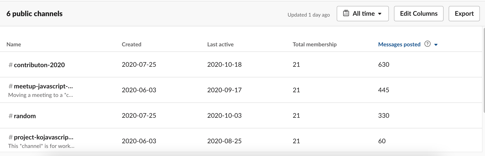
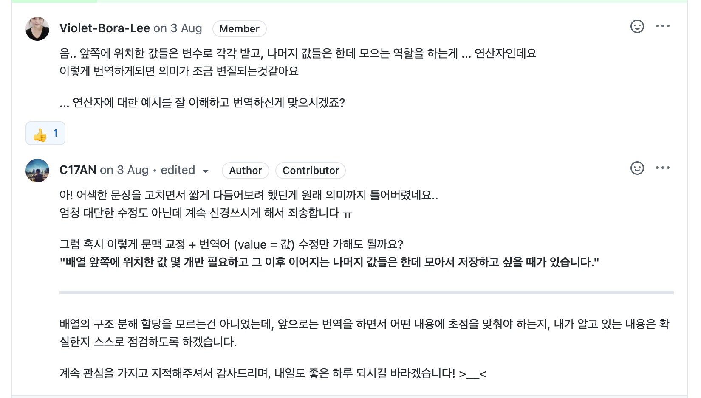
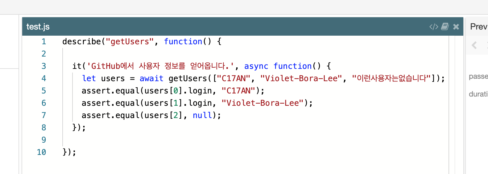
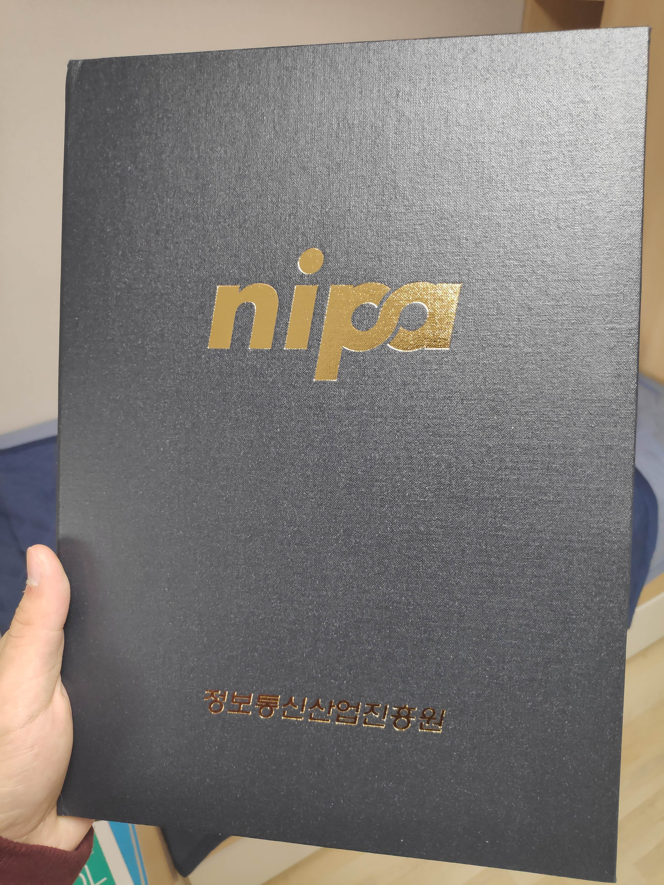
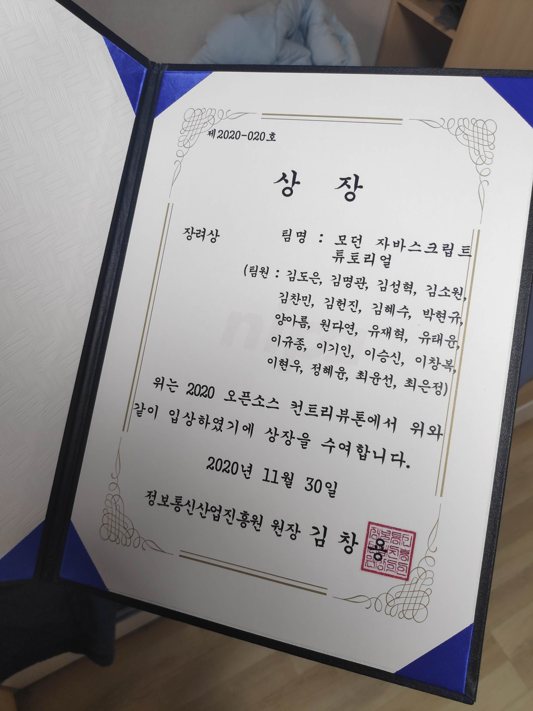

이번 학기에 겪은 가장 큰 이벤트지만 그간 바빠서 정리하지 못했던 컨트리뷰톤 이야기를 해보려 한다.  
컨트리뷰톤을 간단히 소개하자면 마음에 드는 프로젝트에 지원해 선발되면 ~~혹독한~~ Git 교육을 마치고 한 달간 오픈소스 프로젝트에 기여하게 되는 활동이다.[^1]

내가 지원한 그룹은 ["모던 자바스크립트 튜토리얼 번역"](https://ko.javascript.info/) 팀이었는데, **chromium** 이나 **flutter** 같은 주제는 깊게 다뤄본 적이 없기도 하고 내가 공부하면서 참고하던 위키에 직접 기여하는건 일종의 영광이라 생각해 주저없이 자바스크립트 팀에 지원했던 것 같다.

## Git을 써 봅시다. 제대로!

8월 초부터 활동이 시작되기 때문에 7월 말에 전체 멘티를 대상으로 한 Git 교육에서 적잖은 충격을 받은 게 기억난다.  
컨트리뷰톤 이전에는 깃을 써도 `git add .` / `git commit -m "블라블라"` / `git push origin master` 가 내가 쓰던 명령어의 90%을 차지하고 있었으나 교육 과정에서 첫 번째 `Pull Request`와 `merge`를 경험하면서 완전히 새로운 맛(?) 을 느낄 수 있었다.

새로운 배움의 맛이란...

물론 교육이 한번에 끝난 건 아닌데 이 내용은 후술하도록 한다.

## 팀을 만나다, 그리고 다시 Git

아마 8월 1일 토요일이 팀원들과의 첫 번째 온라인 미팅이었던 걸로 기억한다.  
아무래도 다른 현업 개발자들과 날고 기는 일반 멘티분들 사이에서 긴장이 된 탓이었을까 자기소개를 나누면서 든 생각은 호기심 25%, 두려움 75%였다.  
그리고 공포로 가득한 소개가 간략하게 마무리되고 멘토님이 프로젝트 설명과 함께 앞으로 준비해야 할 것들을 간략하게 설명해주시는 시간이 있었는데, [learnGitBranching](https://learngitbranching.js.org/?locale=ko)[^2] 이라는 사이트의 예제를 모두 연습하고 익숙해져야 한다는 말을 듣고 더 큰 폭풍이 다가오는 것을 느낄 수 있었다.

    

비밀) 사실 체리픽은 아직도 못쓴다.

컨트리뷰톤이 마무리되기 거의 직전까지도 멘토님의 매콤한 화상 강의를 들으면서 깃을 다루는 법을 배울 수 있었는데 개인적으로 상이나 명예 이런걸 떠나 컨트리뷰톤 기간동안 깃을 깃답게 다룰 수 있게 된 이 때의 배움이 가장 값진 보상이라고 생각한다.

## 슬랙은 이렇게 쓰는 거구나

COVID-19로 인한 여파로 활동의 90%가 온라인으로 진행되는 동안 온라인이라는 어둠 속에서 가장 빛을 발한 도구는 뭐니뭐니해도 슬랙이었다.  
이전에도 슬랙을 몇 번 써봤을때 들었던 생각은 "카카오톡이랑 그래서 특별히 다를 게 있나..? 개발자 감성..?" 정도였지만 이번 기회에 슬랙을 써보면서 카톡과는 확실히 다른 슬랙만의 장점들도 두루 느낄 수 있었고, 스레드나 채널 분리 등 다양한 기능을 100% 활용해본 이 때의 경험도 기억에 남는다.

이땐 슬랙을 카톡만큼 많이 했었는데...

## 즐거운 주간 회고, 하지만 약간 아쉬운

컨트리뷰톤 기간동안 또 재미있던 건 "주간 회고" 시간이었는데, 격주의 미팅마다 그간 진행한 개인 프로젝트나 흥미롭게 공부한 내용을 팀원들과 공유하는 매우 귀중한 시간이었다. 이 시간을 통해 현업 개발자분들은 어떤 고민을 하고 있는지, 어떤 기술에 주목하고 있는지 등 살아있는 정보를 많이 접할 수 있었고, 나도 내가 진행하던 이것저것 프로젝트들을 소개하고 싶었으...나!

아쉽게도 내 부족한 말주변 때문에 내가 생각한 100%를 어필하는데 실패하는 바람에 다음 회고 시간에는 만반의 준비를 마치고 보여주려 했지만, 컨트리뷰톤 후반으로 갈수록 빡빡해지는 일정으로 인해 다음 주간 회고 코너는 없었다는 슬픈 전설이 내려온다.
그래도 이렇게 나의 개발 경험을 남들과 공유하는 것이 정말 즐거운 시간이었고, 이러한 기술 및 개발 경험 공유 문화는 대학 동기들에게 퍼뜨리려고 노력 중이다.

## 본격적인 번역 - 모범사례 읽고 오세요 \* 100

본격적으로 번역을 진행하는 방식은 먼저 저장소에 내가 작업할 내용에 대한 이슈를 남긴 후 로컬 저장소에서 번역을 진행하고 메인 저장소로 PR을 날려주면 그걸 멘토님이 리뷰 & 머지하는 방식이었다. 이렇게 말로 하면 쉽지만 사실은 굉장히 머리아픈 작업이었는데, 우선 "번역" 이라는 작업이 내 생각만큼 호락호락하지 않았다.

번역에 필요한 모든 단어와 컨벤션이 별도의 문서(이걸 '모범사례' 라는 문서로 따로 관리할 정도였다)에 적혀 있었고, 이 가이드라인에서 조금이라도 어긋나면 서릿발같은 리뷰와 함께 칼같이 `changes needed` 라는 라벨이 붙는다. 물론 그만큼 수도 없이 강조한 내용이었지만... 이게 번역하는 내용의 난이도도 난이도지만 양이 은근히 되다 보니 나도 모르게 놓치는 부분도 있었고 뉘앙스가 어긋나 완전히 다른 번역이 되어 버린 불상사가 생긴 적도 있을 정도로 쉽지 않은 시간이었다.

이게 첫 번째 번역 후 받은 리뷰였는데, 솔직히 무서워서 어쩔 줄을 몰랐었다. 😆

아무튼 이렇게 몇 번 리뷰를 받아보니 번역이라는 것이 수능특강 문제를 푸는 것마냥 적당히 문서를 한국말로 바꾸는 것이 아니라, 정말 모두가 보는 반 공식 문서를 만들어내는 작업이라는 것이 실감됐다. 혹시 향후 컨트리뷰톤 중 모던 자바스크립트 번역 프로젝트에 참여할 계획이 있다면 참여하기 전에(멘티로 선발되기 전에) 간단한 문장 한두개라도 번역 PR을 날려 보면서 번역 프로세스를 체험해 보는 것을 적극 추천한다.

## 번역, 그리고 머지

모든 작업에는 끝이 있듯이 번역에도 끝이 있다.  
내가 번역한 내용이 리뷰를 마치고 실제 프로젝트에 반영되어 ko.javascript.info 에 올라오게 되면 정말 이 기분만큼은 뭐라 설명이 안된다.  
물론 이런 경험이 처음이기도 하고 내가 쉽게 감동받는 스타일이라 그런가, 번역한 예제 문제가 머지되었다는 메일을 받아봤을 때 정말 세상에서 제일 행복했던 기억이 난다.

<a href = "https://ko.javascript.info/fetch">fetch</a> 문서 중, 과제를 풀러 들어가면 테스트케이스에 내 깃허브 아이디가 있다! 😄

## 다른 지원자들을 위한 팁과 후기

기여 목표를 현실적으로 잡고, 우직하게 프로젝트를 들여다볼 수 있으면 좋을 것 같다.  
솔직히 이게 난이도가 어렵다기보다는 책임감과 성실함의 문제인데, 오픈소스 경험이나 지원하고자 분야에 대한 이해가 그리 깊지 않더라도 열정과 성실함만으로도 충분히 제 역할을 해낼 수 있는 활동이다. (컨트리뷰톤이 끝나면 지금까지 각자 어떤 활동을 했는지 최종 보고서를 쓰게 되는데, 자바스크립트 경험이 거의 없다고 소개하셨던 분의 활동이 A4 한장을 훌쩍 넘기는 분량이 나오기도 했었다.)

애초에 컨트리뷰톤이라는 활동 자체가 "눈에 보이는 성과를 내놔랏!" 이게 아니라 "교육도 시켜주고 멘토도 붙여주고 상도 줄테니, 한번 오픈소스를 경험해 봐라!" 는 자유로운 취지이기 때문에 가능한 일인 것 같다. 또 Git을 통한 협업을 이렇게 체계적으로 해볼 수 있는 기회가 정말 드물다고 생각되는데, 대학생이라면 정말 과장 조금 더 보태서 소프트웨어 마에스트로에 버금가는 좋은 기회라고 생각한다.

  

      
  

  

      
  

최종 결과는 장려상 🏅

신청은 대개 매년 6월 ~ 7월 사이에 이루어지니 꼭 참여해 보길 바란다.  
그리고 함께하셨던 2020 컨트리뷰톤 팀원분들, 모두들 정말 즐거웠어요!!

[^1]: [공개SW포털 - 2020 오픈소스 컨트리뷰톤 소개](https://www.oss.kr/contributhon)
[^2]: Git CLI 연습용 사이트 (깃의 동작을 이해하는데 많은 도움이 됩니다.)
