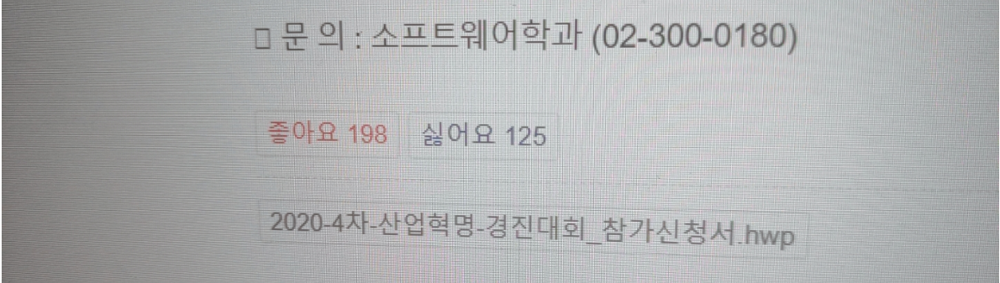
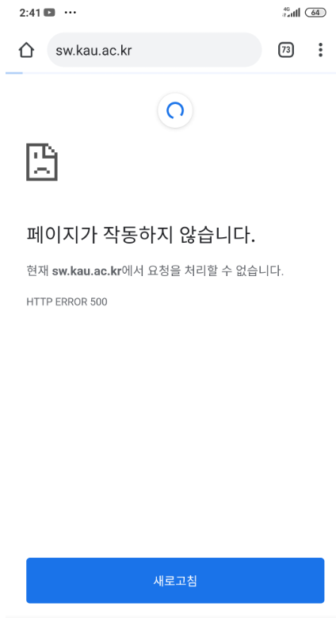

<style>
.kakaotalk__background {
    background-color: #9bbbd4;
    padding: 1rem;
}
.kakaotalk__yourTalk {
    font-weight: 600;
    display: inline-block;
    box-sizing: border-box;
    margin-bottom: 1rem;
    background-color: white;
    padding: 0.8rem;
    border-radius: 8px;
}
.kakaotalk__myTalk {
    font-weight: 600;
    display: inline-block;
    background-color: #fef01b;
    margin-bottom: 1rem;
    padding: 0.8rem;
    text-align:right;
    border-radius: 8px;
}
</style>


## 1. 사건의 발단

비대면 강의가 가져온 여유를 즐기며 멍하니 앉아 있을 때, 갑자기 동기한테 카톡이 왔다.

<div class = "kakaotalk__background">
<div class = "kakaotalk__yourTalk">형 저 매크로 만들어 주세요<br>
<a>http://sw.kau.ac.kr/?mod=document&uid=2305&page_id=739</a><br>이 페이지 좋아요 수를 늘리는 매크로인데<br>크롬 시크릿 창에서 좋아요를 누르면 계속 오르거든요</div>

<div style = "text-align:right;">
<div class = "kakaotalk__myTalk">대체 왜;?</div>
</div>

<div class = "kakaotalk__yourTalk">
그냥<br>
ㅋㅋㅋㅋㅋㅋㅋㅋ<br>
심심<br>
</div>
</div>
<br>

설명을 들어본즉 학과 게시판의 글을 크롬 시크릿 탭으로 좋아요를 누르면 제한 없이 카운트가 올라간다는 것인데, 심심하니 이 카운트를 늘려 보자는 것이었다.

왜 대학친구를 잘 사귀라는 건지 와닿는 순간이었지만 마침 심심했던 차라 재밌어 보여 바로 작업에 들어갔다.  
그리고 전에 퍼펫티어를 다뤄봤던 경험을 살려 금방 코드를 완성할 수 있었는데, 결과는 성공이었다.

```js
const puppeteer = require("puppeteer")

;(async () => {
  for (let i = 0; i < 10000; i++) {
    const browser = await puppeteer.launch({ headless: true })
    const page = await browser.newPage()
    await page.goto("http://sw.kau.ac.kr/?mod=document&uid=2305&page_id=739")
    await page.click("button.kboard-button-like")
    console.log(`like count : ${i}`)
    await browser.close()
  }
})()
```



그런데 문제는 여기부터였다.  
이놈은 자바스크립트보다는 파이썬을 주로 사용해 비동기에 대한 이해가 깊지 않았고, 이게 참사로 이어진다.

<div class = "kakaotalk__background">
<div class = "kakaotalk__yourTalk">카운트 확확 올라가게<br>async를 100개 동시에 돌리는건 어떰<br></div>

<div style = "text-align:right;">
<div class = "kakaotalk__myTalk">그럼 감당이 안될거야 ㅋㅋㅋ</div>
</div>

<div class = "kakaotalk__yourTalk">
갑자기 이상해요<br>
like count : 5<br>
like count : 5<br>
like count : 5<br>
like count : 5<br>
like count : 6<br>
like count : 7<br>
like count : 7<br>
like count : 7<br>
like count : 6<br>
like count : 6<br>
like count : 7<br>
like count : 6<br>
이러는데요? ㅋㅋㅋㅋ<br>
</div>
<div style = "text-align:right;">
<div class = "kakaotalk__myTalk">async 여러개넣었지?<br>
ㅋㅋㅋㅋㅋㅋㅋ
</div>
</div>
</div>
<br/>

헤드리스 브라우저를 호출하는 함수는 비동기 함수인데 이걸 동시에 100개를 실행하면 어떻겠냐는 것이었다.  
뭔가 느낌이 쎄했지만 설마 하는 생각에 말리지는 않았는데, 제대로 망했다는 걸 깨닫는 데는 오래 걸리지 않았다..



<div style = "text-align: center; margin-bottom: 1rem; font-size: 0.8rem">Σ(￣□￣;);;</div>

바로 서버가 터진 것이었다.  
머릿속이 하얘진 채로 가장 먼저 한 일은 학교 서버가 전부 터진건지 아니면 이 페이지 서버만 터진건지 체크했는데, 다행히 LMS나 종합정보시스템 등 중요한 기능들은 살아 있다는 걸 알고 안도했다.

서버는 한 30분쯤 후에 복구되었고, 그제서야 우리는 성공을 축하할 수 있었다. ㅋㅋㅋㅋ


심장 떨리면서도 재밌는 하루였다.  
그리고 전산실 선생님들껜 죄송할 뿐.. 😅;
