## 1. 2편을 시작하며

1편에 비해 2편이 많이 늦어진 이유는 페이지가 실제 배포된 후에 다음 글을 쓰고 싶어서였는데, 배포가 생각보다 늦어져 2편 이야기가 생각보다 많이 늦어지게 되었다. 😅

[바뀐 홈페이지 링크 : 항공교통물류학부 바로가기](http://college.kau.ac.kr/web/index.do?siteFlag=attll_www)

## 2. 교과목 안내 페이지

다른 페이지들은 대부분 과사에서 받은 컨텐츠를 HTML에 붙여넣기하는 수준이라 별 느낌이 없었지만, 이 페이지만큼은 내가 아는 CSS와 자바스크립트를 정말 열심히 (덕지덕지) 바른 끝에 예쁜 결과를 얻을 수 있었다.

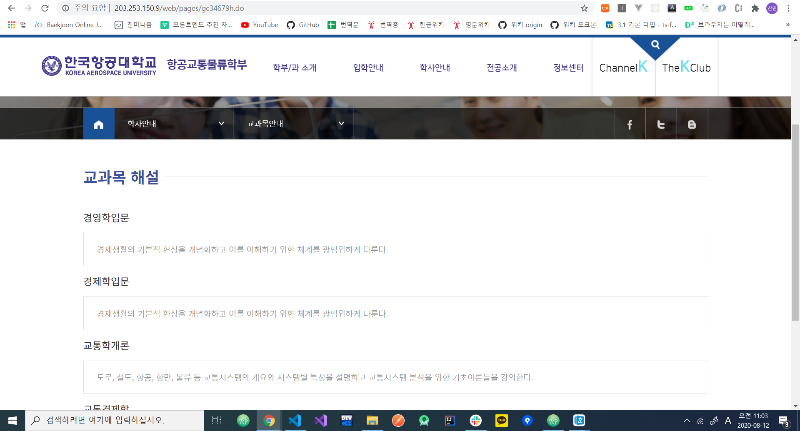

우선 교과목 안내 페이지의 초창기 모습이다.  
별다른 특색 없이 교과목 정보를 소개하는 페이지지만, 항교물에는 아주 커다란 문제가 하나 있었다.

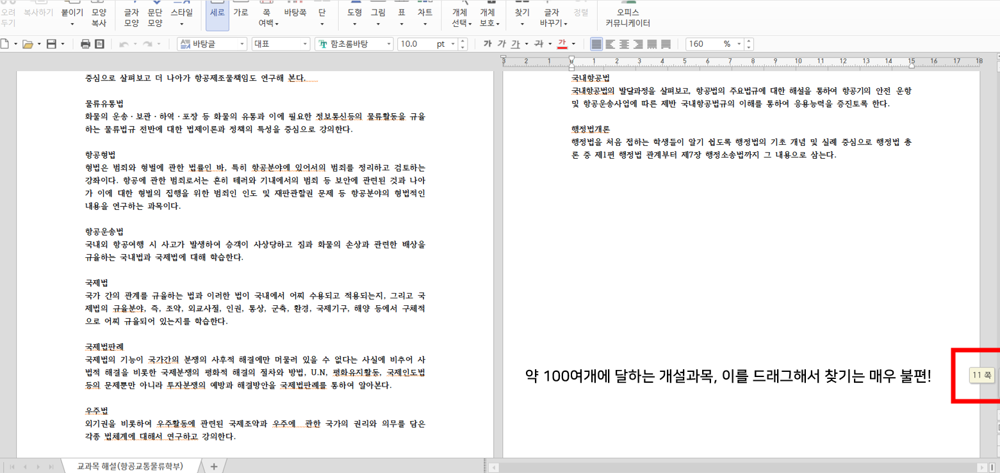

바로 항교물은 3개 학과가 합쳐진 학부다 보니 개설 과목이 100여개에 달한다는 것이었다.  
그러다 보니 이대로 페이지를 런칭했다간 사람들이 불편해할게 뻔했고, 다른 학교들도 이런 식으로 한다고는 하지만 가능하면 개선점을 찾아 고쳐보고 싶었다.

> _"어떻게 해야 사람들이 100여개에 달하는 과목 정보를 쉽게 찾을 수 있을까?"_

이 문제에 대해 정말 고민을 많이 했었는데, 고민 끝에 멋진 페이지를 만든 과정을 소개해보려 한다.

## 2. 1. 드롭다운을 만들자!

첫 번째로 생각한 아이디어는 드롭다운 메뉴를 만들고 메뉴에서 과목을 선택하면 해당 과목의 정보가 출력될 수 있도록 꾸미는 것이었는데 이게 과사 선생님들한테 반응이 되게 좋았다.

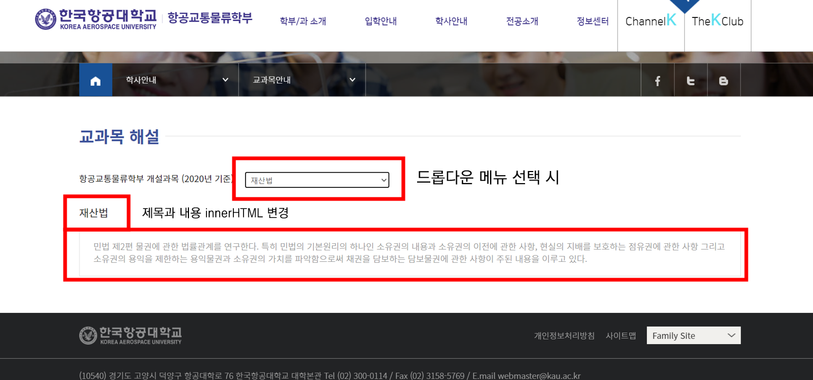

하지만 이걸 내가 직접 사용해보면서 느낀 결과, 결국 스크롤바가 뷰포트에서 드롭다운으로 옮겨갔을 뿐이지 100여개에 달하는 과목 사이에서 스크롤바를 휘저어야 하는 문제는 여전했다.

> _"그럼 여기서 뭘 더 개선할 수 있을까?"_

이후 생각해낸 개선점은 드롭다운 메뉴 상단에 따로 검색창을 만들어 드롭다운 메뉴에서 검색 결과를 찾을 수 있게 한 것이었는데, 딱 내 생각처럼 동작하는 `datalist`[^1] 태그를 찾을 수 있었다.

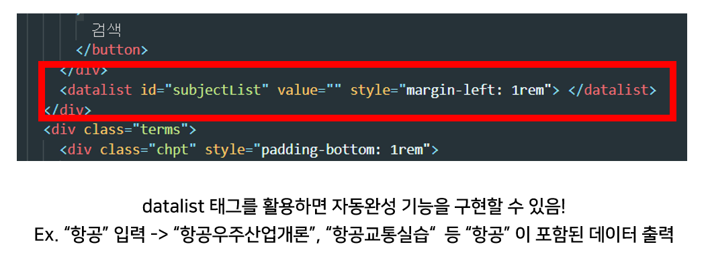

`datalist` 는 `select` 태그를 사용하는 전통적인 드롭다운과는 달리 스크롤 + 검색으로 항목 찾기를 합친 새로운 드롭다운 메뉴를 만들 수 있는데, 기존의 드롭다운보다는 확실히 항목을 찾기 쉬워졌음을 체감할 수 있었다.

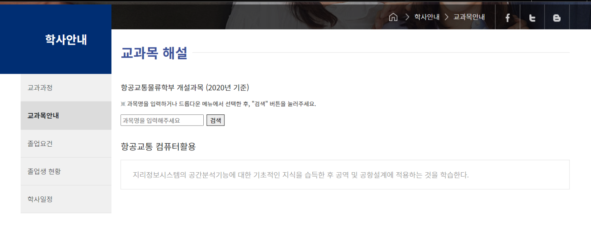

그 결과 기능성 면에서는 전보다 훨씬 나은 성과를 얻을 수 있었지만, 한 가지 문제가 남아 있었다.  
바로 페이지가 어딘가 허전해 보인다는 것이었다.

마감을 앞두고 과사 선생님들과 미팅을 빙자한 과자 파티의 주제는 어떻게 해야 이 페이지가 예쁠지였는데, 한 분이 드롭다운과 기존의 스크롤뷰를 섞어 보는 것은 어떻겠냐는 기가 막힌 아이디어를 주셨다. ~~개발자 죽어욧~~

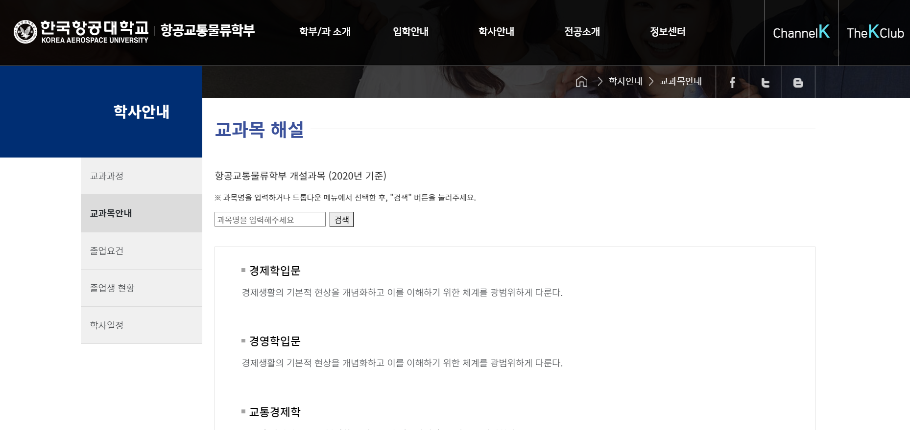

바로 이렇게 말이다.  
결과적으로 페이지가 풍성해 보임과 동시에 매우 편리하게 원하는 과목을 찾을 수 있었는데, 간단히 설명하면 검색창에서 원하는 과목을 찾아 선택하면 그 페이지가 있는 뷰로 스크롤이 이동하게끔 하는 것이다.

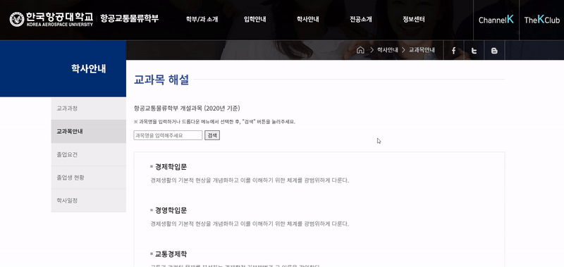

처음에는 스크롤이 이동할 때 순간이동하는 문제 + 과목 탐색 결과가 화면 맨 위에 오는 문제를 수정하기 위해 `scrollIntoView` 라는 속성을 찾아 사용할 수 있었고, 스크롤이 이동한 후에는 다시 위로 올라오기 쉽게 "맨 위로 이동" 이라는 버튼이 나타나도록 했다.

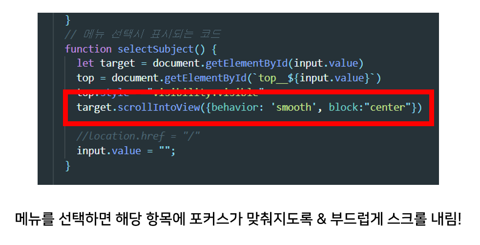

## 3. 데이터 관리하기

교과목 정보를 표시하는 것뿐만 아니라 데이터를 관리하는 과정도 흥미로웠다.  
 초기형 드롭다운 메뉴를 만들었을 때는 이렇게 100여개에 달하는 데이터를 전부 하드코딩으로 입력했었는데, 이대로는 언젠간 내가 만든 이 페이지를 유지보수하게 될 후배가 정말 고생할 것 같았다.

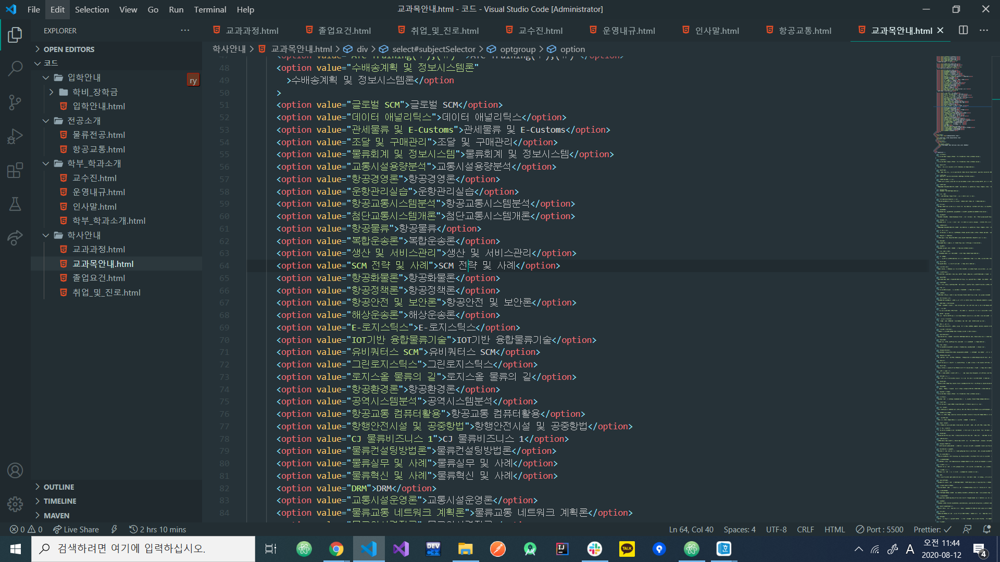

톤즈 오브 HTML

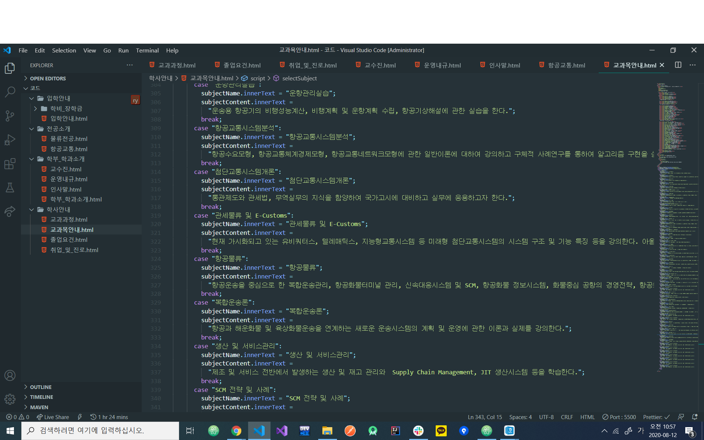

톤즈 오브 자바스크립트

그래서 이렇게 데이터를 관리하는 건 뭔가 아니라고 생각했고, '데이터를 데이터답게' 다루고 싶어 과목 정보가 담긴 객체의 배열을 만들고, 그 안에 과목명/과목 정보 데이터를 옮겼다.

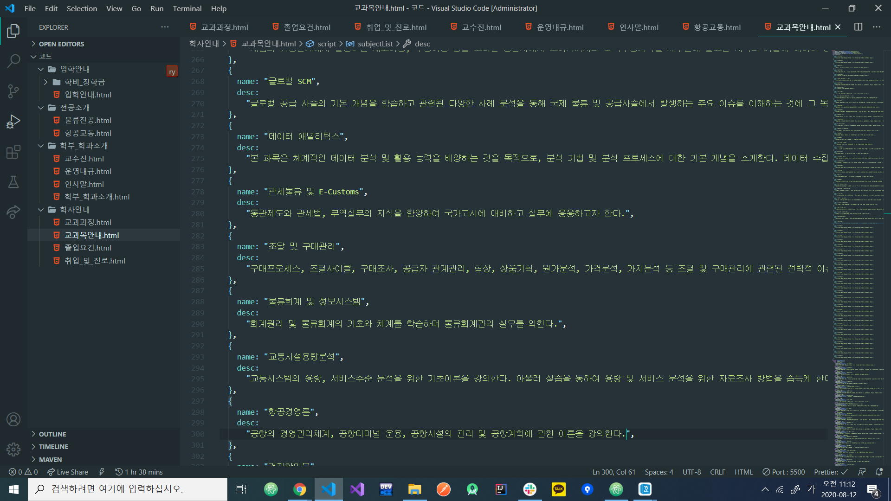

이후 이 데이터를 토대로 HTML 코드를 동적으로 생성하는 코드를 짤 수 있었고, 결과적으로 내가 졸업한 후 유지보수를 맡은 친구는 과목 정보가 담긴 객체의 `name`과 `desc` 속성값만을 수정하면 자동으로 수정되는 드롭다운 메뉴를 관리할 수 있게 되었다.

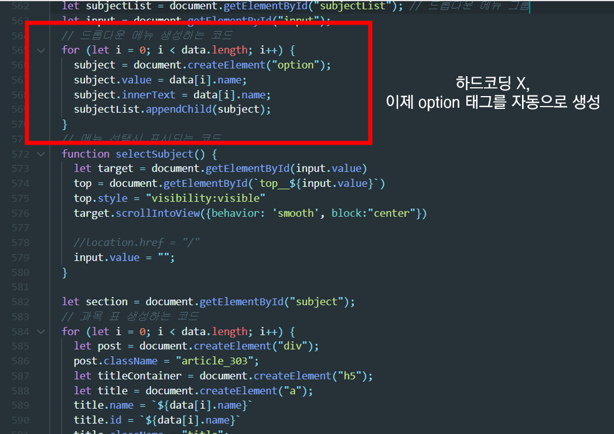

뭐 사실 이런 문제는 개발자가 아니라면 체감하기 어려운 문제겠지만...  
그래도 후임 개발자를 위한 '지속 가능한 코드' 에 대해 생각해볼 수 있어 정말 뿌듯한 작업이었다.

## 4. 작업을 마치며

애초에 CMS로 어느정도 틀이 잡혀있어 정말 대단한 작업은 아니었지만 그래도 내가 기획하고 제작한 결과물이 학교에 실제로 서비스된다고 생각하면 또 기분이 묘하다.

어떻게 해야 사람들이 페이지를 더 사랑해줄지에 대한 고민과 코드로 돈을 벌어본다는 생각으로 행복한 한 달이었으며, 한 가지 아쉬움이 남는 점은 마지막에 주석으로 내 이름을 남기고 싶었는데 문제가 될까봐 차마 그러진 못했다. (지금 생각해보면 일단 질렀어야 했다!!)

마지막으로 메일로 이것저것 부탁드려도 귀찮은 기색 하나 없이 도와주신 과사 선생님들께 너무 감사드리며, 정말 좋은 기회를 마련해준 팔콘 빤치 리더 수환이한테도 고마움을 전하고 싶다.

[^1]: datalist 태그 사용해보기 - [w3schools.com/datalist](https://www.w3schools.com/tags/tryit.asp?filename=tryhtml5_datalist)
