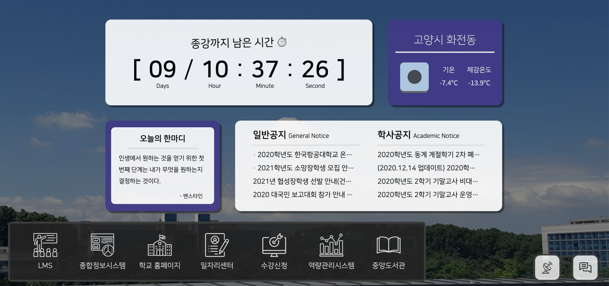
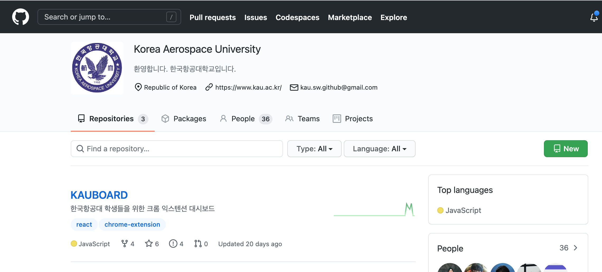
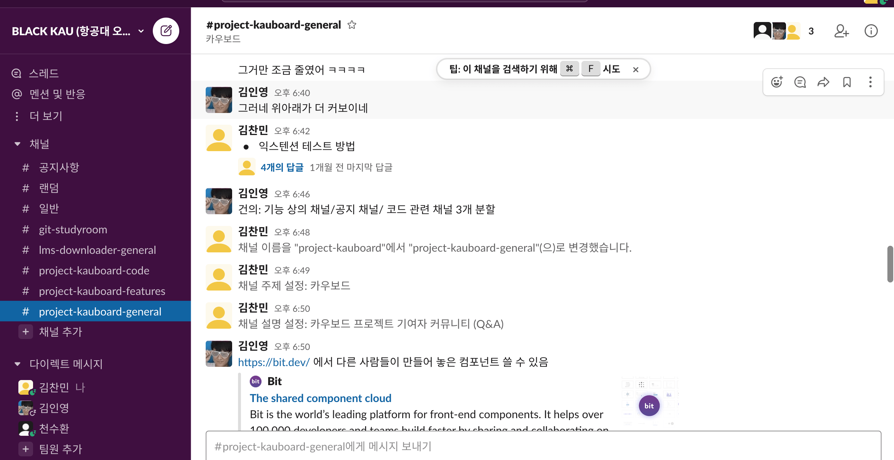
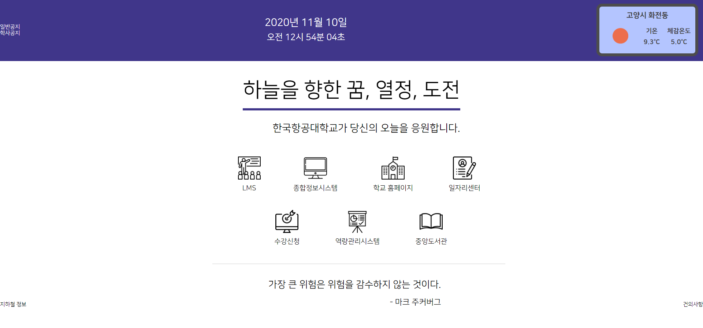
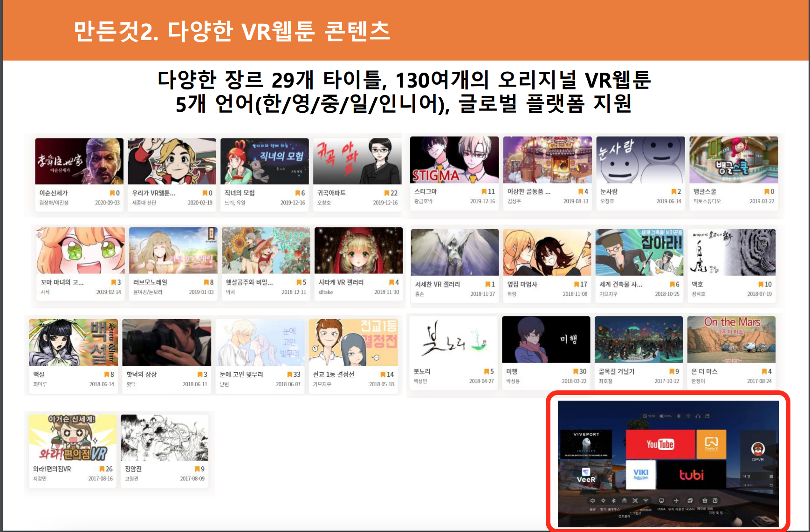
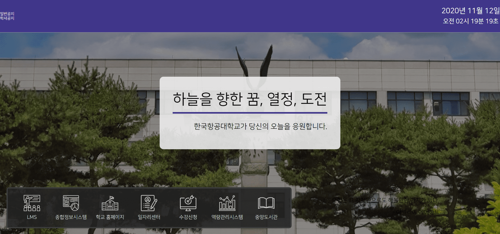
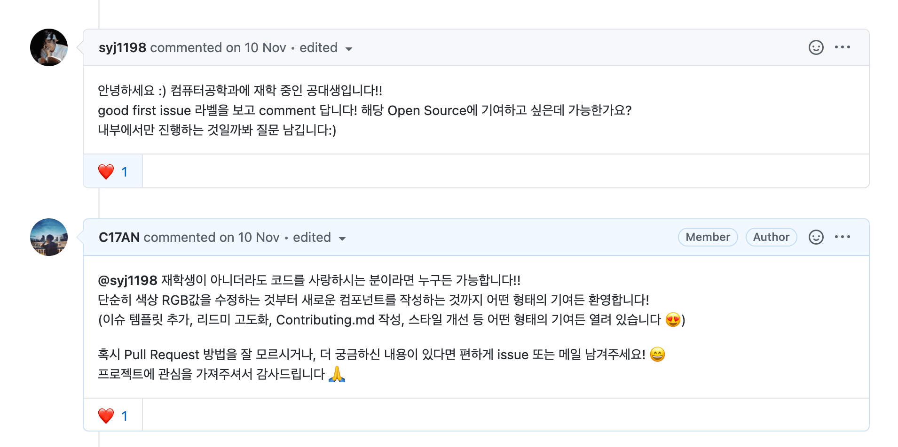
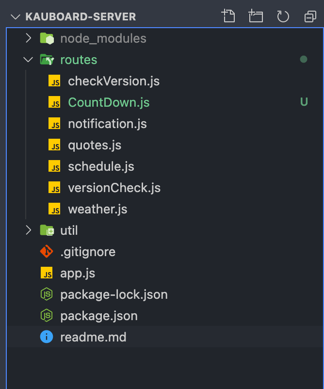
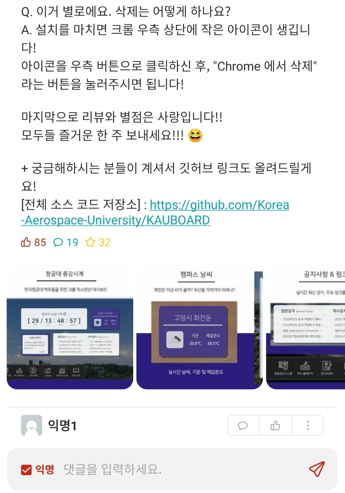
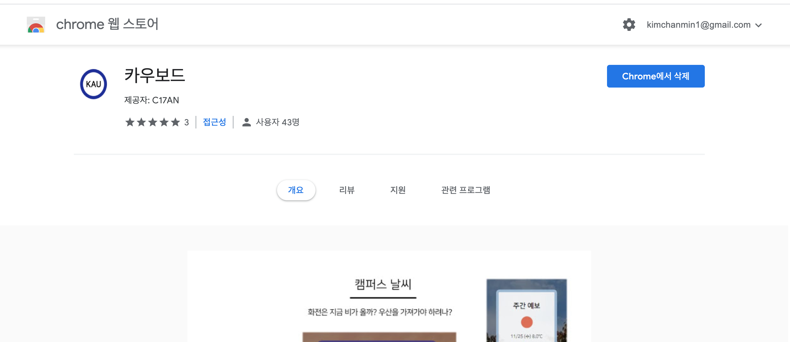

[카우보드(항공대 종강시계) - 크롬 익스텐션 스토어 링크](https://chrome.google.com/webstore/detail/%EC%B9%B4%EC%9A%B0%EB%B3%B4%EB%93%9C/lffcahbpjjidhadlomcpckmljndafmao?utm_source=chrome-ntp-icon)

11월 한달간 야심차게 제작한 항공대 종강시계의 제작 기록을 정리해보려 한다.  
항공대 종강시계는 [한양대 종강시계](https://chrome.google.com/webstore/detail/%ED%95%9C%EC%96%91%EB%8C%80%ED%95%99%EA%B5%90-%EC%A2%85%EA%B0%95%EC%8B%9C%EA%B3%84/gjpmmcimpelilaeciicpfmbggloncipb?utm_source=chrome-ntp-icon) 를 보고 영감을 얻어 제작하게 되었는데 결과적으로는 꽤나 성공적인 프로젝트가 되었다. 😄



<div style = "font-size : 0.8rem; text-align: center; margin-top: -0.5rem; margin-bottom: 1.5rem;">완성 사진(13인치 노트북 화면) / 배경화면은 로드 시마다 변한다</div>

## 1. 일단 삽을 떠보자!

사실 처음에는 무슨 기능을 넣어야 할지, 디자인은 어떻게 해야 할지조차 감이 오지 않아 막막했는데 '일단 앞으로 가보자!' 라는 생각으로 무작정 만들기로 했다.  
그러다가 문득 '이걸 교내 오픈소스로 운영하면 어떨까?' 라고 생각해 학교 깃허브에 저장소를 만들고 본격적인 오픈소스 프로젝트로의 전환을 시도했다.

<div style = "display: flex; justify-content: center;">
  <div style = "width: 400px; 
  margin: 0 1rem;
    margin-bottom : 1.5rem;">
      
  </div>
  <div style = "width: 400px; 
  margin: 0 1rem;
    margin-bottom : 1.5rem;">
      
  </div>
</div>

<div style = "font-size : 0.8rem; text-align: center; margin-top: -0.5rem; margin-bottom: 1.5rem;">깃허브를 만들고 나름 슬랙 채널도 만들어 관리하려 했었다.</div>

결론부터 얘기하면 나를 제외한 기여자는 딱 한명이 링크 아이콘 컴포넌트화 작업에 기여해준 커밋이 전부다. 😂  
오픈소스 프로젝트를 한다고 하면 사람들에게 프로젝트를 전파할 방법과 기여에 필요한 지식을 효과적으로 교육하는 방법에 대한 고민도 해봐야 할 것 같다.

## 2. 그럼 이제 뭘 만들까?

야심차게 깃허브 저장소도 만들었겠다, 이제 본격적으로 구현할 내용을 정리할 차례였다.  
앞서 언급한 한양대 종강시계에서 가져오기로 마음먹은 기능들이 몇 개 있어, 우선은 여기에 초점을 맞추기로 했다.

- 종강일 카운트다운
- 오늘의 명언
- 캠퍼스 현재 날씨 & 예보
- 공지사항

그래서 이 내용들을 기반으로 바로 초안을 만들었지만 역시 공대생의 디자인 능력에는 한계가 있었다.  
깔끔하지만, 뭔가 말로 형언할 수 없는 아쉬움과 부족함이랄까...? 그런게 많이 느껴져 계속 아쉬운 상황이었다.



<div style = "font-size : 0.8rem; text-align: center; margin-top: -0.5rem; margin-bottom: 1.5rem;">지금 보면 처참하지만 저때는 멋지다고 온 동기들한테 자랑하곤 했었다 ㅋㅋㅋ</div>

아무튼 디자인에서 답이 나오고 있지 않던 상황에 단비가 내리듯 기적이 찾아왔는데,
수업시간에 듣고 있던 학과 세미나 PPT중 뇌리를 스치는 디자인이 슬쩍 지나간 것이었다. 그래서 저 디자인을 기반으로 레이아웃을 다시 디자인했고 지지부진했던 프로젝트도 다시 활력을 얻어 나아가기 시작했다.

<div style = "display: flex; justify-content: center;">
  <div style = "width: 300px; 
  margin: 0 1rem;
    margin-bottom : 1.5rem;">
      
  </div>
  <div style = "width: 400px; 
  margin: 0 1rem;
    margin-bottom : 1.5rem;">
      
  </div>
</div>

<div style = "font-size : 0.8rem; text-align: center; margin-top: -0.5rem; margin-bottom: 1.5rem;">왼쪽 PPT 화면 오른쪽 아래를 보면 쭈구리처럼 화면이 놓여있는데, 저 화면을 놓치지 않은게 기적이었다. 😆</div>

거기다 중간에는 반가운 손님(?) 이 한 분 찾아오기도 하셨는데 저장소에 남겨둔 `Good First Issue` 태그를 보고 관심이 생겨 방문하신 것 같았다.  
하지만 아쉽게도 프로젝트의 방향성이나 기여 문서가 제대로 완성되지 않은 탓이었는지 실제 기여로 이어지지는 못했고, 하나의 깜짝 이벤트로만 남게 되었다.


<div style = "font-size : 0.8rem; text-align: center; margin-top: -0.5rem; margin-bottom: 1.5rem;">새로운 기여자가 올까봐 정말 설렜던 순간이었다 🤣</div>

## 3. 백엔드는 전쟁

<div style = "display: flex; justify-content: center;">
  <div style = "width: 250px; 
  margin: 0 1rem;
    margin-bottom : 1.5rem;">
      
  </div>
</div>

<div style = "font-size : 0.8rem; text-align: center; margin-top: -0.5rem; margin-bottom: 1.5rem;">백엔드 부분은 컨트롤러나 DB 없이 단순 라우팅만 되어있는 구조다</div>

백엔드에서 담당해야 하는 부분도 은근히 꽤 있었다.  
명언은 클라이언트에 추가해도 용량을 크게 잡아먹지는 않지만 새로운 명언을 추가하려면 클라이언트를 업데이트해야한다는 단점 때문에 백엔드에서 명언을 관리하는 것이 좋을 것이라고 판단했고, 날씨 정보 또한 클라이언트에서 날씨 api를 요청하면 일일 요청 제한 수에 걸릴지도 모른다는 위험이 있었다. 그리고 애증의 공지사항과 업데이트 정보 확인 (서버와 클라이언트의 버전 정보를 대조해 최신 클라이언트 여부를 검사한다.) 역시 백엔드에서 담당하도록 작업했다.

다양한 작업들 중에서 개인적으로 가장 난감했던 부분은 공지사항을 크롤링한 후 가공하는 작업이었는데, 날씨나 명언은 이미 잘 가공된 api를 내가 후처리만 해주면 되니 간단했지만 크롤링은 내가 데이터를 추출부터 가공까지 전부 마쳐야 해서 막막했던 부분이 많았다.

```js
getGeneralNoti().then(res => {
  let tempGeneralNotiList = []
  let decoded = iconv.decode(res.data, "EUC-KR")
  const $ = cheerio.load(decoded)
  const notiTable = $("#board_form > div.board_list > table > tbody")
  for (let i = 0; i < notiTable.children().length; i++) {
    let content = notiTable
      .children()
      .eq(i)
      .text()
      .trim()
      .replace(/\s\s+/g, " ")

    let timeStamp = new Date(
      content.slice(
        content.lastIndexOf("-") - 7,
        content.lastIndexOf("-") + 3
      ) + " 12:00:00"
    ).getTime()
    tempGeneralNotiList = [
      ...tempGeneralNotiList,
      {
        content: parseNoti(content.slice(0, content.lastIndexOf("-") - 8)),
        date: timeStamp,
      },
    ]
  }
  tempGeneralNotiList.sort((item1, item2) => (item1.date < item2.date ? 1 : -1))
  generalNotiList = tempGeneralNotiList
})
```

<div style = "font-size : 0.8rem; text-align: center; margin-top: -0.5rem; margin-bottom: 1.5rem;">이게 공지사항 크롤링 코드의 일부인데, 이 작업을 10분마다 하도록 해야 하고 정렬도 해야 하고 환장할 노릇이었다</div>

백엔드는 어렵다기보단 리액트의 Hot Reload처럼 내 코드의 변화가 어떤 영향을 미치고 있는지 한눈에 보이지 않으니 깜깜한 방을 더듬어 물건을 찾는 기분이랄까? 여하튼 정말 쉽지 않은 영역이라고 생각한다.

아! 그리고 다음에는 한번 헤로쿠에 내가 처음부터 끝까지 백엔드를 구성하기보다는 파이어베이스나 AWS를 적극 활용해보려 한다.  
다 끝나고 나서 알게 된 사실이지만, 다른 학교들에서는 대부분 파이어베이스로 백엔드를 구성한 것 같았다. 😂

## 4. 건의사항은 여기로 해주세요!

그렇게 모든게 순조로운 와중 궁금한 점이 생겼다.  
만약 사용자들이 개발자에게 건의해야 할 내용이 있으면 어떻게 소통해야 할까?  
처음에는 건의사항을 내게 이메일로 보내주는 방법을 생각했지만 이메일은 내가 제때 보지 않는 편이라 다른 방법을 찾고 싶었다.  
이때 바로 [슬랙 웹후크 api](https://api.slack.com/messaging/webhooks) 에 대해 알게 되었는데 슬랙 웹후크를 사용하면 사람들이 HTML 폼을 활용해 메시지를 특정 슬랙 채널로 보낼 수 있었고, 결과는 대성공이었다.


<div style = "font-size : 0.8rem; text-align: center; margin-top: -0.5rem; margin-bottom: 1.5rem;">사용자 건의사항이 슬랙에 스트레이트로 꽂힌다!</div>

## 5. 배포 배포

그렇게 13인치, 15인치, 32인치에서의 화면 테스트까지 모두 마치고 최종본을 배포할 차례가 되었다.  
다른 분들은 배포가 제일 까다로웠다고 하는데, 나는 거의 6시간만에 검수가 끝나고 마켓에 올라가 당황스러웠다. 😆

<div style = "display: flex; align-items: center; justify-content: center;">
  <div style = "width: 250px; 
  margin: 0 1rem;
    margin-bottom : 1.5rem;">
      
  </div>
  <div style = "width: 550px; 
  margin: 0 1rem;
    margin-bottom : 1.5rem;">
      
  </div>
</div>

<div style = "font-size : 0.8rem; text-align: center; margin-top: -0.5rem; margin-bottom: 1.5rem;">어플리케이션 홍보는 에브리타임을 통해 진행했는데 생각보다 많은 분들이 관심을 가져주셔서 고마웠다! 😍</div>

사실 이거 말고도 정말 우여곡절이 많았던 개발기였지만 아쉽게도 내 필력이 부족해 더 녹여내기는 어려울 것 같다.  
부족한 글을 읽어주셔서 감사드리며, 혹여라도 유사한 크롬 익스텐션 개발에 도움이 필요하다면 편하게 메일이나 댓글 남겨주세요! 😄
