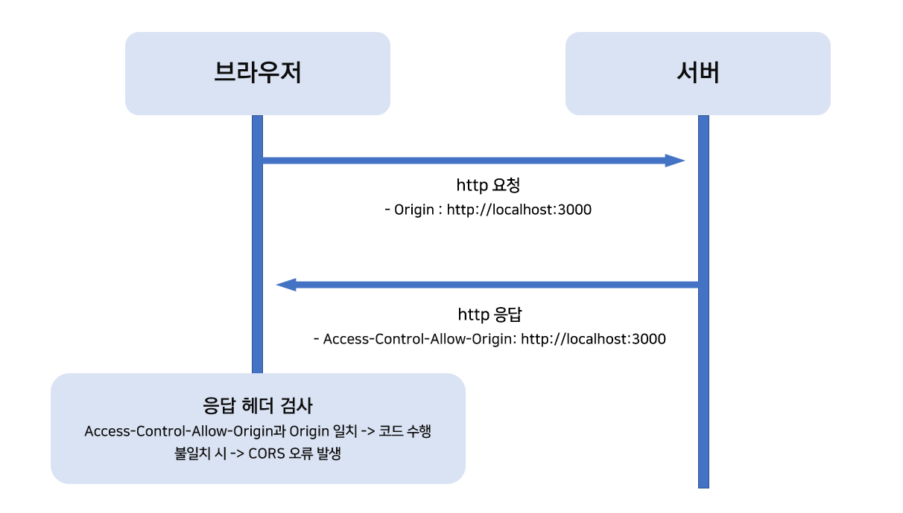
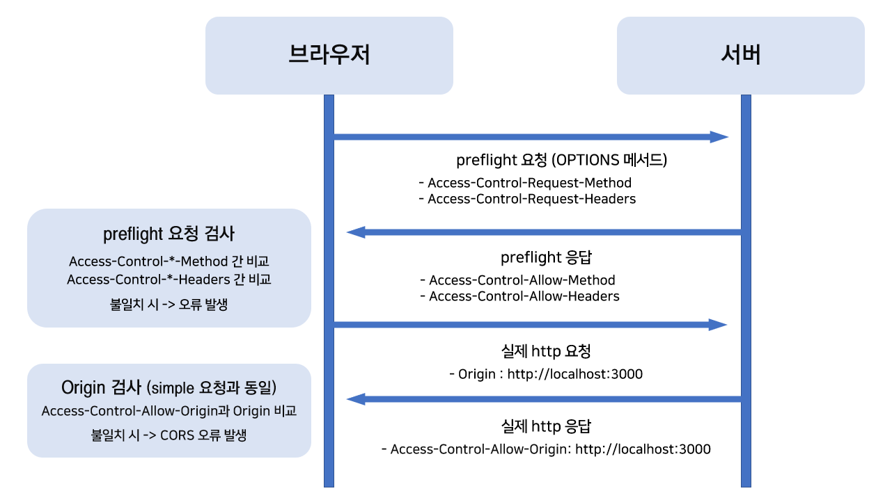

> <span style = "color: red; font-size: 0.9rem">Access to fetch at ~ from origin ~ has been blocked by CORS policy: No 'Access-Control-Allow-Origin' header is present on the requested resource.</span>

직접 서버를 만든 후 `fetch` 나 `axios`를 사용해 요청을 보내본 사람이라면 한번쯤은 봤을 에러 메시지인데요,  
오늘은 이 에러의 원인인 CORS 가 무엇인지 알아보도록 하겠습니다.

## 1. CORS 란?

`CORS` 는 `Cross-Origin Resource Share` 의 약자로, 오리진(Origin)[^1] 간 리소스를 공유할 수 있도록 하는 정책입니다.

브라우저는 보안 상의 이유로 오리진에서 다른 오리진으로 요청을 보내는 `Cross-Origin Request`를 금지하고 같은 오리진[^2]간의 리소스 공유만을 허용하는 `SOP(same-origin policy)` 정책을 사용합니다.

하지만 다른 오리진으로의 요청을 아예 하지 않을 수는 없으니 `Cross-Origin Request` 를 수행하기 위한 방법도 필요한데요, 서버에서 허용한 오리진과 요청 헤더의 오리진을 비교해 검사하는 것이 `CORS`의 핵심 원리입니다.

## 2. Access-Control-Allow-Origin



<div style = "text-align: center; margin-bottom: 1rem; font-size: 0.88rem">[그림 1. 크로스 오리진 요청 모식도]</div>

클라이언트에서 서버로 요청을 보내면 요청 헤더에는 언제나 Origin 속성이 포함됩니다.

요청을 받은 서버는 응답 헤더에 특별한 `Access-Control-Allow-Origin` 이라는 속성을 추가해 응답을 보내는데요, 응답을 받은 브라우저는 응답 헤더를 검사해 `Access-Control-Allow-Origin`의 값과 요청 헤더의 Origin 값을 비교합니다.

이후 요청 오리진이 허용되지 않은 오리진이라면 코드 수행을 거부하고, 허용된 오리진일 경우에는 크로스 오리진 요청이 성공적으로 마무리됩니다.

## 3. simple CORS와 non-simple CORS

크로스 오리진 요청에는 `simple`과 `non-simple`의 두 종류가 있는데요, simple 유형의 크로스 오리진 요청을 보내는 조건은 요청에 특정 헤더만 존재하고 HTTP 메서드가 `GET`, `HEAD`, `POST` 중 하나일 때입니다.

**[CORS-safelisted 요청 헤더 목록]**

- Accept
- Accept-Language
- Content-Language
- Content-Type (application/x-www-form-urlencoded, multipart/form-data, text/plain 의 경우에만)
- DPR
- Downlink
- Save-Data
- Viewport-Width
- Width

simple 유형의 크로스 오리진 요청은 흔히 알고 있는 요청으로 한번만 수행됩니다.

그러나 `non-simple` 유형의 요청일 경우에는 `preflight` 라고 불리는 사전 요청을 전송해 도메인이 안전한지 확인한 후 실제 요청을 전송합니다.



<div style = "text-align: center; margin-bottom: 1rem; font-size: 0.88rem">[그림 2. non-simple 요청 모식도]</div>

`preflight` 요청 헤더는 `Access-Control-Request-Method` 와 `Access-Control-Request-Headers` 라는 속성을 포함하고 있으며, 각 속성값으로 요청을 보낼 때 사용한 메서드와 헤더 속성을 가집니다.

이후 도메인이 안전한지 확인하기 위해 요청 헤더의 `Access-Control-Request-*`[^3] 값을 응답 헤더가 가진 `Access-Control-Allow-*`[^4] 값과 비교하는데, 둘을 비교해 허용되지 않은 메서드나 헤더 속성이 발견될 경우 허용되지 않은 오리진으로 간주합니다.

`preflight` 요청에 성공한 후에는 simple 유형의 요청과 동일하게 오리진 검사를 수행합니다.

## 4. Solution

Express를 활용해 서버를 구축할 때는 응답 헤더에 직접 `Access-Control-Allow-Origin`를 추가하거나, 익스프레스의 경우 `cors` 라이브러리를 활용할 수 있습니다.

**[샘플 클라이언트]**

```js
// app.js (React.js 클라이언트)
import React, { useEffect, useState } from "react"

function App() {
  const [data, setData] = useState(null)
  const fetchData = () => {
    fetch("http://localhost:5000/user")
      .then(res => res.json())
      .then(data => setData(data.name))
  }
  useEffect(() => {
    fetchData()
  }, [])

  return <div className="App">{data}</div>
}

export default App
```

**[샘플 서버 1 - 헤더에 Access-Control-Allow-Origin 직접 추가]**

```js
// server.js (Express 서버)
const express = require("express")
const app = express()

app.get("/user", (req, res) => {
  // Access-Control-Allow-Origin에 * 을 줌으로써
  // 모든 오리진으로부터 요청을 허용한다.
  res.header("Access-Control-Allow-Origin", "*")
  res.status(200).send({ name: "Chanmin" })
})

app.listen(5000, () => {
  console.log("server is running at port 5000")
})
```

**[샘플 서버 2 - cors 라이브러리 사용]**

> cors 라이브러리는 `$ npm i cors` 명령어로 설치 후 사용할 수 있습니다.

```js
const express = require("express")
const cors = require("cors")
const app = express()

// cors 라이브러리를 활용하면 간편한 cors 이슈 해결이 가능함.
app.use(cors())

app.get("/user", (req, res) => {
  res.status(200).send({ name: "Chanmin" })
})

app.listen(5000, () => {
  console.log("server is running at port 5000")
})
```

## 5. 정리를 마치며

아무것도 모르던 처음에는 크롬 CORS 익스텐션으로 문제를 피해 가기도 하고, 백엔드와 네트워크 지식에 대한 막연한 두려움때문에 "그냥 cors 라이브러리 쓰면 되는걸 뭐~" 라고 생각했지만, 원리를 모르고 가져다 쓰면서 느끼는 찝찝함과 함께 프론트엔드 개발 면접에서 **무조건** 물어본다는(...) 컨트리뷰톤 멘토님의 조언을 받아들여 정리하게 되었습니다.

덕분에 찝찝함도 하나 줄고, 새로운 걸 배웠다는 기분에 즐거운 하루가 될 듯 하네요. 😄

<div style = "text-align: center; font-size: 1.4rem">. . .</div>

<br>

> 📖 참고

- [**모던 자바스크립트 튜토리얼**](https://ko.javascript.info/fetch-crossorigin)
- [**원티드 제품 팀블로그**](https://medium.com/wantedjobs/cors-a-to-y-28cc0b16349d)

[^1]: Origin : 도메인·프로토콜·포트가 조합된 **주소**
[^2]: 프로토콜(http / https), 도메인, 포트 중 하나라도 다르면 다른 오리진으로 간주합니다.
[^3]: `Access-Control-Request-Method`, `Access-Control-Request-Headers`
[^4]: `Access-Control-Allow-Method`, `Access-Control-Allow-Headers`
