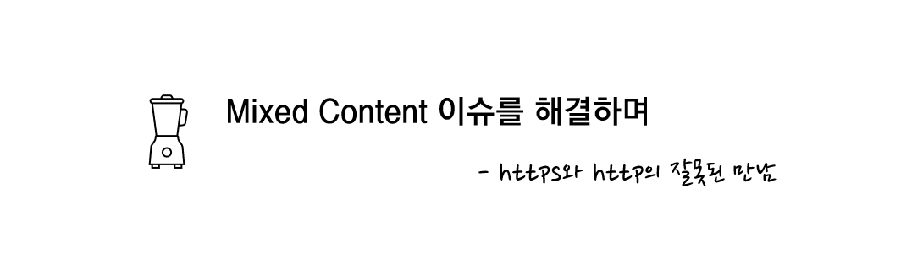
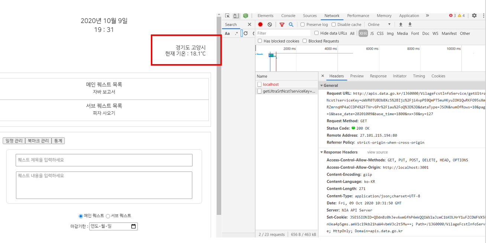
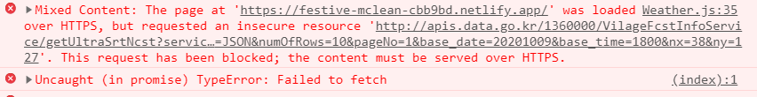

## 1. http - https 간 네트워크 이슈

건대 엔제리너스를 들러 대시보드를 만들면서 있었던 일이다.

대시보드에 기온 정보를 추가하기 위해 기상청 동네예보 API를 사용하고 있을 때였는데, API 엔드포인트가 "http://apis.data.go.kr/1360000/VilageFcstInfoService/..." 로 프로토콜이 `https`가 아닌 `http`인 것을 알게 되었다.



<div style = "text-align: center; margin-bottom: 1rem; font-size: 0.8rem; line-height:1.2rem">로컬 테스트에서는 기온을 잘 받아온다.</div>

로컬 환경에서는 위 사진처럼 `https`와 `http` 프로토콜 사이에서 아무 문제가 없어[^1] 그냥 넘어갔는데, Netlify로 실제 배포한 페이지에서는 응답을 받아오지 못하는 것이었다.



<div style = "text-align: center; margin-bottom: 1rem; font-size: 0.8rem; line-height:1.2rem">진짜 화난다</div>

뒤이어 개발자 도구를 확인해 보니 `Mixed Content` 라는 이슈임을 확인할 수 있었고, 더 찾아본 결과 보안 문제로 인해 최신 브라우저들에서는 https 페이지에서 http 리소스를 요청할 수 없음을 알 수 있었다.

이 문제를 해결하기 위해 시도한 방법은 두 가지였다.

### 시도 1. 엔드포인트의 프로토콜을 https로 바꿔 요청하기

문제를 확인한 후 가장 먼저 한 일은 요청을 보내는 주소를 'http://apis.data.go.kr/1360000/'에서 'https://apis.data.go.kr/1360000/' 로 바꿔 요청한 것이었다.

하지만 이 API (http://apis.data.go.kr/1360000/)는 http만을 지원하고 있었고, https 프로토콜로 보낸 요청은 영영 대답을 들을 수 없었다.

---

### 시도 2. 요청 프로토콜 업그레이드하기

```html
<meta
  http-equiv="Content-Security-Policy"
  content="upgrade-insecure-requests"
/>
```

이게 무엇인고 하니 내가 페이지에서 보내는 `http` 요청들을 `https` 요청으로 바꿔 전송하는 메타 태그다.  
여기에 희망을 많이 걸었었지만 똑같이 응답은 받을 수 없었다.

## 2. 이슈를 닫으며

그런데 좀 더 깊게 찾아본 결과 이건 내 네트워크 지식이 부족해서 생긴 문제임을 알게 되었다.

나는 당연히 `http`와 `https`간 연결이 가능하다고 생각해 왔고 이걸 진지하게 생각해 본 적이 없었는데, 이게 원래 가능한 것이 아니라 `http`로 요청을 보내면 브라우저가 똑똑하게 `https`로 업그레이드 시켜주기 때문에 가능한 것이었다.

아무튼 원래는 백엔드 없이 파이어베이스를 활용해서 서버리스 앱을 만들어보고 싶었지만, 결국 백엔드 서버를 만들고 백엔드에서 `http`로 기온 정보를 받아온 후 클라이언트에는 `https`로 쏴주는 방식으로 해야 할 것 같다.

서버를 만드는 건 만만찮게 까다로운 작업이 되겠지만, 그래도 모르는 걸 짚게 되어 정말 다행이라고 생각한다. 😄

[^1]: 이 부분은 나중에야 알았지만 리액트 개발 서버는 `http` 프로토콜을 사용해 문제가 없던 것이었다.
