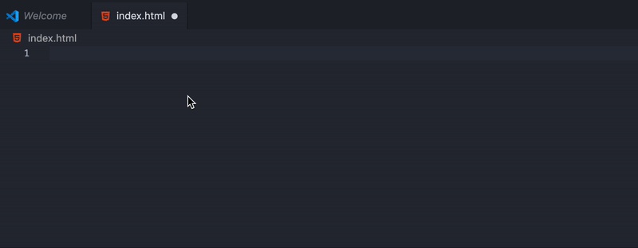
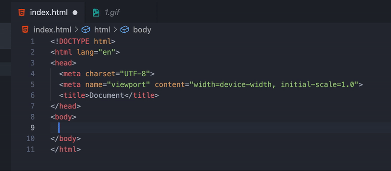
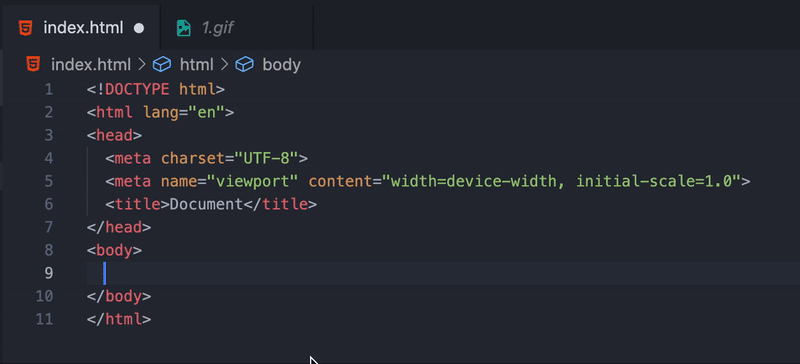
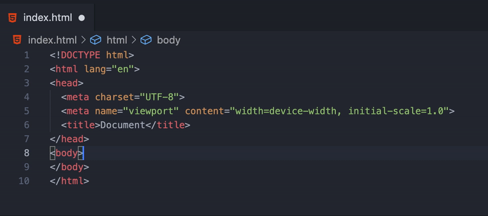
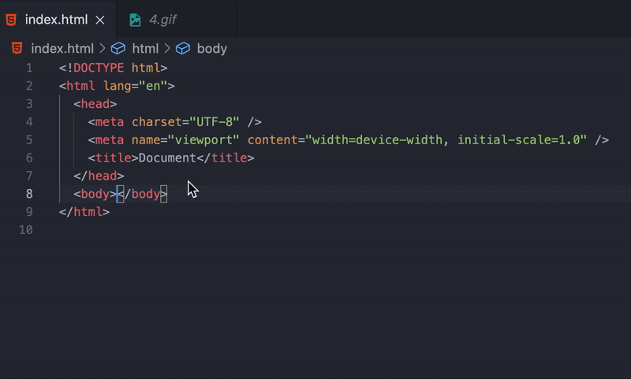
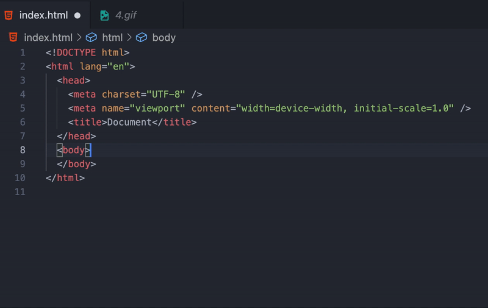

웹 개발자라면 수도 없이 보았을 HTML 기본 구조입니다.

```html
<!DOCTYPE html>
<html lang="en">
  <head>
    <meta charset="UTF-8" />
    <meta name="viewport" content="width=device-width, initial-scale=1.0" />
    <title>Document</title>
  </head>
  <body></body>
</html>
```

자, 지금부터 간단한 마술을 하나 보여드리겠습니다.  
비주얼 스튜디오 코드나 다른 코드 에디터에서 `index.html` 파일을 만들고 ! 를 입력해보세요.



와! 손 하나 까딱 안하고 기본 템플릿이 생성된 모습입니다. (사실 느낌표를 찍기는 했지만요)  
이렇게 빠른 HTML 코딩을 위해 에밋(**emmet**)이라는 플러그인이 존재하는데요, 오늘은 에밋 문법을 소개하는 시간을 갖겠습니다.

## 요소 생성하기

`<span>`, `<div>` 등 HTML 요소를 생성하는 방법은 정말 간단한데요, 태그명을 영어로 입력하면 무려 알아서 태그를 생성해줍니다.

```html
태그명 -> <태그명></태그명>

# [div 태그는 예외적으로 태그명을 생략할 수 있습니다.]

span.content -> <span class = "content"></span>
.content -> <div class = "content"></div>

# [태그 안에 작성할 내용은 {} 기호로 감싸면 됩니다.]

.content{이 블로그는 참 심심합니다.} -> <div class = "content">이 블로그는 참 심심합니다.</div>
```



눈 깜짝할 사이에 `<span>` 태그가 생성된 모습이네요!  
생성한 태그에 클래스나 아이디 값을 부여하는 방법도 간단한데요, 클래스와 아이디를 부여하는 방법은 **CSS 선택자를 사용하는 방식**과 동일합니다.

```html
태그명.클래스명#아이디명 -> <태그명 class = "클래스명" id = "아이디명"></태그명>
```



아이디와 클래스뿐만 아니라 입력의 타입 등 특정한 속성값을 지정하는 것도 가능합니다.

```html
태그명[속성명=속성값] -> <태그명 속성명 = "속성값"></태그명>
```

input 태그에 `my-button` 클래스를 부여하고 타입을 버튼으로 지정한 모습입니다.



슬슬 에밋이 매력적으로 느껴지지 않으시나요?  
에밋과 CSS 선택자를 결합하면 더 복잡한 HTML 문서도 구성할 수 있습니다.

## CSS 선택자와 함께 사용하기

복합 선택자인 `>`(자식 선택자), `+`(형제 선택자)를 기억하시나요?  
에밋에서도 이러한 선택자들을 사용해 자식 요소들과 형제 요소들을 만들 수 있습니다.

```html
body>header>div{여긴 헤더입니다!}

<body>
  <header>
    <div>여긴 헤더입니다!</div>
  </header>
</body>

form:get>label.label+input[type=email]+input[type=password]

<form action="" method="get">
  <label for="" class="label"></label>
  <input type="email" />
  <input type="password" />
</form>
```



<figcaption>사실 저도 아직 완전히 익숙하지는 않아서..^^</figcaption>

## 반복 사용하기

이뿐만 아니라 원하는 요소를 N개 생성하는 것도 손쉽게 가능합니다.

```html
ul>li.item-list*5

<ul>
  <li class="item-list"></li>
  <li class="item-list"></li>
  <li class="item-list"></li>
  <li class="item-list"></li>
  <li class="item-list"></li>
</ul>

# [$ 기호를 사용해 반복문의 인덱스를 활용할 수도 있습니다.]
ul>li.item-list*5{이건 $번째 요소입니다!}

<ul>
  <li class="item-list">이건 1번째 요소입니다!</li>
  <li class="item-list">이건 2번째 요소입니다!</li>
  <li class="item-list">이건 3번째 요소입니다!</li>
  <li class="item-list">이건 4번째 요소입니다!</li>
  <li class="item-list">이건 5번째 요소입니다!</li>
</ul>
```



어떤가요? 이제 <> 기호를 열고 닫고 태그 짝 맞추느라 스트레스 받을일도 없고..  
저는 에밋을 오늘 처음 배웠지만, 마크업을 코드 짜듯이 짤 수 있다는 점에서 정말 매력적이라 느껴졌습니다. 😆
