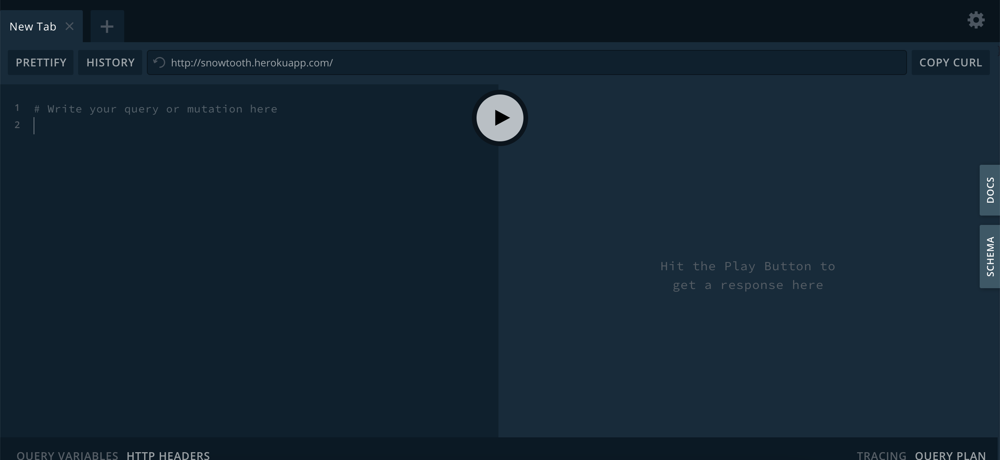

지난 글에서는 GraphQL이 왜 필요한지와 어떻게 REST 방식을 대체할 수 있을지에 대해 알아보았습니다.  
오늘은 본격적인 예제를 통해 GraphQL 쿼리문을 작성하는 방법을 소개할텐데, 쿼리 실습을 위한 데이터로는 [Snowtooth](http://snowtooth.herokuapp.com)[^1] 링크에서 제공하는 GraphQL 플레이그라운드와 샘플 api를 사용하도록 하겠습니다.



<div style = "font-size : 0.8rem; text-align: center; margin-top: -0.5rem; margin-bottom: 1rem;">중앙 상단의 재생 버튼을 눌러 요청을 전송합니다.</div>

## 1. 첫 번째 쿼리 요청하기

```graphql
query {
  allLifts {
    name
    status
  }
}
```

GraphQL 플레이그라운드에서 한번 첫 번째 쿼리를 요청해봅시다.  
요청에 성공하면 돌아오는 JSON 응답에는 allLifts 배열과 각 리프트의 이름과 상태 정보가 담겨 있습니다.

```json
{
  "data": {
    "allLifts": [
      {
        "name": "Astra Express",
        "status": "OPEN"
      },
      {
        "name": "Jazz Cat",
        "status": "OPEN"
      },
      {
        "name": "Jolly Roger",
        "status": "OPEN"
      },
      ...
    ]
  }
}
```

만약 리프트 정보 말고도 스키 코스에 대한 정보가 필요하면 어떻게 할 수 있을까요?

```graphql
query {
  allLifts {
    name
    status
  }

  allTrails {
    name
    difficulty
  }
}
```

이렇게 하면 한 쿼리 안에 리프트 정보와 코스 정보를 모두 요청할 수 있습니다.  
단! 문서 안에서 둘 이상의 쿼리 작업을 수행할 수는 없다는 점에 유의해야 합니다.

```graphql
// 이렇게 작성하면 안돼요!
query lift {
  allLifts {
    name
    status
  }
}

query trail {
  allTrails {
    name
    difficulty
  }
}
```

만약 쿼리를 이렇게 작성하면 실제로 수행되는 작업은 하나뿐이며, 실제로 이렇게 쿼리를 작성해 보면 두 쿼리 중 하나만을 선택해야 하는 것을 확인할 수 있습니다.  
따라서 두 종류의 데이터를 모두 받아오고 싶을 때는 별도의 쿼리를 구성하지 않고 한 쿼리 안에 요청할 정보들을 모두 담아야 합니다.

## 2. 필드 별칭과 쿼리 인자

리프트의 이름과 상태 쿼리를 요청한 후 필드 이름을 원하는 이름으로 바꿔서 받을 수도 있습니다.  
리프트의 이름 정보를 받아오는 쿼리 작업을 수행해 보겠습니다.

```graphql
query {
  allLifts {
    name
  }
}
```

```json
{
  "data": {
    "allLifts": [
      {
        "name": "Astra Express",
      },
      {
        "name": "Jazz Cat",
      },
      {
        "name": "Jolly Roger",
      },
      ...
    ]
  }
}
```

결과는 대강 짐작하실 수 있듯이 리프트 이름이 포함된 allLifts 배열이 JSON 형식에 실려 옵니다.  
그런데 만약 리프트의 이름을 "name" 이 아니라 "id" 라는 필드명으로 받아와야 할 일이 있다면, 쿼리의 필드명을 바꿔서 전송하면 됩니다.

```graphql
query {
  allLifts {
    id: name
  }
}
```

```json
{
  "data": {
    "allLifts": [
      {
        "id": "Astra Express"
      },
      {
        "id": "Jazz Cat"
      },
      {
        "id": "Jolly Roger"
      }
    ]
  }
}
```

그럼 이렇게 "name" 필드명을 "id" 라는 새로운 필드명으로 치환한 응답을 받아볼 수 있습니다.  
뿐만 아니라 **쿼리 인자** 를 사용해 별도의 코드 로직 없이 쿼리 결과에 대한 필터링 작업도 가능합니다.

### 예시 1. "CLOSED" 상태의 리프트 목록 요청하기

```graphql
query closedLifts {
  allLifts(status: CLOSED) {
    name
    status
  }
}
```

```json
{
  "data": {
    "allLifts": [
      {
        "name": "Summit",
        "status": "CLOSED"
      },
      {
        "name": "Western States",
        "status": "CLOSED"
      }
    ]
  }
}
```

### 예시 2. "Jolly Roger" 라는 이름의 리프트 정보 요청하기

```graphql
query findRoger {
  Lift(id: "jolly-roger") {
    id
    name
    status
    night
  }
}
```

```json
{
  "data": {
    "Lift": {
      "id": "jolly-roger",
      "name": "Jolly Roger",
      "status": "OPEN",
      "night": true
    }
  }
}
```

이렇게 쿼리 필드에 포함된 키-값 쌍을 인자로 넣어 주어진 조건을 만족하는 쿼리 결과만을 받아올 수도 있습니다.

[^1]: 가상의 스키 리조트 데이터를 GraphQL 형식으로 제공합니다.
