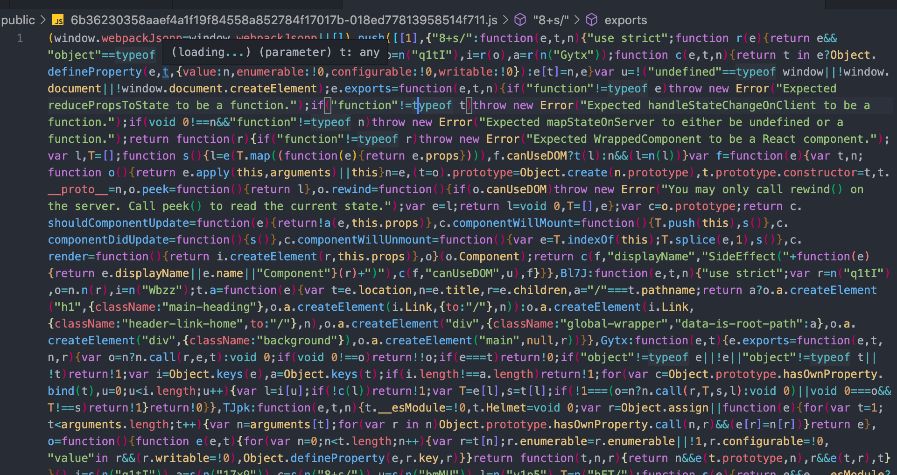

프론트엔드에 어느 정도 관심을 가지고 있다면 "웹팩" 이라는 도구를 한번은 들어보았을 것입니다.  
오늘은 이 웹팩이 무엇이고 어떻게 사용하는지 다뤄 보도록 하겠습니다.

## 1. What is Webpack?

웹팩은 여러 모듈을 한데 묶어주는 **'모듈 번들러'** 입니다.  
모듈을 묶는다니, 그게 무슨 뜻인가요?

```js
// foo.js
export default function foo() {
  console.log("FOOOOOOO!")
}
```

```js
// bar.js
export default function bar() {
  console.log("BARRRRR!!")
}
```

```js
// index.js
import bar from "./bar"
import foo from "./foo"

foo()
bar()
```

현재 디렉토리에 `foo.js` 라는 모듈과 `bar.js` 라는 모듈이 있는 상태네요.  
이제 `npm i -D webpack` 으로 웹팩을 설치한 후, 웹팩 설정 파일을 생성해 봅시다.

```js
const path = require("path")

module.exports = {
  entry: "./index.js",
  output: {
    path: path.resolve(__dirname, "dist"),
    filename: "bundle.js",
  },
}
```

아직 설정 파일의 속성들이 뭘 의미하는지 아직은 자세히 몰라도 됩니다.  
글을 쓰는 시점에서 아직 저도 잘 모르거든요.

자, 이제 터미널에서 `webpack` 이라는 커맨드를 입력해 봅시다.

```js
// dist/bundle.js
;(() => {
  "use strict"
  console.log("fooooo!"), console.log("BARRRRR!!")
})()
```

`dist` 폴더와 함께 뭔가 요상한 코드가 생성됐는데 뭔가 보이지 않으시나요?  
자세히 보면 `foo.js`와 `bar.js` 모듈 본문의 코드가 어렴풋이 보이는데요, 이렇게 **여러 모듈을 번들로 만드는 것**이 웹팩의 역할입니다.


<figcaption>코드가 길어지면 이런 번들이 탄생하기도 합니다!</figcaption>

그럼 왜 이런 요상한 코드를 만드는 걸까요?

## 2. Why Webpack?

웹팩을 사용하는 이유는
