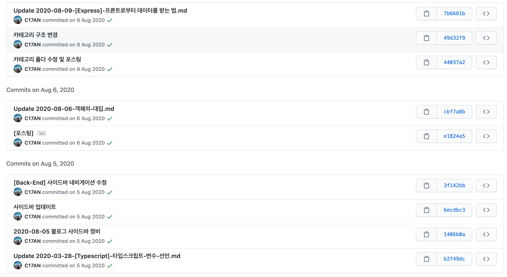
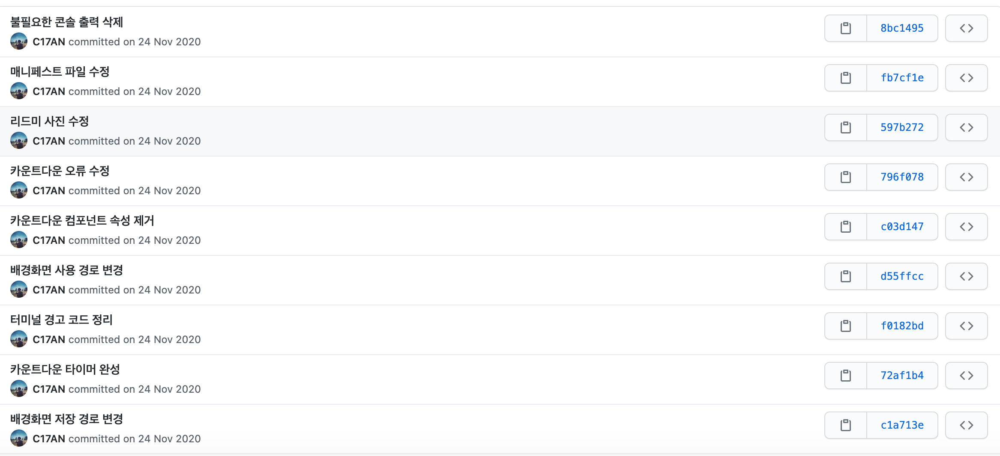
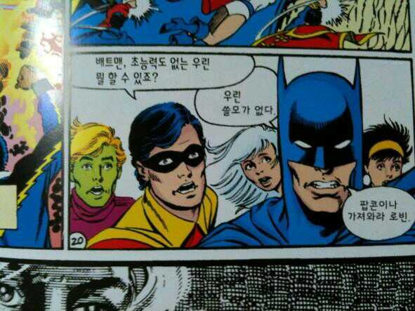

깃과 커밋은 뗄래야 뗄 수 없는 관계인데, 내 깃허브를 되돌아보면 커밋 메시지가 제대로 적힌 내용이 드물다.  
물론 갈수록 나아지고 있다고는 하지만 아직도 정확한 기준을 잡지 못해 남의 흉내만 내고 있는 실정인데, 이번 기회에 커밋 메시지에 대한 정리를 해보기로 했다.


<figcaption>옛날 블로그의 커밋 기록. 근본? 그런 거 없다!</figcaption>

## 1. 왜 좋은 커밋 메시지를 남겨야 하는가?

사실 좋은 질문은 아닌 것 같다.  
깃이 뭔지 모르는 사람이라도 '좋은' 무언가를 남겨야 한다는 데에는 동의할 것이기 때문이다.  
그렇다면 질문을 조금 바꿔서 "왜 우리는 좋은 커밋 메시지를 남기지 못할까?" 에 대한 답을 찾아보자.

아마 가장 솔직한 대답은 "귀찮아서" 또는 "어차피 혼자 진행할 프로젝트니까" 정도가 될 것이다.  
하지만 한편으로는 **"제대로 남기고 싶어도 어떻게 남겨야 할지 몰라서"** 라고 대답할 사람도 많을 것이다.

나는 프로젝트를 진행할 때 언제나 커밋 제목에 변경사항을 짤막하게 요약하곤 했었다.  
예시로 스타일을 변경하면 "날씨 컴포넌트 스타일 수정", 컴포넌트를 추가하면 "헤더 컴포넌트 추가" 이런 식인데, 나름 괜찮다고 생각했던 커밋 메시지였지만 문제를 인지하게 된 계기가 있었다.


<figcaption>이걸 언제 다읽어!!</figcaption>

최근에 진행한 항공대 종강시계 프로젝트에서 남긴 커밋 기록인데, 커밋별로 수정/추가된 사항을 잘 기록했다고 생각했지만 이렇게 모아보니 일관성이 단 하나도 없다는 것이었다.  
만약에 프로젝트에 생판 처음인 협업자가 들어와 커밋 기록을 살펴보면 커밋별로 수정된 사항은 알 수 있겠지만, 원하는 커밋을 찾기 위해 하나부터 열까지 모든 커밋을 뒤져야 한다는 문제가 있다.

## 2. 그럼 어떡하죠?

<div style = "width: 400px; border-radius: 12px; text-align: center; left: 500px; margin-bottom: 1rem">
</img>
</div>

어떡하긴, 바로 한눈에 봐도 이해할 수 있는 커밋 메시지를 남기는 것이다!

```bash
--- 제목 ---
[커밋 타입]: [작업내용을 50자 이내 요약]
--- 본문 ---
1. 무엇을 수정했는지
2. 왜 수정했는지
```

이런 식으로 커밋 메시지를 남기면 커밋을 받아본 다른 개발자가 충분히 변경사항을 이해할 수 있을 것이다.  
또 내가 가장 중요하다고 생각한 내용은 바로 커밋 타입을 통해 작업의 종류를 설명해주는 것인데, 커밋 타입은 [박준우님 블로그](https://junwoo45.github.io/2020-02-06-commit_template/) 에 잘 분류되어 있어 그대로 사용해도 될 것 같았다.

```
# feat     : 기능 (새로운 기능)
# fix      : 버그 (버그 수정)
# refactor : 리팩토링
# style    : 스타일 (코드 형식, 세미콜론 추가: 비즈니스 로직에 변경 없음)
# docs     : 문서 (문서 추가, 수정, 삭제)
# test     : 테스트 (테스트 코드 추가, 수정, 삭제: 비즈니스 로직에 변경 없음)
# chore    : 기타 변경사항 (빌드 스크립트 수정 등)
```

Ex. 스타일을 변경한 후 커밋 메시지를 남길 때

```bash
commit 23fce12
style: h2 요소 전역 스타일 변경

1. global.scss 에서 h2 요소에 적용된 그림자를 제거했습니다.
2. 그림자와 어두운 배경이 어울리지 않는다고 판단해 제거합니다.
```

확실히 "일부 스타일 변경" 보다는 우아한 커밋 메시지가 탄생한 모습이다.  
그런데 게으른 내가 매 커밋마다 이걸 실천할 수 있을까?

그래서 필요한 것이 "커밋 템플릿" 이다.

## 3. 템플릿을 활용해 커밋 규칙 습관화하기

습관을 고치기 위한 수많은 앱처럼 깃에도 템플릿을 적용해 습관을 고쳐나가는 것이다.  
깃 템플릿을 제작하는 방법은 다음과 같다. (MAC 기준)

**1. 터미널 진입 후 아래 커맨드 입력**

```
$ touch ~/.gitmessage.txt
```

**2. 텍스트 에디터 진입**

```
$ vim ~/.gitmessage.txt
```

**3. 커밋 메시지 템플릿 작성 (다른 분들의 템플릿을 참고해 내가 제작한 템플릿 초안은 다음과 같다.)**

```
##### 제목 - 50자 이내로 요약!

### [커밋 타입]: [작업내용]

##### 본문 - 한 줄에 최대 72 글자까지만 입력하기

# 1. 무엇을 수정했는지
# 2. 왜 수정했는지

# 꼬릿말은 아래에 작성: ex) #이슈 번호
-
#   [커밋 타입]  리스트
#   feat      : 기능 (새로운 기능)
#   fix       : 버그 (버그 수정)
#   refactor  : 리팩토링
#   style     : 스타일 (코드 형식, 세미콜론 추가: 비즈니스 로직에 변경 없음)
#   docs      : 문서 (문서 추가, 수정, 삭제)
#   test      : 테스트 (테스트 코드 추가, 수정, 삭제: 비즈니스 로직에 변경 없음)
#   chore     : 기타 변경사항 (빌드 스크립트 수정 등)
# ------------------
#   [체크리스트]
#     제목 첫 글자는 대문자로 작성했나요?
#     제목은 명령문으로 작성했나요?
#     제목 끝에 마침표(.) 금지
#     제목과 본문을 한 줄 띄워 분리하기
#     본문에 여러줄의 메시지를 작성할 땐 "-"로 구분했나요?
# ------------------
```

**4. 깃 설정 저장하기**

```
$ git config --global commit.template ~/.gitmessage.txt
```

이러면 `git commit` 명령을 실행할 때마다 위에서 생성한 템플릿이 나타나게 된다.  
지금까지는 거의 대부분 `commit -m` 으로 한 줄로 메시지를 퉁쳤지만, 이제부터는 템플릿에 적혀있는 규칙대로 커밋 메시지를 작성하도록 노력해야겠다.
