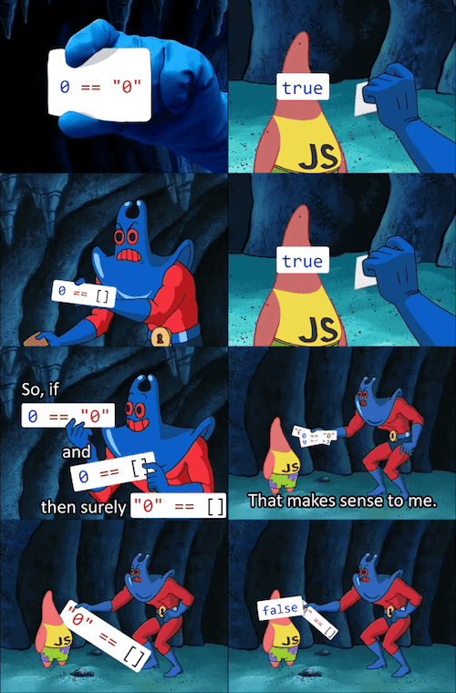
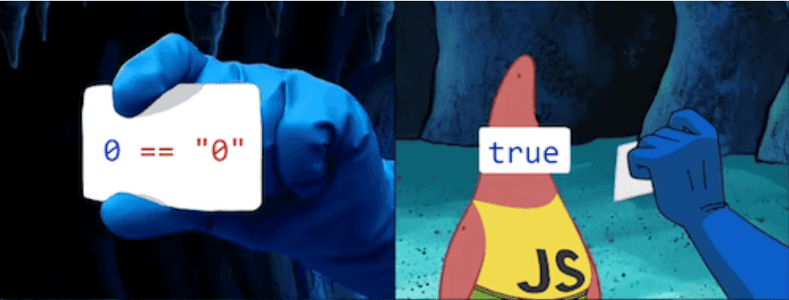
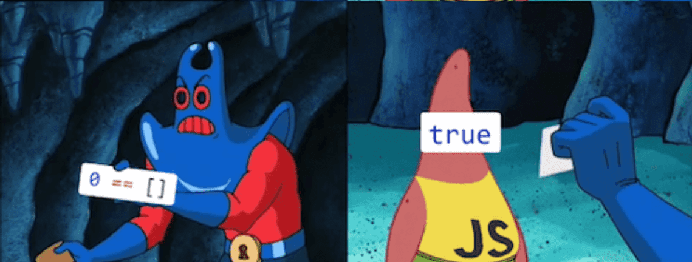
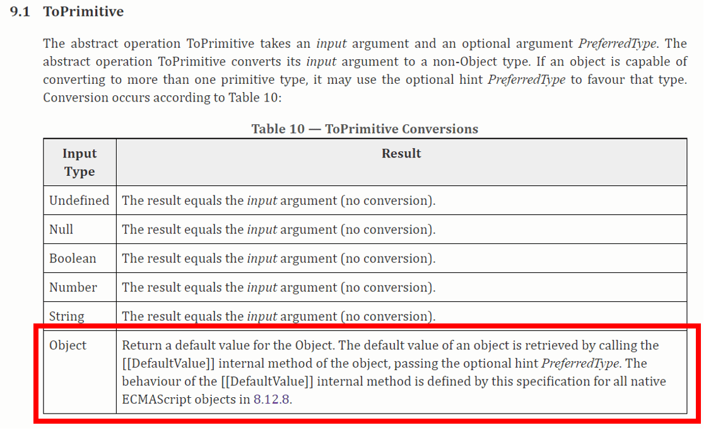
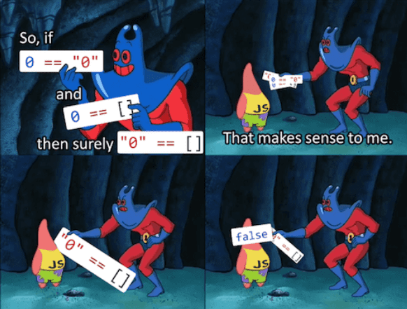

굉장히 유명한 자바스크립트 밈인데, 정말 재밌게 봤었던 짤이다. 🤣  
광선맨과 뚱이의 대화를 들어보면서 자바스크립트의 상동 연산자가 어떻게 동작하는지 알아보자.

## 들어가기 앞서. == 과 === 의 차이

대부분의 언어들이 상동 연산자로 `==` 연산자를 사용하는 것과는 달리 자바스크립트에는 `==` 연산자와 `===` 연산자 2종이 존재한다.  
두 연산자의 차이는 명확한데, `==` 연산자는 두 타입을 일치시킨 후 값만을 비교하고 `===` 연산자는 타입과 값을 모두 비교해 이런 결과를 얻을 수 있다.


> 첫 번째 비교에서는 **true** 가 **Number** 타입의 1로 변환되어 비교 결과가 동일하다는 값을 출력했다.  
> 그러나 두 번째 비교에서는 타입 변환이 이루어지지 않아 **Number** 타입과 **Boolean** 타입의 비교 결과로 **false** 를 출력하는 모습이다.

이제 `==` 과 `===` 의 차이도 알았으니 뚱이와 광선맨의 대화를 엿들어보자.

## 첫 번째 비교. 0 과 "0" 비교하기



== 연산자는 두 대상의 타입이 다를 경우 타입을 변환한 후 값의 비교를 수행하기 때문에 **String** 타입의 "0" 을 **Number** 타입의 0 으로 변환한 후 비교를 진행한다.  
따라서, 0 == "0" 은 0과 0을 비교하는 것과 동일하므로 위 비교의 결과는 참이 맞다.

```js
[Step 1] -> 0 == "0"
[Step 2] -> 0 == (Number) "0"

[Result] = true
```

## 두 번째 비교. 0 과 [] 비교하기



자바스크립트 공식 스펙에 따르면 자바스크립트의 원시형과 객체를 비교할 때는 객체에 **ToPrimitive** 라는 추상 연산을 가한 후 얻은 값을 통해 비교하게 되어 있다.



**ToPrimitive** 추상 연산의 수행 과정을 살펴보면[^1] 먼저 객체의 **DefaultValue**[^2] 가 될 요소를 찾아야 하는데, 배열(**객체**)로부터 **DefaultValue** 를 얻는 방법을 찾아보자.


내용이 살짝 긴데 이를 한글로 요약하면 다음 순서를 거친다.

---

### [객체의 DefaultValue를 구하는 과정]

1. 객체에 <b>valueOf()</b> 를 적용한 후, <b>valueOf()</b> 의 결과물이 원시형인지 확인한다.
2. 원시형이 아니라면 <b>toString()</b> 을 적용한다.
3. 만약 둘 다 적용이 불가능하다면 타입 에러를 출력한다.

---

따라서 위 과정을 빈 배열에 적용하면 아래와 같은 결과를 얻게 된다.

```js
let a = [];
// undefined
a.valueOf();
// []
a.toString();
// ""

-> 빈 배열에 toPrimitive 연산을 수행한 결과로 빈 문자열을 얻을 수 있음.
```

먼저 빈 배열에 **valueOf()** 연산을 수행하면 빈 배열을 얻게 되고 이는 원시형이 아니라 참조 타입 변수이므로 **toString()** 연산을 적용하게 된다.  
그리고 빈 배열에 **toString()** 연산을 적용한 결과로는 빈 문자열을 얻게 되는데, 빈 문자열을 숫자 타입으로 변환한 결과인 0과 0을 비교하게 되므로 이 비교의 결과도 참이 된다.

```js
[Step 1] -> 0 == [] // 직접 비교 불가, []에 toPrimitive 연산 적용
[Step 2] -> 0 == ""
[Step 3] -> 0 == (number) ""

[Result] = true
```

## 세 번째 비교. "0" 과 [] 비교하기



마지막 문제는 위에서 다룬 내용들을 총동원해 풀 수 있다.  
원시형과 객체 타입을 비교하면 객체 타입에서 **ToPrimitive** 라는 연산이 이루어짐을 알았고, 빈 배열에 **ToPrimitive** 연산을 적용한 결과는 **빈 문자열** 임을 알 수 있었다.  
따라서 "0" == [] 의 비교는 곧 "0" 과 빈 문자열 "" 의 비교가 되고, 둘의 타입은 일치하지만 값은 다르므로 비교 결과는 거짓이 된다.

```js
[Step 1] -> "0" == [] // 직접 비교 불가, []에 toPrimitive 연산 적용
[Step 2] -> "0" == ""
[Step 3] -> "0" == ""

[Result] = false
```

많은 사람들이 이 광선맨 짤로 자바스크립트를 근본이 없는 언어라고 놀리기도 하지만 그래도 나름의 규칙이 있는 언어다!  
하지만 헷갈릴 여지가 충분히 있는 것은 분명하니, 이 기회에 잘 정리해 두자 :)

---

> 📖 참고

- [**MDN - 자바스크립트 재입문하기**](https://developer.mozilla.org/ko/docs/A_re-introduction_to_JavaScript)
- [**The Best JavaScript Meme I've Ever Seen**](https://www.freecodecamp.org/news/explaining-the-best-javascript-meme-i-have-ever-seen/)

[^1]: [**자바스크립트 공식 스펙**](https://www.ecma-international.org/ecma-262/5.1/#sec-9.1) 참조
[^2]: 여기서의 defaultValue는 HTML DOM의 그것이 아니라 추상 연산의 결과값을 의미한다.
