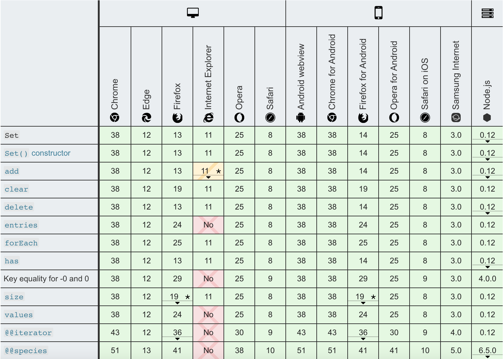

## 1. Set 이란?

ES6에서 추가된 다양한 기능들 중 새롭게 추가된 자료구조들도 존재하는데 오늘은 고윳값을 관리하는데 효과적인 **Set** 객체에 대해 알아보고자 한다.  
주로 배열과 객체만을 사용하다가 새로운 컬렉션이 낯설 수도 있지만, "그 브라우저" 를 제외한 최신 브라우저들에서는 어느 정도 자리를 잡은 모습이다.



<div style = "text-align: center; font-size: 0.9rem; margin-top: -0.5rem">하여튼 그놈이 문제다.</div>

## 2. Set 사용법

Set 객체를 생성할 때는 Map 객체를 만들 때처럼 `new` 키워드를 사용해 새로운 인스턴스를 만든다.

### Set 객체 생성하기

```javascript
let person = new Set()
```

이 때 인스턴스의 생성자 인수를 검사한 후, 인자가 **이터러블 객체** 일 경우 해당 객체의 중복을 제거한 결과를 Set 객체에 저장한다.  
Set 객체는 Map 객체와는 다르게 get / set 메서드를 통한 데이터 조작은 불가능하지만, 맵과는 다른 결정적인 특징이 하나 있다.  
바로 Set 객체에는 언제나 **고유한 값** 만이 존재할 수 있다는 것이다.

### Set 객체를 사용해 중복을 제거하는 예시

```javascript
let colors = new Set(["하늘색", "보라색", "빨간색", "하늘색"])
console.log(colors)
// {"하늘색", "빨간색", "보라색"}
```

이렇게 색상을 저장하는 Set 객체를 만들고 **"하늘색"** 이라는 값을 두 번이나 사용해 초기화한 모습이다.  
하지만 이후 `colors` 객체를 출력해 보면 "하늘색" 이라는 문자열은 한 번만 출력됨을 확인할 수 있다.

## 3. Set 을 활용해 배열 내 중복값 제거하기

위의 예시처럼 중복된 색을 제거하는 기능을 함수로 만든다고 해보자.

```javascript
let colors = ["하늘색", "보라색", "빨간색", "하늘색"]
const getUnique = colors => {
  const unique = []
  for (color of colors) {
    if (!unique.includes(color)) {
      unique.push(color)
    }
  }
  return unique
}
// ["하늘색", "보라색", "빨간색"]
```

이렇게 반복문을 통해 배열을 순회하는 과정에서 코드는 자연스레 길어지게 되는데, Set을 사용하면 위 코드를 훨씬 세련되게 고칠 수 있다.

```javascript
let colors = ["하늘색", "보라색", "빨간색", "하늘색"]
const getUnique = colors => {
  // 펼침 연산자를 사용해 Set 객체 전개하기!
  return [...new Set(colors)]
}
// ["하늘색", "보라색", "빨간색"]
```

이렇게 이터러블 객체 내 중복 제거를 위해서는 reduce, map 등 비교적 복잡한 메서드를 활용하기 전에 **Set** 을 사용할 생각을 먼저 해보자!

---

> 📖 참고

- [**MDN 문서 - Set**](https://developer.mozilla.org/ko/docs/Web/JavaScript/Reference/Global_Objects/Set)
- 조 모건, 자바스크립트 코딩의 기술 (2019), 길벗
