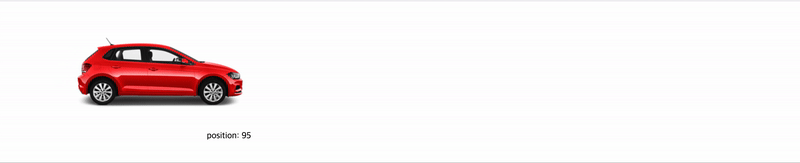

`requestAnimationFrame`은 자바스크립트로 \*애니메이션 효과를 쉽게 구현할 수 있는 API입니다.

######(\* 이 글에서의 애니메이션이란, 프레임 단위로 픽셀을 재렌더링하는 행위를 의미합니다.)######

기존의 자바스크립트 애니메이션은 `setInterval` 등을 사용해 1.5ms 마다 대상의 위치를 변경하는 등의 방법을 사용했지만, 디스플레이 주사율이 기기마다 다양해짐에 따라 이는 좋지 않은 경험으로 다가올 수도 있었습니다.

## **setInterval을 사용한 애니메이션**

```html
<!DOCTYPE html>
<html lang="ko">
  <head>
    <script src="./index2.js" defer></script>
  </head>
  <body>
    
    <span>position: </span><span id="value">0</span>
  </body>
</html>
```

```js
const car = document.querySelector("#car")
const value = document.querySelector("#value")

let xPos = 0

const render = () => {
  value.innterHTML = xPos
  xPos += 1
  car.style.transform = `translateX(${xPos}px)`
}

setInterval(render, 1.5) // 약 66프레임 애니메이션 효과
// -> 144Hz 모니터에서는 프레임이 부드럽지 않게 재생됨!
```


그러나 `requestAnimationFrame`은 순수히 애니메이션을 구현하기 위해 등장한 API로, 현재 디스플레이의 주사율을 기반으로 한 보정을 적용해 동작합니다.

## **requestAnimationFrame을 사용한 애니메이션**

```js
const car = document.querySelector("#car")
const value = document.querySelector("#value")

let xPos = 0

const render = () => {
  value.innerHTML = xPos
  xPos += 1
  car.style.transform = `translateX(${xPos}px)`
  requestAnimationFrame(render)
}

render()
```

`requestAnimationFrame`은 화면 주사율에 맞춰 동작할 콜백을 인자로 받고, 주사율에 따라 다른 주기로 호출합니다.

현재 모니터의 경우 60Hz로 동작하기 때문에 render 함수는 1초에 60번 실행되고, 사용자는 디스플레이에 최적화된 애니메이션을 느낄 수 있게 됩니다.


## **cancelAnimationFrame**

`setInterval`에 `clearInterval` 함수가 함께하는 것처럼 애니메이션을 중단하기 위한 함수도 존재합니다.

바로 `cancelAnimationFrame` 함수로, 이를 사용하면 애니메이션을 정지시킬 수도 있습니다.

```js
const car = document.querySelector("#car")
const value = document.querySelector("#value")

let xPos = 0
let animationId

const render = () => {
  value.innerHTML = xPos
  xPos += 5
  car.style.transform = `translateX(${xPos}px)`
  animationId = requestAnimationFrame(render)
}

// 클릭 시, 3초간 정지 후 재생
window.addEventListener("click", () => {
  cancelAnimationFrame(animationId)
  setTimeout(() => requestAnimationFrame(render), 3000)
})

render()
```



## **TL;DR**

1. `requestAnimationFrame`을 사용하면 효과적인 애니메이션 구현이 가능하다.

2. `requestAnimationFrame`은 콜백을 인자로 받으며, 콜백의 호출 주기는 디스플레이 주사율에 따라 결정된다.

3. `cancelAnimationFrame`을 사용하면 애니메이션 중단이 가능하다.
