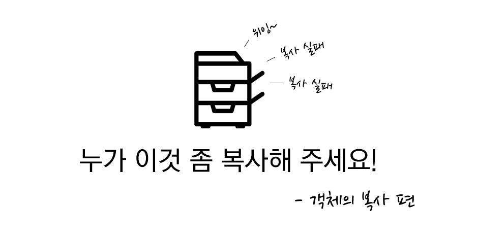
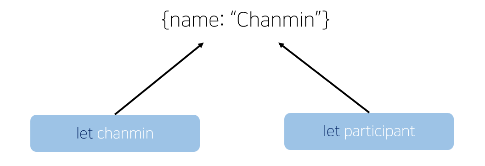

## 1. 객체의 특징

참조 타입[^1]과 원시 타입[^2]의 가장 큰 차이는 참조 타입을 변수에 저장하면 언제나 대상의 참조를 담는다는 점입니다.

간단한 예시를 들어볼게요.

```js
let chanmin = { name: "Chanmin" }
let participant = chanmin // participant 변수에 { name: 'Chanmin' } 의 '참조' 를 할당한다.
chanmin.name = "I am NOT Chanmin"
console.log(participant.name) // 'I am NOT Chanmin'
```

원본 객체가 수정되니 `participant` 변수에 할당된 객체의 값도 변한 모습입니다.  
따라서 객체를 복사하면 객체의 **참조**가 복사될 뿐, 객체가 가진 값들이 복사되는게 아니라는 것을 알 수 있습니다.



<div style = "text-align: center; margin-bottom: 1rem; font-size: 0.8rem">두 변수는 같은 객체를 가리키고 있습니다.</div>

하나 놀라운 점은 객체로 값을 초기화한 `chanmin` 변수조차 `{ name: 'Chanmin' }` 객체를 저장하고 있지 않다는 것입니다.

변수에 객체를 할당해도 실제로 할당되는 것은 객체의 참조일 뿐이고, `chanmin` 변수와 `participant` 변수는 참조를 따라 `{ name: 'Chanmin' }` 객체를 가리킬 뿐인거죠.

그럼 객체의 참조가 아닌 실제 값을 복사받아 독립적인 객체를 만들려면 어떻게 해야 할까요?

## 2. 객체의 값 복사하기 (깊은 복사)

값의 참조를 복사하는 것을 **'얕은 복사'** 라고 하는데요, 반대로 값을 직접 복사하는 것을 **'깊은 복사'** 라고 부릅니다.
그럼 오늘은 깊은 복사를 통해 객체를 복사하는 방법들을 알아보겠습니다.

---

### 2. 1. Object.assign

객체의 값만 복사하고 싶을 때는 Object 프로토타입의 `assign` 메서드를 활용할 수 있습니다.

> 함수 형태 : Object.assign(dest, src1, src2, src3...)

첫 인자 `dest`는 복사받을 객체를 의미하며 `src1, src2, src3...`은 속성과 값을 복사할 객체를 의미합니다.  
이 때 복사받을 객체에 동일한 속성이 존재하면 값을 덮어씌웁니다.

```js
let chanmin = { name: "Chanmin" }
let participant = Object.assign({}, chanmin)
chanmin.name = "NOT_Chanmin"
console.log(participant.name) // "Chanmin"
```

`Object.assign`을 사용해 빈 객체에 값을 복사한 후 이를 `participant` 변수에 할당한 모습입니다.  
원본 객체의 값이 변경되었지만 이제는 복사받는 객체의 값이 유지되고 있네요.

`assign` 메서드는 분명 편리하지만 이보다 더 좋은 방법도 있습니다. 바로 분해 할당입니다.

---

### 2. 2. 분해 할당으로 값 복사하기

구조 분해 할당을 사용하면 객체의 값들을 변수로 곧장 빼올 수 있습니다.

```js
const person = {
  name: "chanmin",
  age: "24",
  married: false,
}

const { name, age, married } = person
```

분해 할당으로 객체를 분해하면 객체가 가진 값을 대입한다는 점을 이용하는 건데요,  
펼침 연산자와 조합하면 `assign` 없이 객체의 모든 값을 새로운 객체에 대입할 수 있습니다.

```js
let chanmin = { name: "Chanmin" }
let participant = { ...chanmin } // 펼침 연산자를 사용해 구조 분해 할당 수행
chanmin.name = "NOT_Chanmin"
console.log(participant.name) // "Chanmin"
```

여기까지만 보면 객체를 안전하게 복사할 수 있는 것 같지만 아직 한 가지 문제가 숨어 있습니다.

## 3. 중첩된 객체 복사

영화 정보를 보관한 서버에 요청을 보내 이런 응답을 받았다고 가정합시다.  
"바람과 함께 사라지다!" 를 받았네요. 물론 본 적 없는 영화입니다.

```js
body: {
    title: "바람과 함께 사라지다",
    actor: ["비비언 리", "클라크 게이블", "레슬리 하워드"],
    prize: {
        academy: "최우수 감독상",
        honor: "아카데미상 명예상",
        celebration: "어빙 G. 탤버그 기념상"
    }
}
```

이제 이 데이터를 복사하고 싶겠지만 위에서 다룬 방법들로는 중첩된 객체를 복사할 수 없습니다.

```js
const body = {
  title: "바람과 함께 사라지다",
  actor: ["비비언 리", "클라크 게이블", "레슬리 하워드"],
  prize: {
    academy: "최우수 감독상",
    honor: "아카데미상 명예상",
    celebration: "어빙 G. 탤버그 기념상",
  },
}

let data = Object.assign({}, body)
body.prize.academy = "개근상"
console.log(data.prize.academy) // "개근상"
```

위 코드처럼 `assign` 이나 분해 할당을 사용해도 중첩된 객체의 값 대신 참조를 복사하게 되는데요,  
아카데미 최우수 감독상이 개근상으로 변하는 일이 없도록 방법을 찾아 봅시다.

---

### 3. 1. 객체의 키를 검사하기

첫 번째 방법은 객체가 가진 키의 값이 객체인 경우를 찾아가며 재귀적으로 처리하는 방법입니다.

```js
const deepClone = obj => {
  if (typeof obj !== "object") return obj
  let result = Array.isArray(obj) ? [] : {}
  for (let key in obj) {
    result[key] = deepClone(obj[key])
  }
  return result
}

data = deepClone(body)
body.prize.academy = "개근상"
console.log(data.prize.academy) // "최우수 감독상"
```

얼핏 보면 쉬워 보이지만 꼭 한번 직접 짜보는걸 권장하고 싶습니다.

---

### 3. 2. lodash 라이브러리 사용하기

다음은 객체와 배열을 쉽게 다룰 수 있게 도와주는 `lodash` 라이브러리를 사용하는 방법입니다.  
`loadsh` 라이브러리 중에서 `lodash.clonedeep` 을 사용하면 쉽게 중첩된 객체 구조를 복사해올 수 있습니다.

```js
const clonedeep = require("lodash.clonedeep") // npm i lodash.clonedeep 으로 설치합니다.

const body = {
  title: "바람과 함께 사라지다",
  actor: ["비비언 리", "클라크 게이블", "레슬리 하워드"],
  prize: {
    academy: "최우수 감독상",
    honor: "아카데미상 명예상",
    celebration: "어빙 G. 탤버그 기념상",
  },
}

const data = clonedeep(body)
body.prize.academy = "개근상"
console.log(data.prize.academy) // "최우수 감독상"
```

"이정도는 직접 구현해야 한다 vs 라이브러리가 괜히 있겠냐" 로 논쟁의 여지가 있긴 하지만 저는 좋은 게 있으면 좋은 대로 쓰자는 입장이기 때문에 `lodash` 를 사용해볼 것 같습니다. 😄

[^1]: 참조 타입: 객체, 배열, 함수
[^2]: 원시 타입: 숫자, 문자열, 논리형, null, undefined
