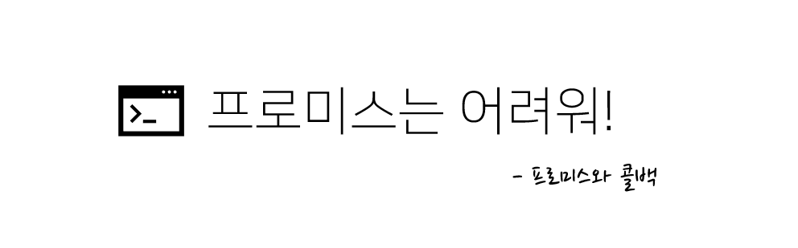
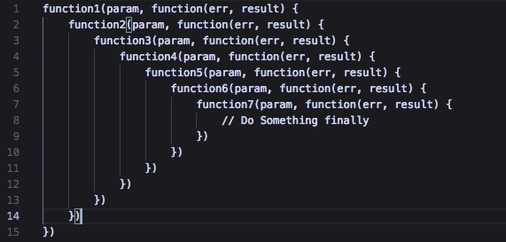

만약 면접관이 내게 "프로미스에 대해 설명해 보세요." 라고 하면 뭐라고 설명할 수 있을까?

> 대답 : 중첩된 콜백으로 인해 코드의 가독성을 해치는 '콜백 지옥' 현상을 해결하기 위해 등장한 도구입니다.

음.. 괜찮은 답안같긴 한데 뭔가 약간 부족하다.  
오늘은 콜백과 프로미스의 형태를 직접 비교해가면서, 프로미스가 어떻게 콜백을 대체할 수 있는지 정리해보자.

## 1. 중첩된 콜백

콜백은 주로 비동기 작업을 제어하기 위해 사용되는데, 영화 정보를 보여주는 페이지를 예로 들어보자.  
만약 영화 정보를 서버에서 불러오기 전에 클라이언트에서 보여주려 한다면 흰 화면만이 나타날 것이다.

```js
let movieData

function getMovie(printMovie) {
  // jquery를 사용한 ajax 요청 예시
  $.get("https://jsonplaceholder.typicode.com/posts", function (res) {
    movieData = res
  })
  // $.get은 비동기 작업이므로 console.log(movieData)가 먼저 수행됨.
  console.log(movieData) // undefined
}
```

사용자가 흰 화면을 보지 않게 하려면 비동기 동작을 순차적으로 제어할 수 있는 기법이 필요한데, 이 때 사용할 수 있는 방법이 바로 콜백을 활용하는 것이다.

```js
function getMovie(printMovie) {
  $.get("https://jsonplaceholder.typicode.com/posts", function (res) {
    printMovie(res) // 인자 res는 영화 정보
  })
}

function printMovie(data) {
  console.log(data) // 영화 정보를 출력
}
```

콜백을 통해 비동기 작업을 순서대로 제어할 수 있게 되었는데, 아직 두 문제가 남아있다.  
우선 콜백을 사용하기 위해서는 수행할 작업<span style = "color: #2e3e78; font-size: 0.88rem"><b>(printMovie)</b></span>을 인자로 넘겨야 하는데, 처음 보는 사람이라면 약간 어려운 흐름으로 인해 `printMovie`와 `getMovie` 함수를 몇 번은 넘나들며 살펴봐야 할 것이다.

그리고 어떻게든 콜백의 흐름을 이해한다고 해도 콜백이 여러번 중첩되면 곧바로 코드의 형태가 변하게 되고, 결국 _사람이 코드를 읽기 어려워진다는_ 문제가 생긴다.



<div style = "text-align: center; margin-bottom: 1rem; font-size: 0.8rem">[딱 봐도 흉악하지 않은가? ]</div>

이런 치명적인 단점때문에 비동기 동작을 콜백에만 의존하는 것에 한계를 느껴 결국 개발자들은 ES6에서 새로운 대안을 제시하는데, 바로 **프로미스(Promise)** 다.

## 2. 프로미스 (Promise)

프로미스는 ES6에서 등장한 새로운 문법으로 코드의 흐름을 보다 자연스럽게 읽을 수 있도록 해준다.

```js
function getMovie() {
  return new Promise(function (resolve, reject) {
    $.get("https://jsonplaceholder.typicode.com/posts", function (res, status) {
      if (status === "success") {
        // 요청 성공시, resolve 함수에 비동기 작업의 결과를 전달함
        resolve(res)
      } else {
        // 요청 실패시, reject 함수에 비동기 작업의 결과를 전달함
        reject(res)
      }
    })
  })
}

getMovie()
  .then(movieData => console.log(movieData))
  .catch(err => console.error(err))
```

비록 문법은 조금 복잡해졌지만, 콜백을 사용할 때는 복잡한 흐름으로 인해 코드를 위아래로 넘나들며 살펴봐야 했던 것과는 달리 이제 코드를 자연스럽게 위에서 아래로 읽을 수 있다.

프로미스에 대한 설명을 덧붙이자면 프로미스는 생성자의 인자로 함수를 받는 특수한 형태의 객체다.

```js
let promise = new Promise(function (resolve, reject) {
  // 수행할 비동기 작업
  // 작업 성공시, resolve(작업 결과);
  // 작업 실패시, reject(작업 결과);
})
```

인자로 받은 함수는 `resolve`와 `reject` 라는 프로미스의 메서드를 인자로 갖는데, 비동기 작업 <span style = "font-size: 0.88rem">(예시: 데이터 불러오기)</span> 이 성공하면 성공한 결과를 `resolve` 에 전달하고 실패 시에는 `reject` 에 전달하면 된다.

`resolve`와 `reject`는 프로미스의 상태를 변화시키고 전달받은 값을 사용할 수 있게 하는데, `resolve`에 전달한 데이터는 `promise.then()` 이라는 함수에 전달해 사용할 수 있고 `reject`에 전달한 데이터<span style = "font-size: 0.88rem">(실패 결과)</span>는 `promise.catch()` 라는 함수에 전달해 사용할 수 있다.

```js
let promise = new Promise(function (resolve, reject) {
  $.get("https://jsonplaceholder.typicode.com/posts", function (res, status) {
    if (status === "success") {
      resolve(res)
    } else {
      reject(res)
    }
  })
})

promise.then(data => console.log(data)).catch(err => console.error(err))
```

## 3. 콜백과 프로미스 코드 비교

`setTimeout` 은 비동기 동작의 대표적인 예인데, 콜백과 프로미스를 사용해 동일한 동작을 수행하는 두 예시 코드를 살펴보자.

**[콜백을 사용한 코드]**

```js
timeout = function (callback) {
  setTimeout(() => {
    callback()
  }, 1000)
}

timeout(function () {
  console.log("작업 1")
  timeout(function () {
    console.log("작업 2")
    timeout(function () {
      console.log("작업 3")
      timeout(function () {
        console.log("작업 4")
      })
    })
  })
})
```

**[프로미스를 사용한 코드]**

```js
timeout = function () {
  return new Promise(function (resolve, reject) {
    setTimeout(() => {
      resolve()
    }, 1000)
  })
}

timeout()
  .then(function () {
    console.log("작업 1")
    return timeout()
  })
  .then(function () {
    console.log("작업 2")
    return timeout()
  })
  .then(function () {
    console.log("작업 3")
    return timeout()
  })
  .then(function () {
    console.log("작업 4")
  })
```

아직은 수행하는 동작이 간단하고 코드의 깊이도 깊지 않아 콜백의 단점이 크게 부각되지 않지만, 동기적으로 동작하는 코드를 읽듯 비동기 동작의 코드를 위에서 아래로 읽어갈 수 있다는 점은 프로미스의 큰 장점이다.

---

> 📖 참고

- [**모던 자바스크립트 튜토리얼 - 프라미스**](https://ko.javascript.info/promise-basics)
- 이소 히로시, 모던 자바스크립트 입문 (2018), 길벗
