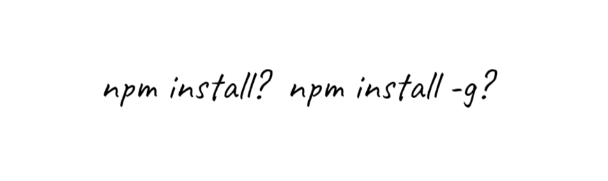

여러 강좌나 개발 문서를 따라가다 보면 `npm install` 에 `--save-dev` 나 `-g` 등 여러 접미어가 붙은 것을 확인할 수 있는데요, 이것들은 무엇이고 어떤 역할을 하는지 알아보겠습니다.

## 1. npm install 과 패키지

먼저 간단하게 `npm install` 의 동작을 둘로 나누면 다음과 같습니다.

1. 패키지명을 명시해 특정 패키지를 설치하는 동작
2. 패키지명을 명시하지 않고 `package.json` 파일의 의존성을 설치하는 동작

예를 들어 `$ npm install express` 를 실행하면 express 모듈이 설치될 것이고, `$ npm install` 을 실행하면 `package.json` 에 포함된 의존성 패키지들이 일괄적으로 설치됩니다.

## 2. 특정 패키지를 설치할 때

특정 패키지를 설치할 때는 크게 두 가지 옵션으로 구분됩니다.

하나는 프로젝트를 구동할 때 필요한 `dependencies` 목록에 추가될 `$ npm install (프로젝트명)` 으로 프로젝트를 설치하는 옵션이고, 다른 하나는 개발 단계에서만 필요한 `devDependencies` 목록에 추가될 `$ npm install -D (프로젝트명)` 옵션입니다.

- `-D` 와 같은 접미어를 "플래그" 라고 부르는데, 주로 사용되는 플래그는 다음과 같습니다.

---

|   플래그    |                               효과                                |
| :---------: | :---------------------------------------------------------------: |
|     -P      |   패키지를 설치하고 프로젝트의 `dependencies` 목록에 추가한다.    |
| --save-prod |   패키지를 설치하고 프로젝트의 `dependencies` 목록에 추가한다.    |
|     -D      |  패키지를 설치하고 프로젝트의 `devDependencies` 목록에 추가한다.  |
| --save-dev  |  패키지를 설치하고 프로젝트의 `devDependencies` 목록에 추가한다.  |
|     -g      | 패키지를 프로젝트가 아닌 시스템의 `node_modules` 폴더에 설치한다. |

## 2. 1. -P, --save-prod 플래그를 사용할 때

`-P`, `--save-prod` 플래그는 사용할 일이 많지 않습니다.

왜냐하면 `-P` 플래그의 효과는 기본 `$ npm install (프로젝트)` 와 완전히 동일하기 때문인데요, `-P` 플래그는 패키지를 설치한 후 프로젝트의 `dependencies` 목록에 추가합니다.

> 결론 : -P 플래그(기본 옵션) 는 프로젝트의 의존성 패키지 `dependencies` 목록에 추가한다.

## 2. 2. -D, --save-dev 플래그를 사용할 때

사람들이 잘 헷갈려하는 플래그가 바로 `-D` 플래그입니다.

`-D` 플래그는 기본 `-P` 와 동일하게 프로젝트의 `node_modules` 폴더에 패키지를 설치하지만, 패키지명을 `dependencies` 가 아닌 `devDependencies` 에 기록한다는 차이가 있습니다.

`dependencies` 와 `devDependencies` 의 차이는 아래와 같습니다.

---

1. dependencies : `express` 패키지처럼 실제 코드에도 포함되며 앱 구동을 위해 필요한 의존성 파일들
2. devDependencies : `concurrently` 패키지처럼 실제 코드에 포함되지 않으며 개발 단계에만 필요한 의존성 파일들

---

> 결론 : -D 플래그를 사용하면 개발 전용 패키지 `devDependencies` 목록에 추가한다.

## 2. 3. -g, --global 플래그를 사용할 때

`-g` 또는 `--global` 플래그는 약간 다른 동작을 수행합니다.

`$ npm install (패키지명)` 은 프로젝트 폴더에 패키지를 설치했지만, `-g` 플래그를 통해 패키지를 설치하면 시스템 폴더에 패키지를 설치하게 됩니다.

(Win10 기준으로는 `(사용자명)\AppData\Roaming\npm\node_modules`)

시스템의 `node_modules` 폴더 경로는 `npm root -g` 를 통해 찾을 수 있으며, `-g` 플래그를 사용할 경우 `package.json` 의 의존성 목록에 기록되지 않습니다.

> 결론 : -g 플래그를 사용하면 패키지를 시스템 폴더에 설치한다.

## 3. 의존성 패키지를 설치할 때

패키지명을 붙이지 않고 `$ npm install` 만을 실행하게 되면 프로젝트의 `package.json` 에 기록된 모든 의존성 패키지들을 내려받게 되는데요, 이때도 플래그를 사용할 수 있습니다.

방금 다룬 `devDependencies` 파일은 개발에만 사용된다고 했으니 일반 사용자들이 이 패키지를 내려받는 것은 시·공간의 낭비가 될 가능성이 있겠죠?

그래서 사용하는 플래그가 `-production` 으로, 이 플래그를 붙이면 `devDependencies` 를 제외한 의존성 파일만을 내려받게 됩니다.

```json
{
  "devDependencies": {
    "concurrently": "^5.3.0"
  },
  "dependencies": {
    "express": "^4.17.1"
  }
}
```

만약 이렇게 기록된 `packages.json` 이 있고 `$ npm install -production` 을 실행한다면 프로젝트는 `concurrently` 패키지는 무시하고 `express` 패키지만을 설치합니다.

> 결론 : -production 플래그를 사용하면 `devDependencies` 목록을 제외한 패키지들을 설치한다.

## 4. 결론

사실 플래그 없이 `npm install` 만을 사용해도 동작은 하지만, 플래그를 사용해 `dependencies` 와 `devDependencies` 로 의존성 목록을 구분하면 "이건 개발용, 이건 실제 서비스용" 으로 구분하기 쉬워진다는 면에서 개발자들에게 필요한 기능이라고 볼 수 있겠습니다. 😄
