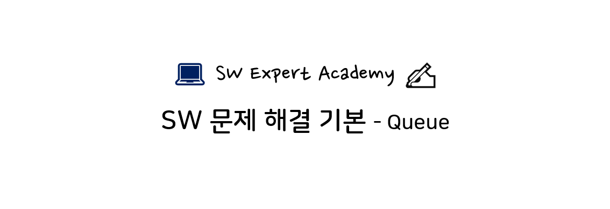

- 모든 문제의 저작권은 SW Expert Academy에 있습니다.

## 문제 목록

> [D2] No. 5097 회전

## 풀이 코드 (Python)

### 1. 5097번 - 회전

- 기본 리스트를 사용해 해결할 수도 있지만 `deque`에 익숙해지고자 데크를 사용한 풀이입니다.

- 한가지 특이한 점으로는 `split()` 으로 입력을 공백으로 구분할 때 인자로 `' '` 를 사용하면 런타임 오류가 발생합니다. 만약 런타임 오류를 겪고 계신다면 이 부분을 점검해보시길 바랍니다.

```python
from collections import deque

T = int(input())
for i in range(1, T+1):
  N, M = map(int, input().split())
  q = deque(list(map(int, input().split())))
  for j in range(M):
    q.append(q.popleft())
  print('#{} {}'.format(i, q[0]))
```
