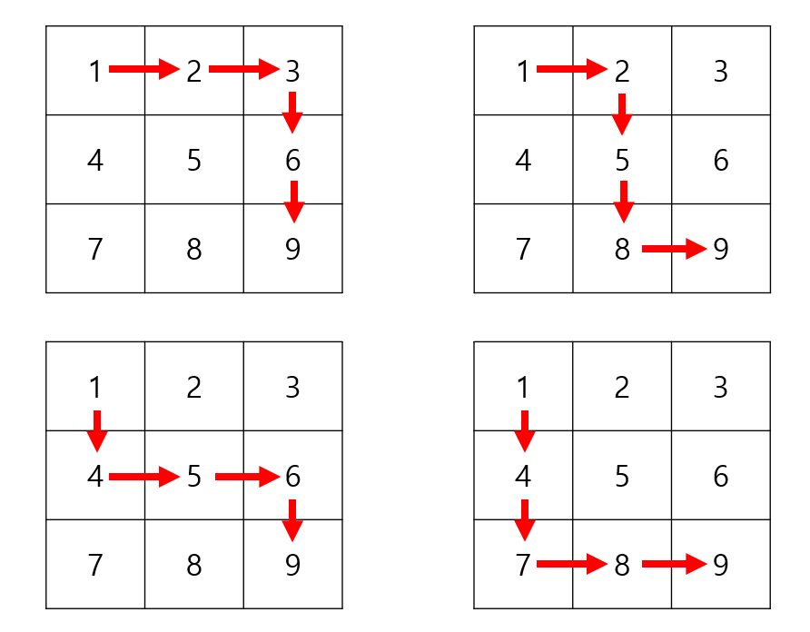

- 모든 문제의 저작권은 SW Expert Academy에 있습니다.

## 문제 목록

> [D3] No. 5188 최소합

## 풀이 코드 (Python)

### 1. 5188번 - 최소합[^1]

- DFS - BFS 기법을 사용하면 그래프의 모든 노드를 탐색할 수 있습니다.  
  그럼 모든 노드를 탐색하는 "모든 경우의 수" 를 탐색하려면 어떻게 해야 할까요?  
  모든 경우의 수를 탐색하기 위해 백트래킹을 활용해 탐색의 시작 지점을 계속해서 바꿔줘야 합니다.



<div style = "margin-bottom: 1rem; font-size: 0.9rem; text-align: center;">맨 오른쪽 밑까지 탐색을 마치면, 다른 경우의 수를 찾기 위해 돌아갑니다.</div>

```python
T = int(input())


def dfs(start_node):
    global sub_cnt, cnt
    cur_y, cur_x = start_node
    if sub_cnt > cnt:
        return

    if cur_y == N - 1 and cur_x == N - 1:
        cnt = sub_cnt
        return

    for dir in range(2):
        next_y = cur_y + dy[dir]
        next_x = cur_x + dx[dir]
        if 0 <= next_y <= N - 1 and 0 <= next_x <= N - 1 and (next_y, next_x) not in visited:
            visited.append((next_y, next_x))
            sub_cnt += board[next_y][next_x]
            dfs((next_y, next_x))
            visited.remove((next_y, next_x))
            sub_cnt -= board[next_y][next_x]


for idx in range(1, T + 1):
    board = list()
    visited = list()
    dx = [0, 1]
    dy = [1, 0]
    N = int(input())
    for _ in range(N):
        board.append(list(map(int, input().split())))
    sub_cnt, cnt = board[0][0], 1000
    dfs((0, 0))
    print("#{} {}".format(idx, cnt))
```

[^1]: 많이 고민해봤지만 답을 찾지 못해 [해리의 데브로그](https://tothefullest08.github.io/algorithm/2019/08/01/1_5188_%EC%B5%9C%EC%86%8C%ED%95%A9/) 님의 풀이를 참고했습니다.
