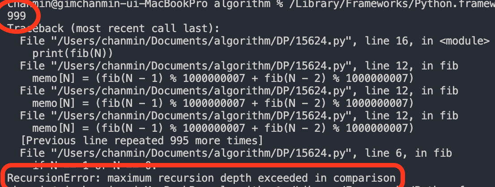
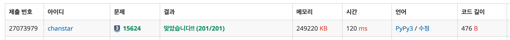

## [[백준 온라인 저지 - 문제 링크]](https://www.acmicpc.net/problem/15624)

N번째 피보나치 수를 구하는 문제입니다.  
다만 N의 범위가 0 ~ 1백만 사이로 꽤나 큰 피보나치 수를 구해야 하는데요, 스포일러를 하자면 이 문제는 파이썬 + 재귀 조합으로는 풀 수 없습니다!



C++이나 자바 등의 언어에서는 어떤지 모르겠지만 파이썬은 기본적으로 1000번까지의 재귀 호출만을 허용합니다.  
따라서 메모이제이션을 활용하는 재귀 함수 코드로는 런타임 에러를 피할 수 없습니다!

###### **(\* `sys` 모듈을 불러온 후 `sys.setrecursionlimit()` 함수를 활용하면 최대 재귀 깊이를 조정할 수 있긴 합니다만, 이 문제에서는 메모리 초과 에러에 걸리게 됩니다.)**

그래서 이 문제는 잠깐 초심(?) 으로 돌아가 단순 for문을 활용해 해결할 수 있습니다.

## 정답 코드 (Python)

```python
N = int(input())
a, b, c = 0, 1, 1
temp = 0

for i in range(N):
    temp = c
    a = b % 1000000007
    b = temp % 1000000007
    c = a + b

print(a)
```


