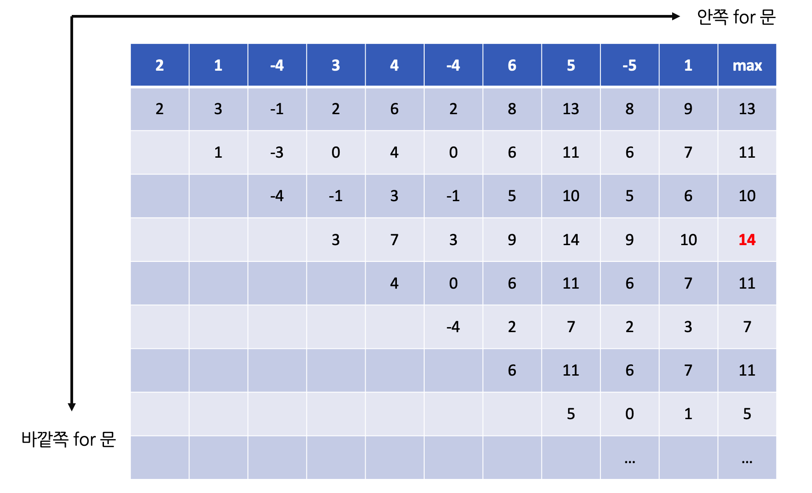
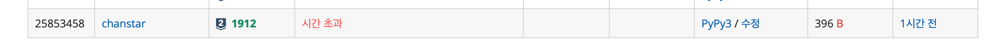
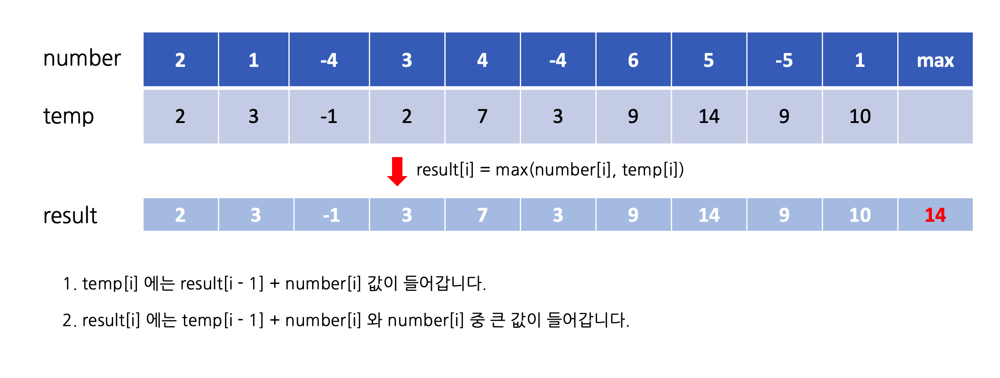

## [[백준 온라인 저지 - 문제 링크]](https://www.acmicpc.net/problem/1912)

이 문제에는 시간 초과라는 잔인한 함정이 깔려 있습니다.  
여느 DP 문제처럼 DP 테이블을 그려 해결할 수 있지만, 테이블을 조금 더 창의적으로(?) 고안해야 하는 문제입니다!


<br>

처음 제가 구상한 알고리즘은 증가하는 인덱스 i ~ N까지의 원소 중 최댓값을 각 i 별로 구한 후, 이 중에서 최댓값을 찾는 방법이었습니다.  
이를 기반으로 거친 생각과 불안한 마음을 안고 코드를 짜 봤으나...

## 실패 코드 (Python)

```python
# 시간 초과 코드
T = int(input())

d = [0] * 100001
arr = list(map(int, input().split()))
ans_list = []
temp_list = []

d[0] = arr[0]

for i in range(1, T):
    temp_list.append(arr[0])
    for j in range(i, T):
        d[j] = d[j - 1] + arr[j]
        temp_list.append(d[j])

    ans_list.append(max(temp_list))
    d = [0] * 100001
    temp_list = []

print(max(ans_list))
```


<br>

이 방법은 로컬 환경에서는 제대로 동작하지만 아쉽게도 채점 환경에서는 테스트 케이스의 범위로 인해 시간 초과에 걸리게 됩니다.  
따라서 위의 알고리즘을 개선해야만 하는데요, 이중 for문을 돌린 이유가 연속합을 시작하는 지점을 구하기 위한 것이라는 점을 생각해 봅시다.


<br>

이걸 어떻게 설명해야 할지 잘 몰라 그림을 그려서 준비했는데요, 이렇게 하면 연속합을 시작하는 지점을 한 번의 반복문만으로도 구할 수 있습니다!

## 풀이 코드 (Python)

```python
T = int(input())

num_list = list(map(int, input().split()))
d = [0] * 100001
ans = -1001

for i in range(T):
    d[i] = max(num_list[i], d[i - 1] + num_list[i])
    ans = max(d[i], ans)

print(ans)
```

개인적으로는 실버 1을 배정받은 [RGB 거리](https://www.acmicpc.net/problem/1149)보다도 더 어려웠던 문제라고 생각합니다.  
잊지 마세요, 결국 DP 문제는 DP 테이블을 어떻게 창의적으로 구상하느냐의 싸움이랍니다! ~~(이상 10문제 풀어본 후기)~~
