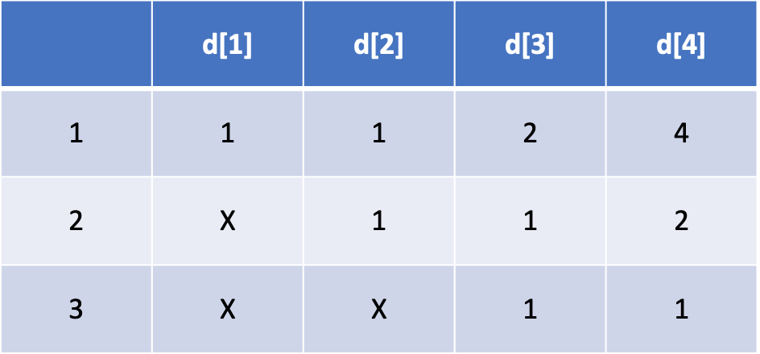

## [[백준 온라인 저지 - 문제 링크]](https://www.acmicpc.net/problem/9095)

얼핏 보면 정말 어려워 보이지만, 정석대로 DP 테이블을 그려보면 쉽게 규칙을 찾을 수 있는 문제입니다.



<figcaption style= "text-align: center; margin: 1rem 0 1.5rem 0; color: #666666; font-size: 0.9rem">결과가 4가 되는 연산의 횟수인 d[4]는 4 + 2 + 1 = 7이 됩니다.</figcaption>

## 풀이 코드 (Python)

```python
T = int(input())

for _ in range(T):
    N = int(input())

    d = [0] * 11
    d[1] = 1
    d[2] = 2
    d[3] = 4

    for i in range(4, N + 1):
        d[i] = d[i - 1] + d[i - 2] + d[i - 3]

    print(d[N])
```
