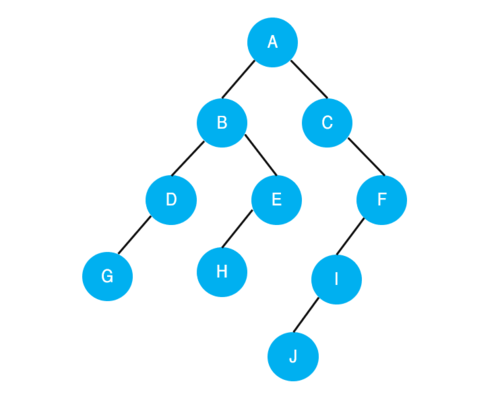
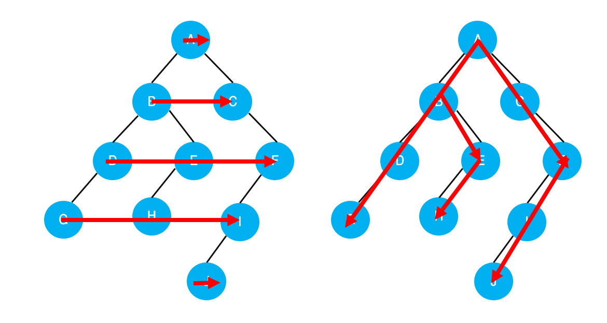

내 컴플렉스중 하나는 PS를 못한다는 것이다.  
정말 기가 막히게 못하지만, 그래도 취직은 해야 하니까.. (눈물)

## 1. DFS와 BFS



<div style = "margin: 1rem; font-size: 0.9rem; text-align: center;">그림은 트리지만, 그래프에도 당연히 적용할 수 있다.</div>

우선 너비 우선 탐색(BFS)과 깊이 우선 탐색(DFS)은 어렵게 생각할 필요 없이 그냥 탐색 방향이 다른거다.  
깊이 우선 탐색은 그냥 수직으로 깊이 들어가는 거고, 너비 우선 탐색은 수평으로 넓게 탐색한다고 생각하자.

위 그래프에서 노드를 탐색해 보자.  
BFS로 탐색한 결과는 A - B - C - D - E - F - G - H - I - J (또는 A - C - B - F - E - D - I - H - G - J),  
DFS로 탐색한 결과는 A - B - D - G - E - H - C - F - I - J (또는 A - C - F - I - J - B - E - H - D - G) 이다.  
텍스트로만 보면 정신이 없으니까 예쁘게 그림으로 그려 봤다.



<div style = "margin-bottom: 1rem; font-size: 0.9rem; text-align: center;">탐색 방향 : BFS(왼쪽) / DFS(오른쪽)</div>

아무튼 이제 두 탐색 기법의 차이도 알았으니 이걸 구현해보자.  
구현할 때 BFS는 주로 큐를 사용하고 DFS는 주로 스택을 사용하는 것으로 알려져 있는데, **자료구조에 집착하지 말고** 탐색할 노드를 **빼는** 방향이 반대라는 점에만 초점을 맞추면 될 듯 하다.

## 2. 구현 코드 (Python)

위에서 그림으로 표현한 그래프를 탐색하는 코드다.  
파이썬은 C++보다 훨씬 유연한 문법 덕분에 정말 간단하게 코드를 짤 수 있다는 장점이 있다.  
<span style = "font-size: 0.9rem">(이게 말이 이렇지 실제로 짜보면 그냥 신세계다.. 파이썬! 파이썬! 파이썬!)</span>

> **2. 1. 큐를 사용한 bfs의 구현**

```python
from collections import deque

graph = {
    'A': ['B', 'C'],
    'B': ['A', 'D', 'E'],
    'C': ['A', 'F'],
    'D': ['B', 'G'],
    'E': ['B', 'H'],
    'F': ['C', 'I'],
    'G': ['D'],
    'H': ['E'],
    'I': ['F', 'J'],
    'J': ['I']
}

def bfs(graph, start_node):
    visited = []
    queue = deque()
    queue.append(start_node)

    while queue:
        node = queue.popleft()
        if node not in visited:
            visited.append(node)
            queue.extend(graph[node])

    return visited


print(bfs(graph, 'A'))
# ['A', 'B', 'C', 'D', 'E', 'F', 'G', 'H', 'I', 'J']
```

> **2. 2. 스택을 사용한 dfs의 구현**

```python
graph = {
    'A': ['B', 'C'],
    'B': ['A', 'D', 'E'],
    'C': ['A', 'F'],
    'D': ['B', 'G'],
    'E': ['B', 'H'],
    'F': ['C', 'I'],
    'G': ['D'],
    'H': ['E'],
    'I': ['F', 'J'],
    'J': ['I']
}

def dfs(graph, start_node):
    visited = list()
    stack = list()
    stack.append(start_node)
    while stack:
        node = stack.pop()
        if node not in visited:
            visited.append(node)
            stack.extend(graph[node])
    return visited

print(dfs(graph, 'A'))
# ['A', 'C', 'F', 'I', 'J', 'B', 'E', 'H', 'D', 'G']
```

## 3. 마치며

이제 약간 감 잡았다.  
어-이 삼성전자, 2년 후에 딱 기다리라구!! 🎯
