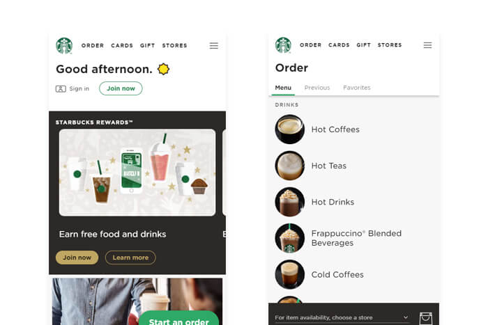
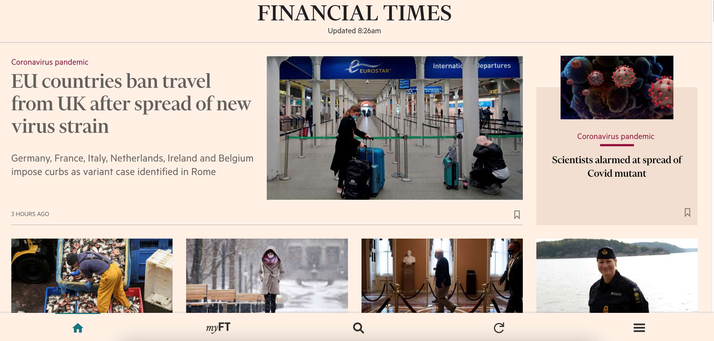
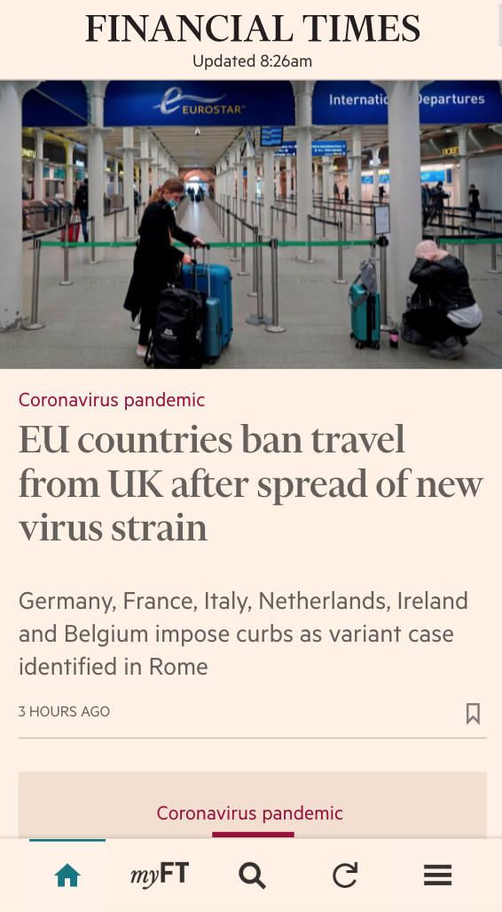

PWA는 웹을 앱처럼 사용할 수 있는 기술로써 사용자에게 더 나은 UX를 제공할 수 있다는 장점이 있다.  
오늘은 PWA의 장점과 흔히 많이 사용하는 모바일 어플리케이션(앱)의 차이를 간단히 다뤄보도록 하자.

## 1. PWA란?

PWA는 프로그레시브 웹 앱의 약자로, 웹 페이지를 모바일 환경에 더욱 특화시킨 기술이다.  
기존의 모바일 웹이 CRUD[^1]를 제공하는 수준에서 벗어나지 못했다면 PWA는 카메라나 푸시 알람 등 기기의 종속적인 기능들까지 이식할 수 있다는 차이가 있다.

2020년 기준 스타벅스, 우버, 핀터레스트, 스포티파이 등 쟁쟁한 회사들이 PWA를 사용해 자사 서비스를 제공하고 있을 정도로 자리를 잡은 상태이며, 나는 과감히 모바일 시장에서 PWA의 점유율은 점점 커질 것이라고 예상한다.

UI만 봐서는 네이티브 앱과 구별하기 힘든 수준에 이르렀다.

## 2. 장점 : 극한의 이득

PWA의 강력한 장점은 바로 극한의 효율성이다.  
사실 규모가 작은 서비스를 앱으로 런칭한다고 하면 안드로이드와 IOS 앱을 동시에 개발하는 데에 부담이 느껴질 수밖에 없다.  
(요즘은 flutter 같은 크로스 플랫폼 개발이 점점 뜨고 있다고는 하지만 아직은 규모가 많이 작은 것도 사실이다.)

또 어렵사리 앱을 시장에 내놓아도 나의 작고 귀여운 앱이 페이스북이나 크롬 같은 거대 앱만큼의 경쟁력을 갖추기는 어렵고, 결국 소규모 서비스를 위한 앱을 별도로 제작하는 것은 투자 대비 리스크가 너무 커지게 된다. 바로 이런 상황에서 PWA는 웹의 높은 접근성과 앱의 편리한 사용자 경험을 모두 제공할 수 있다는 장점을 가질 수 있다.

PWA로 제공하는 서비스를 체험해보고 싶다면 [Financial Times](https://app.ft.com/stream/home) 페이지를 들러 보길 바란다.  
아마 조금 둘러보고 나면, 저절로 "야 웹으로 이정도 서비스가 된다고?" 라는 생각이 들게 될 것이다.

  

      
  

  

      
  

좌측 : 웹 화면 / 우측 : 모바일 화면  한가지 주의해야 할 점은 PWA는 단순한 반응형 웹 사이트가 아니라 엄연한 어플리케이션으로 동작한다는 점이다!

[^1]: 데이터의 쓰기, 읽기, 삭제 (예시: 게시판)
