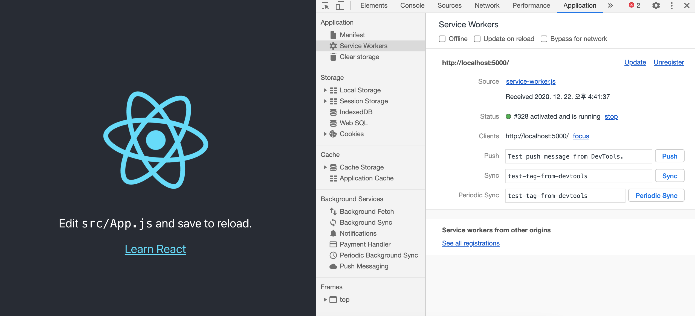

바로 지난 글에서 PWA의 매력을 알아봤으니 리액트로 직접 PWA 프로젝트를 구축해 보자.  
PWA 프로젝트를 위해서는 서비스워커(serviceWorker)에 현재 프로젝트를 등록해야 하는데, 한 가지 문제가 있다.

```js
// index.js
// If you want your app to work offline and load faster, you can change
// unregister() to register() below. Note this comes with some pitfalls.
// Learn more about service workers: https://cra.link/PWA
serviceWorker.unregister() // -> 해당 메서드를 register() 로 고쳐준다.
```

이전 버전의 `create-react-app` 프로젝트에서는 index.js 파일에 들어가 최하단의 서비스워커 설정을 `register` 로 고쳐 주면 되지만 2020년 11월에 릴리즈된 `create-react-app` 4.0 버전부터는 PWA 등록을 위한 서비스워커 설정 파일이 따라오지 않는다는 것이다.

```
(프로젝트명)
├── build
├── node_modules
├── src
│   ├── App.css
│   └── App.js
│   ├── App.test.js
│   └── index.css
│   └── logo.svg
│   └── reportWebVitals.js
│   └── setupTests.js
│
├── .gitignore
├── package.json
└── package-lock.json
```

<div style = "font-size : 0.8rem; text-align: center; margin-top: -0.5rem; margin-bottom: 1.5rem;">이전 버전까지만 해도 프로젝트에 serviceWorker.js 가 따라왔으나 더이상 포함되지 않는다.</div>

따라서 `create-react-app` 4. 이상 버전에서 PWA 프로젝트를 구성하려면 별도의 플래그를 추가해줘야 한다.

```powershell
npx create-react-app {프로젝트명} --template cra-template-pwa
```

플래그를 붙여 생성한 프로젝트의 모습은 전과 비슷하면서도 약간 달라지게 된다.

```
(프로젝트명)
├── build
├── node_modules
├── src
│   ├── App.css
│   └── App.js
│   ├── App.test.js
│   └── index.css
│   └── logo.svg
│   └── reportWebVitals.js
│   └── service-worker.js               <- PWA 지원을 위해 새로 추가됨
│   └── serviceWorkerRegistration.js    <- PWA 지원을 위해 새로 추가됨
│   └── setupTests.js
│
├── .gitignore
├── package.json
└── package-lock.json
```

해당 명령어로 프로젝트를 세팅하면 PWA를 위한 `service-worker.js` 파일과 `serviceWorkerRegistration.js` 파일이 추가된 프로젝트가 생성되며 `index.js` 파일에 들어가면 서비스워커 등록을 위한 코드가 돌아온 것을 확인할 수 있다.

```js
// index.js
// If you want your app to work offline and load faster, you can change
// unregister() to register() below. Note this comes with some pitfalls.
// Learn more about service workers: https://cra.link/PWA
serviceWorkerRegistration.register() // -> PWA 지원을 위해 register() 함수를 사용한다.
```

다음으로 앱 아이콘과 기타 설정을 위해 public 폴더의 `manifest.json` 파일을 수정해주면 된다.  
각 속성의 구체적인 역할은 [링크](https://developer.mozilla.org/en-US/docs/Web/Manifest) 에서 확인할 수 있지만, 지금은 `"start_url"` 속성의 값만 "/" 으로 정해주자.

```json
{
  "short_name": "항스타그램",
  "name": "항공대 심플 SNS",
  "icons": [
    {
      "src": "favicon.ico",
      "sizes": "64x64 32x32 24x24 16x16",
      "type": "image/x-icon"
    },
    {
      "src": "logo192.png",
      "type": "image/png",
      "sizes": "192x192"
    },
    {
      "src": "logo512.png",
      "type": "image/png",
      "sizes": "512x512"
    }
  ],
  "start_url": "/",
  "display": "standalone",
  "theme_color": "#000000",
  "background_color": "#ffffff"
}
```

매니페스트 설정까지 마치고 내 프로젝트에 PWA가 적용되었는지 확인하기 위해서는 크롬 개발자 도구에 들어가 **Application** 메뉴를 선택한다.  
어플리케이션 메뉴에 들어갔을 때 이렇게 현재 페이지에 등록된 서비스워커 정보가 출력되면 성공이다.



## + 만약 서비스워커 정보가 나오지 않는다면?

크롬 개발자 툴에서 서비스워커 정보가 나오지 않는다면 `serve` 패키지를 통해 테스트 서버가 아닌 정적 서버를 사용해 보자.

```npm
npm i serve -g

serve -s build
```

이제 리액트로 프로그레시브 웹앱을 제작할 기초공사가 모두 끝났다!
